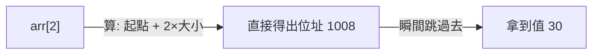
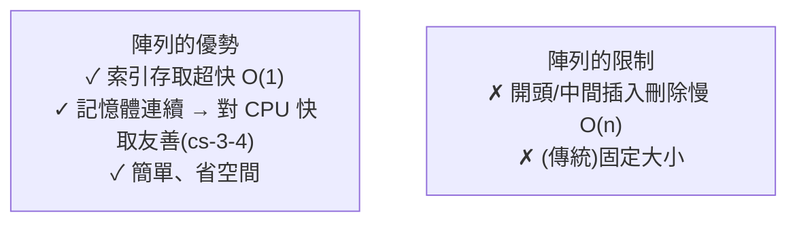

# [dsa-2-1] 陣列（Array）：記憶體連續、隨機存取為什麼是 O(1)

> **本章目標**：深入理解最基礎的資料結構——陣列，搞懂它「記憶體連續」的特性，以及為什麼用索引取值能瞬間完成（O(1)）。

## 你會學到

- 陣列的本質：記憶體中一塊連續的空間
- 為什麼「用索引取值」是 O(1)
- 陣列各種操作的複雜度
- 陣列的優勢與限制

## 概念說明

### 陣列的本質：連續的格子

**陣列（array）** 是最基礎的資料結構——**在記憶體裡，一塊「連續」的空間，依序存放同類型的元素**。回憶 [cs 課程 Part 3-5] 的記憶體像「一排有編號的格子」，陣列就是「**連續的一段格子**」：

```
一個陣列 [10, 20, 30, 40]，在記憶體裡：
   位址 1000: 10
   位址 1004: 20      ← 緊接著，連續排列
   位址 1008: 30
   位址 1012: 40
（假設每個元素佔 4 個位址）
```

「連續」是陣列最關鍵的特性——它帶來一個超能力：**隨機存取（random access）**。

### 為什麼索引取值是 O(1)

當你寫 `arr[2]` 想拿第 3 個元素，電腦怎麼找到它？因為連續排列，**位置可以直接「算」出來**：

```
元素位址 = 起始位址 + 索引 × 每個元素大小
arr[2] 的位址 = 1000 + 2 × 4 = 1008  → 直接跳過去拿！
```



這張圖在說：取陣列元素**不用「一個個找」，而是用公式「直接算出位址、瞬間跳過去」**——所以是 **O(1)**，和陣列多長完全無關。這就是「隨機存取」的意思：存取任何位置都一樣快。這也是為什麼 [dsa-0-1] 的二分搜尋能成立（它需要「瞬間跳到中間」）。

> 這也呼應 [cs 課程 Part 1-1、E-5-1] 「為什麼陣列從 0 開始」——因為索引其實是「距離起點的偏移量」，第一個元素偏移 0。

### 各種操作的複雜度

陣列不同操作的快慢差很多，關鍵看「**會不會牽動其他元素**」：

| 操作 | 複雜度 | 為什麼 |
|------|--------|--------|
| 用索引讀取 `arr[i]` | **O(1)** | 直接算位址跳過去 |
| 修改 `arr[i] = x` | **O(1)** | 同上 |
| 在結尾加 `push` | O(1) 攤銷 | 通常直接放（[dsa-1-4] 攤銷）|
| 在開頭/中間插入 | **O(n)** | 要把後面的元素全部往後挪一格！|
| 在開頭/中間刪除 | **O(n)** | 要把後面的元素全部往前補一格 |
| 搜尋某個值 | O(n) | 可能要看過全部（除非已排序用二分）|

重點是那兩個 **O(n)**：在開頭或中間插入/刪除，因為陣列要保持「連續」，得**挪動大量元素**：

```
在 [10, 20, 30, 40] 開頭插入 5：
   要把 10,20,30,40 全部往後挪一格，才能空出開頭 → O(n)
   → 這就是 [dsa-1-4] 說 unshift 是 O(n) 的原因
```

### 優勢與限制



這張圖總結陣列的取捨：**擅長「用索引快速存取」，不擅長「在前面或中間增刪」**。這個限制，正是下一個資料結構「鏈結串列」（[dsa-2-3]）要來補足的——它們是互補的一對。

## 程式碼範例

```typescript
const arr = [10, 20, 30, 40];

// O(1)：索引存取與修改
console.log(arr[2]);     // 30，瞬間
arr[2] = 99;             // 瞬間

// O(1) 攤銷：結尾操作
arr.push(50);            // [10,20,99,40,50]
arr.pop();               // 移除結尾

// O(n)：開頭/中間操作（要挪動元素）
arr.unshift(5);          // 開頭插入 → 全部後挪，慢
arr.splice(1, 0, 15);    // 中間插入 → 後面的後挪，慢

// O(n)：搜尋
const idx = arr.indexOf(99);   // 可能要掃過全部
```

說明：記住「**索引存取快（O(1)）、前面/中間增刪慢（O(n)）**」這個陣列的核心特性，你就掌握了選用陣列的判斷依據。

## 小練習

1. 用「連續格子 + 算位址」解釋為什麼 `arr[1000000]` 和 `arr[0]` 一樣快（都是 O(1)）。
2. 為什麼「在陣列開頭插入一個元素」是 O(n)？畫出或描述「挪動」的過程。
3. 思考題：如果你的程式「主要用索引讀取、很少在中間增刪」，陣列適合嗎？反過來「常在開頭增刪」呢？

## 課外讀物

> 記憶體連續、位址、快取友善 → **cs 課程 Part 3-4（記憶體階層）、Part 3-5（位址）**

> 為什麼索引從 0 開始 → [課外讀物 E-5-1：為什麼陣列從 0 開始](../../../課外讀物/E-5-fun-facts/E-5-1-why-arrays-start-at-zero.md)

> 下一步：能自動長大的動態陣列 → [dsa-2-2]
