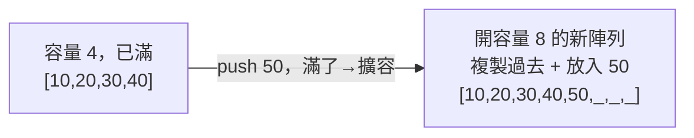

# [dsa-2-2] 動態陣列：自動擴容的祕密與「攤銷 O(1)」

> **本章目標**：理解你天天用的「能自動長大的陣列」（TypeScript 陣列、Vec）背後怎麼運作——「擴容」的機制，以及為什麼 push 平均是 O(1)。

## 你會學到

- 傳統陣列「固定大小」的限制
- 動態陣列怎麼「自動長大」
- 「容量翻倍」擴容策略
- 為什麼 push 是攤銷 O(1)（複習並深入 [dsa-1-4]）

## 概念說明

### 固定大小的麻煩

[dsa-2-1] 的傳統陣列有個限制——**大小固定**（建立時就定死有幾格）。但寫程式時你常常「事先不知道會有幾個元素」（使用者陸續輸入的資料）。難道每次都要先猜一個大小？

**動態陣列（dynamic array）** 解決這個——它能**自動長大**。你一直 `push`，它會在需要時自己擴大。你用的 TypeScript 陣列、[rust-6-1] 的 `Vec`、Java 的 ArrayList，都是動態陣列。

### 祕密：底層還是固定陣列 + 擴容

動態陣列怎麼做到「自動長大」？祕密是——**底層其實還是一個固定大小的陣列，當它滿了，就「換一個更大的」**：

```
動態陣列內部：
   有一塊「實際的固定陣列」（容量 capacity）
   記錄「目前用了幾格」（size）

   push 時：
      如果還沒滿（size < capacity）→ 直接放進去，size + 1  → O(1)
      如果滿了（size == capacity）→ 觸發「擴容」：
         1. 開一塊「更大的」新陣列
         2. 把舊陣列的元素「全部複製」到新陣列  ← O(n)！
         3. 放入新元素，丟棄舊陣列
```



這張圖在說：當固定容量滿了，動態陣列「**開一塊更大的、把舊資料搬過去**」——這次擴容是 O(n)（要複製全部）。但這不常發生，所以平均很便宜（下面解釋）。

### 容量翻倍：為什麼擴容要「加倍」

擴容時要開多大？關鍵策略是——**容量「翻倍」（×2）**，而不是「每次加一格」。為什麼？

```
如果「每次加一格」：
   每次 push 滿了都要擴容、複製全部 → 幾乎每次都 O(n) → 總體 O(n²)，超慢！

如果「容量翻倍」：
   擴容後有「一倍的空位」，接下來很多次 push 都不用再擴容
   擴容越來越少發生（容量 4→8→16→32…）
   → 把那幾次昂貴的擴容，攤銷到大量便宜的 push 上
```

### 所以 push 是攤銷 O(1)

這正是 [dsa-1-4] 講的**攤銷分析**的經典案例。雖然「某一次剛好觸發擴容的 push」是 O(n)，但因為翻倍策略讓擴容極少發生，**把成本平均分攤後，每次 push 是 O(1)**：

```
直覺：要 push n 個元素，總共的「複製成本」是
   擴容發生在容量 1,2,4,8,...,n → 複製次數 1+2+4+...+n ≈ 2n
   2n 的複製成本，分攤到 n 次 push → 每次平均約 2 次 → O(1) 攤銷
→ 這就是為什麼你能放心地一直 push，不用擔心效能。
```

比喻（複習 [dsa-1-4]）：像健身房年費——偶爾一次大筆支出（擴容），分攤到每天去（每次 push），平均很便宜。

## 程式碼範例

```typescript
// TypeScript 的陣列就是動態陣列，你不用管擴容，它自動處理
const arr: number[] = [];      // 空的
arr.push(1);                   // O(1) 攤銷
arr.push(2);
arr.push(3);
// ...一直 push，它自動擴容，你完全無感

console.log(arr.length);       // 目前有幾個元素（size）
```

說明：好消息是——**動態陣列幫你把「擴容」這件複雜事完全藏起來了**（這就是抽象，[cs 課程 Part 8-1]）。你只管 `push`，它自動處理容量。但**理解背後機制**讓你知道：「為什麼 push 偶爾會稍慢一下（剛好擴容）」「為什麼它整體還是很高效」。

> 在 Rust，你能看到更明確的控制——`Vec::with_capacity(n)` 可以「預先配置容量」，避免多次擴容（[rust-6-1]）。如果你「事先知道大概會有幾個元素」，預配容量是個小優化。

## 小練習

1. 用自己的話解釋：動態陣列「滿了」的時候做了什麼（三個步驟）？這次操作是 O(1) 還 O(n)？
2. 為什麼擴容要「容量翻倍」而不是「每次加一格」？後者會造成什麼問題？
3. 思考題：既然 push 偶爾會 O(n)（擴容），為什麼我們說它是「攤銷 O(1)」？（複習 [dsa-1-4]。）

## 課外讀物

> 攤銷分析 → 複習 [dsa-1-4]

> Rust 的 Vec 與預配容量 → **rust 課程 [rust-6-1]**

> 下一步：另一種線性結構，擅長增刪——鏈結串列 → [dsa-2-3]
