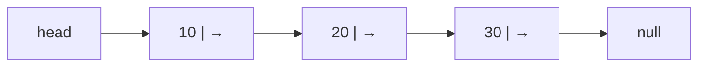
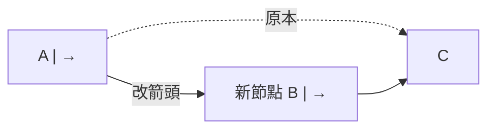
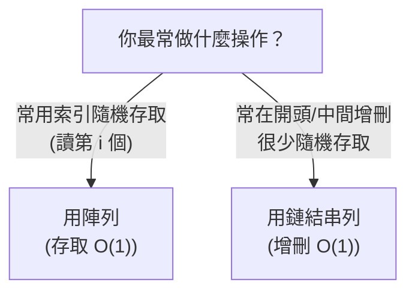

# [dsa-2-3] 鏈結串列（Linked List）：單向、雙向、與陣列的本質差異

> **本章目標**：認識鏈結串列——用「指標串起一個個節點」的資料結構，理解它和陣列的本質差異，以及它擅長與不擅長什麼。

## 你會學到

- 鏈結串列的結構：節點 + 指向下一個的連結
- 單向 vs 雙向鏈結串列
- 為什麼它「插入刪除快、但隨機存取慢」
- 和陣列的本質對比

## 概念說明

### 不連續的串珠

[dsa-2-1] 的陣列是「連續的格子」。**鏈結串列（linked list）** 完全相反——**它的元素散落在記憶體各處，靠「指標」一個串一個連起來**，像串珠子：

```
陣列：    [10][20][30][40]   ← 緊緊相鄰，連續
鏈結串列： [10|→] ... [20|→] ... [30|→] ... [40|null]
          每個「珠子(節點)」存著「值」+「指向下一個的箭頭」
          珠子本身可以散落在記憶體任何地方，靠箭頭串起來
```

每個「珠子」叫一個**節點（node）**，包含兩部分：

```
一個節點 = 「資料值」 + 「指向下一個節點的指標（連結）」
最後一個節點的指標指向「null」（表示結束）
```



這張圖在說：鏈結串列用一個 `head` 指向第一個節點，每個節點指向下一個，最後指向 null。要走訪它，得「**從 head 開始，順著箭頭一個個走**」。

### 單向 vs 雙向

```
單向鏈結串列：每個節點只「指向下一個」 → 只能往後走
雙向鏈結串列：每個節點「指向下一個」也「指向上一個」 → 能前後走
   雙向更靈活（例如能往回找、好刪除），但每個節點多存一個指標、多花空間。
```

### 本質差異：為什麼增刪快、存取慢

鏈結串列和陣列的複雜度幾乎「**剛好相反**」，這是它最關鍵的特性：

| 操作 | 陣列 | 鏈結串列 |
|------|------|---------|
| 用索引存取第 i 個 | **O(1)** | **O(n)** 😈 |
| 在已知位置插入/刪除 | O(n)（要挪動）| **O(1)** 😎 |
| 在開頭插入/刪除 | O(n) | **O(1)** 😎 |

**為什麼存取慢（O(n)）？** 因為節點散落各處、不連續，沒辦法像陣列那樣「算位址直接跳過去」。要拿第 5 個，只能**從 head 順著箭頭走 5 步**——所以是 O(n)。

**為什麼插入刪除快（O(1)）？** 因為只要「改幾個箭頭」，不用挪動其他元素：

```
在鏈結串列中間插入一個節點：
   只要：新節點指向「下一個」，前一個節點指向「新節點」
   → 改兩個箭頭就好，O(1)！（不像陣列要把後面全部挪開）
```



這張圖在說：插入只要「重接箭頭」——A 改指向 B、B 指向 C，完全不動其他節點。這就是鏈結串列「增刪快」的祕密。

### 怎麼選：陣列 vs 鏈結串列



這張圖是選擇的關鍵：**要「快速隨機存取」用陣列；要「頻繁增刪（尤其開頭/中間）」用鏈結串列。** [dsa-2-4] 會更詳細對比。

## 程式碼範例

用 TypeScript 定義一個簡單的單向鏈結串列節點：

```typescript
// 一個節點：存值 + 指向下一個節點（或 null）
class ListNode {
  value: number;
  next: ListNode | null = null;     // 指向下一個，預設 null
  constructor(value: number) {
    this.value = value;
  }
}

// 手動串成 10 → 20 → 30
const head = new ListNode(10);
head.next = new ListNode(20);
head.next.next = new ListNode(30);

// 走訪：從 head 順著 next 一個個走（O(n)）
let current: ListNode | null = head;
while (current !== null) {
  console.log(current.value);       // 10, 20, 30
  current = current.next;           // 往下一個走
}
```

說明：注意 `next: ListNode | null`——一個節點指向「下一個節點，或 null（結尾）」。走訪時用 `current = current.next` 一步步往後。這個「順著指標走」就是 O(n) 存取的來源。（呼應 **rust 課程 [rust-8-1]**，那裡用 `Box` 處理鏈結串列的遞迴型別。）

## 小練習

1. 用「串珠子」的比喻，解釋鏈結串列和陣列的本質差異。
2. 為什麼鏈結串列「取第 5 個元素」是 O(n)，但陣列是 O(1)？
3. 為什麼鏈結串列「在中間插入」是 O(1)，但陣列是 O(n)？用「改箭頭 vs 挪元素」說明。

## 課外讀物

> 鏈結串列的遞迴型別實作（用指標）→ **rust 課程 [rust-8-1]：Box**

> 下一步：陣列 vs 鏈結串列的完整對照與選用 → [dsa-2-4]
