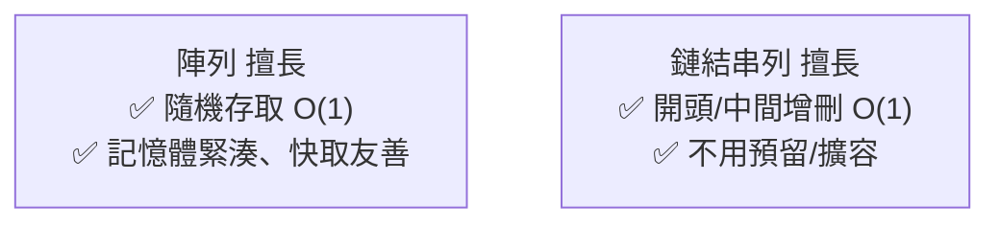
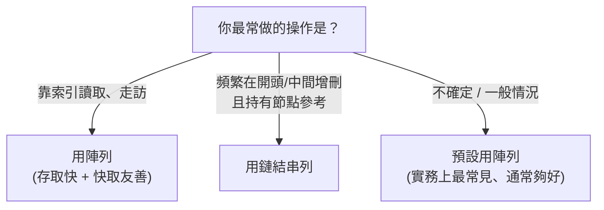

# [dsa-2-4] 陣列 vs 鏈結串列：什麼情境用哪個（一張對照表）

> **本章目標**：把陣列和鏈結串列做一次完整對比，建立「拿到需求怎麼選」的判斷力，並認識「快取友善」這個常被忽略的實務因素。

## 你會學到

- 陣列與鏈結串列的完整複雜度對照
- 「快取友善」為什麼讓陣列實務上常勝出
- 怎麼根據「主要操作」選對結構
- 一個務實的建議

## 概念說明

### 完整對照表

把 [dsa-2-1]~[dsa-2-3] 整理成一張總表：

| 操作 | 陣列（動態）| 鏈結串列 |
|------|------|---------|
| 用索引存取第 i 個 | **O(1)** ✅ | O(n) |
| 在結尾插入 | O(1) 攤銷 | O(1)（有尾指標）|
| 在開頭插入/刪除 | O(n) | **O(1)** ✅ |
| 在中間（已知節點）插入/刪除 | O(n) | **O(1)** ✅ |
| 搜尋某個值 | O(n) | O(n) |
| 記憶體 | 連續、緊湊 | 分散、每個節點多存指標 |



這張圖總結：**陣列贏在「隨機存取」與「記憶體效率」，鏈結串列贏在「任意位置增刪」。** 它們是互補的一對。

### 一個常被忽略的關鍵：快取友善

理論上鏈結串列「增刪 O(1)」聽起來很美，但**實務上陣列常常更快**——即使在某些理論上鏈結串列佔優的場景。為什麼？因為**快取友善（cache-friendly）**：

```
回憶 cs 課程 Part 3-4 的記憶體階層與「局部性」：
   陣列：元素「連續」存放 → CPU 一次載入一塊，附近元素都進快取
        → 走訪陣列超快（大多在快取命中）
   鏈結串列：節點「散落」各處 → 每跳一個節點可能就要去慢的主記憶體拿
        → 走訪時頻繁 cache miss，實際上慢很多

→ 所以「理論複雜度一樣 O(n) 的走訪」，陣列實務上往往快好幾倍。
  這是純看 Big-O 看不出來的「常數因素」（呼應 dsa-1-1 提的常數）。
```

這是個重要的實務教訓——**Big-O 是第一層篩選，但不是全部**。記憶體存取模式（快取友善）這類「常數因素」，在真實效能裡可能很關鍵。

### 怎麼選



這張圖給選擇建議。注意最後一條——**不確定時，預設用陣列（動態陣列）**。原因：

```
務實的建議：
   現代語言的「動態陣列」（TypeScript 陣列、rust Vec）
   是日常 90% 情況的好選擇——存取快、快取友善、API 方便。
   鏈結串列雖然「某些操作理論上更快」，但快取不友善 + 實作較煩，
   實務上純鏈結串列用得比你想像的少。
   → 除非你「明確知道」需要鏈結串列的特性，否則先用陣列。
```

這呼應 [dsa-0-3] 的「夠好往往勝過最佳」——別過度設計，先用最通用、最不易錯的。

## 範例：兩個情境的選擇

```
情境 A：一個排行榜，要常常「顯示第 N 名」「依分數排序」
   → 主要是「索引存取」和「排序」 → 陣列（存取 O(1)、好排序）

情境 B：實作一個「待處理任務佇列」，常在「頭部移除、尾部加入」
   → 主要是兩端增刪 → 鏈結串列適合（兩端 O(1)）
   → 但其實！用「動態陣列 + 一些技巧」或語言內建的雙端佇列
     往往更實際（快取友善）。下一章的佇列會談到。

→ 重點：先看「主要操作」，再參考「快取友善」與「實作複雜度」綜合判斷。
```

## 小練習

1. 不看上面，憑記憶填：陣列和鏈結串列在「索引存取」「開頭插入」各是什麼複雜度？
2. 用自己的話解釋「快取友善」，以及為什麼它讓陣列「實務上常比理論預期更快」。
3. 思考題：為什麼這門課建議「不確定時預設用陣列」？這和 [dsa-0-3] 的哪個觀念呼應？

## 課外讀物

> 快取友善的根源——記憶體階層與局部性 → **cs 課程 Part 3-4**

> 「夠好勝過最佳、別過度設計」 → 複習 [dsa-0-3]

> 下一步：兩個基於線性結構的重要概念——堆疊 → [dsa-2-5]
