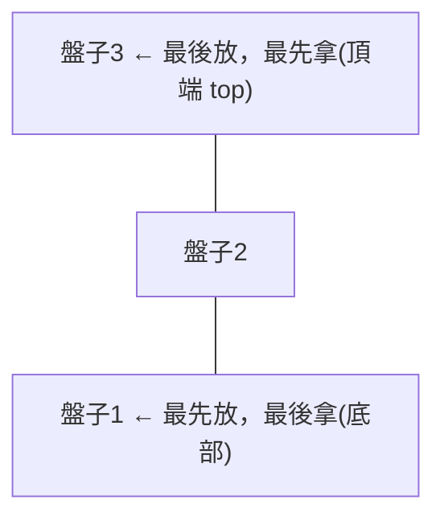

# [dsa-2-5] 堆疊（Stack）：後進先出，與「函式呼叫堆疊」的關係

> **本章目標**：認識堆疊——一種「後進先出」的資料結構，理解它的操作、實作，以及它怎麼支撐程式的「函式呼叫」與遞迴。

## 你會學到

- 堆疊的核心規則：後進先出（LIFO）
- push 與 pop 操作
- 堆疊怎麼實作（用陣列就行）
- 「呼叫堆疊」：程式怎麼用堆疊管理函式呼叫

## 概念說明

### 後進先出：一疊盤子

**堆疊（stack）** 是一種有「**特定存取規則**」的資料結構——它規定：**只能從「頂端」存取，後放進去的先拿出來**。這叫**後進先出（LIFO，Last In First Out）**。

比喻最貼切的是「**一疊盤子**」：

```
洗好的盤子一個個疊上去（push，放在最上面）
要用時從最上面拿（pop，拿最上面那個）
→ 最後疊上去的，最先被拿走。你不會從中間抽盤子。
```



這張圖在說：堆疊像一疊盤子，只能在「頂端」操作。它只有兩個核心動作：

```
push：把一個東西放到頂端
pop： 把頂端的東西拿走（並回傳）
（常還有 peek：看一下頂端是什麼，但不拿走）
```

這些操作都是 **O(1)**——只動頂端，不牽動其他元素。

### 為什麼這個「限制」有用？

你可能想：「限制只能從頂端拿，不是很不方便嗎？」但很多問題的本質就是「後進先出」，這時堆疊剛好完美契合：

```
撤銷功能（Ctrl+Z）：最後做的動作，最先被撤銷 → 堆疊！
瀏覽器上一頁：最後造訪的頁，最先回去 → 堆疊！
括號配對檢查：最後開的括號，要最先被關 → 堆疊！
```

**選對資料結構 = 它的規則剛好符合問題的本質。** 堆疊就是「後進先出」這類問題的完美工具。

### 用陣列實作堆疊

堆疊不是什麼神祕的東西——用一個陣列（[dsa-2-1]）就能輕鬆實作，因為陣列的「結尾 push/pop」剛好是 O(1)：

```typescript
class Stack<T> {
  private items: T[] = [];

  push(item: T): void {
    this.items.push(item);          // 加到陣列結尾 = 堆疊頂端
  }

  pop(): T | undefined {
    return this.items.pop();        // 移除陣列結尾 = 拿堆疊頂端
  }

  peek(): T | undefined {
    return this.items[this.items.length - 1];   // 看頂端，不拿走
  }

  isEmpty(): boolean {
    return this.items.length === 0;
  }
}

// 使用
const stack = new Stack<number>();
stack.push(1);
stack.push(2);
stack.push(3);
console.log(stack.pop());   // 3（最後進的最先出）
console.log(stack.pop());   // 2
```

說明：用陣列的 `push`/`pop`（都操作結尾，O(1)）就實作出堆疊。注意我們**只暴露 push/pop/peek**——把「只能從頂端存取」這個規則「封裝」起來，使用者不能亂從中間動（呼應 [cs 課程 Part 8-1 抽象]、[課外讀物 E-7 封裝]）。（這也對應 **rust 課程 [rust-3-6]** 用 `Vec` 的 `pop()` + `while let` 處理堆疊。）

### 呼叫堆疊：程式自己也在用堆疊

最重要的應用——**程式執行「函式呼叫」時，背後就是一個堆疊**，叫**呼叫堆疊（call stack）**：

```
函式 A 呼叫 函式 B，B 又呼叫 C：
   呼叫 A → A 推上堆疊
   A 呼叫 B → B 推上堆疊（疊在 A 上）
   B 呼叫 C → C 推上堆疊（疊在 B 上）
   C 執行完 → C 彈出，回到 B
   B 執行完 → B 彈出，回到 A
   → 「後呼叫的先返回」，完美符合後進先出！
```

這就是為什麼——**函式總是「最內層的先執行完、先返回」**，因為它們在呼叫堆疊上後進先出。這也解釋了兩個你聽過的詞：

```
「stack overflow（堆疊溢位）」：遞迴太深，呼叫堆疊堆爆了 → 程式崩潰
   （著名的工程師問答網站就叫這名字！）
「stack trace（堆疊追蹤）」：出錯時印出的「函式呼叫鏈」，就是當下呼叫堆疊的快照
```

> 呼叫堆疊、堆疊溢位 → **cs 課程 Part 5-2（行程與執行緒）**；遞迴與呼叫堆疊 → 本書 [dsa-6-1]、**rust 課程 [rust-2-1]（堆疊記憶體）**

## 小練習

1. 用「一疊盤子」解釋後進先出（LIFO），並說出堆疊的兩個核心操作。
2. 舉一個生活中或軟體中「本質是後進先出」的例子（除了文中提的）。
3. 思考題：為什麼「無窮遞迴」會造成「stack overflow」？這和呼叫堆疊有什麼關係？

## 課外讀物

> 呼叫堆疊、堆疊溢位的底層 → **cs 課程 Part 5-2**、**rust 課程 [rust-2-1]**

> 堆疊的實作對應 → **rust 課程 [rust-3-6]（while let + pop）**

> 下一步：堆疊的兄弟——先進先出的佇列 → [dsa-2-6]
