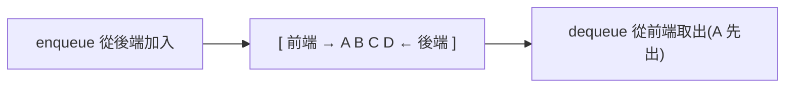

# [dsa-2-6] 佇列（Queue）：先進先出、雙端佇列、環狀佇列

> **本章目標**：認識佇列——「先進先出」的資料結構，理解它和堆疊的對比、常見變體，以及它在真實系統（任務排隊、訊息佇列）的應用。

## 你會學到

- 佇列的核心規則：先進先出（FIFO）
- enqueue 與 dequeue 操作
- 為什麼「用陣列直接做」會有效率陷阱
- 雙端佇列、環狀佇列，與真實應用

## 概念說明

### 先進先出：排隊

如果說堆疊（[dsa-2-5]）是「一疊盤子（後進先出）」，**佇列（queue）** 就是「**排隊**」——**先來的先服務，後進先出**，正式名稱**先進先出（FIFO，First In First Out）**：

```
排隊買票：
   先來的人排前面，先買到票離開（從「前端」出去）
   後來的人排後面（從「後端」加入）
→ 先進的先出，公平地依序處理。
```



這張圖在說：佇列有「前後兩端」——**從後端加入（enqueue）、從前端取出（dequeue）**，先加入的先被取出。這和堆疊「同一端進出」剛好不同。

```
堆疊 LIFO：同一端（頂端）進出 → 後進先出
佇列 FIFO：一端進、另一端出 → 先進先出
```

### 為什麼佇列無所不在

「先進先出」符合大量「**公平依序處理**」的真實需求：

```
任務排程：先送來的任務先處理（cs 課程 Part 5-3 的排程）
印表機佇列：先送的文件先印
訊息佇列：系統間傳訊息，依序處理（你之後做後端、分散式會遇到）
廣度優先搜尋（BFS）：用佇列依層探索（本書 Part 4、5 會用到！）
```

### 效率陷阱：別直接用陣列的 shift

實作佇列要小心一個陷阱。直覺上，你可能想用陣列：`push` 加到結尾（enqueue）、`shift` 從開頭移除（dequeue）。但——

```
arr.push(x)    // 結尾加入 → O(1) ✓
arr.shift()    // 開頭移除 → O(n) ！⚠️
```

回憶 [dsa-2-1]——**從陣列「開頭」移除是 O(n)**（要把後面所有元素往前挪）！所以「陣列 + shift」做的佇列，每次 dequeue 都 O(n)，資料一多就慢。

**正確的高效做法**有幾種：

```
方法一：用鏈結串列（dsa-2-3）——兩端增刪都 O(1)，天生適合佇列
方法二：用「環狀佇列」——用陣列但「用兩個指標標記頭尾」，
        不真的挪動元素，達成兩端 O(1)（下面說）
方法三：用語言內建的雙端佇列結構
```

### 環狀佇列：聰明地用陣列

**環狀佇列（circular queue）** 是個巧妙的做法——**用固定陣列，但用「頭、尾兩個指標」標記範圍，並讓指標「繞圈」重複利用空間**：

```
不真的「挪動元素」，而是移動「頭尾指標」：
   dequeue → 頭指標往後移一格（不挪元素）→ O(1)
   enqueue → 尾指標往後移一格 → O(1)
   指標到陣列末端 → 「繞回」開頭（像時鐘繞圈）→ 重複利用前面空出的格子
```

這樣 enqueue/dequeue 都是 O(1)，又享受陣列的快取友善（[dsa-2-4]）。代價是容量固定（或要自己擴容）。

### 雙端佇列（Deque）

**雙端佇列（deque，double-ended queue）** 是更靈活的變體——**兩端都能加入和取出**。它同時能當堆疊（一端進出）和佇列（兩端）用，是很實用的「萬用」線性結構。

## 程式碼範例

一個簡單的佇列（教學用；正式可用鏈結串列或環狀佇列優化）：

```typescript
class Queue<T> {
  private items: T[] = [];

  enqueue(item: T): void {
    this.items.push(item);          // 後端加入 O(1)
  }

  dequeue(): T | undefined {
    return this.items.shift();      // 前端取出 ⚠️ O(n)（教學簡化版）
  }

  peek(): T | undefined {
    return this.items[0];           // 看前端
  }

  isEmpty(): boolean {
    return this.items.length === 0;
  }
}

const queue = new Queue<string>();
queue.enqueue("A");
queue.enqueue("B");
queue.enqueue("C");
console.log(queue.dequeue());   // A（先進的先出）
console.log(queue.dequeue());   // B
```

說明：這個版本用 `shift` 是 O(n)（如上面警告），適合學概念。正式場合要避開這個陷阱——這正是「**懂底層複雜度，才能避開效能坑**」的好例子（呼應 [dsa-1-1]）。

## 小練習

1. 用「排隊」解釋先進先出（FIFO），並說出佇列和堆疊（LIFO）的核心差別。
2. 為什麼「用陣列 + shift 做佇列」會有效率問題？是哪個操作 O(n)、為什麼？
3. 思考題：環狀佇列怎麼用「移動指標 + 繞圈」達成兩端 O(1)，而不用真的挪動元素？

## 課外讀物

> 佇列用於 CPU 排程 → **cs 課程 Part 5-3**；佇列用於 BFS → 本書 [dsa-5-3]

> 從開頭移除為什麼 O(n) → 複習 [dsa-2-1]

> 本 Part 完成！下一步：O(1) 查找的魔法——雜湊 → 本書 Part 3
