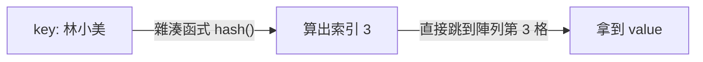

# [dsa-3-1] 雜湊表（Hash Table）：把 key 變成位址，O(1) 查找的原理

> **本章目標**：揭開雜湊表「查找超快（O(1)）」的魔法——用「雜湊函式」把 key 直接算成位址，這是計算機科學最重要的資料結構之一。

## 你會學到

- 雜湊表解決什麼問題
- 雜湊函式：把 key 變成陣列位址
- 為什麼查找、插入是 O(1)
- 雜湊表的威力與你早就在用它

## 概念說明

### 問題：怎麼「用 key 瞬間查到 value」

前面的結構，搜尋一個值都要 O(n)（逐一找）或 O(log n)（排序後二分）。但很多需求是「**用一個 key 查對應的 value**」——例如用「學號」查「學生資料」、用「使用者名稱」查「帳號」。有沒有辦法「**瞬間**」查到，不用逐一找？

有——**雜湊表（hash table）**，它能做到平均 **O(1)** 的查找、插入、刪除。這幾乎是「最快」了，所以雜湊表無所不在。

### 核心魔法：用 key 算出位址

雜湊表的祕密是——**不用「找」，而是用 key「算」出 value 該放哪**。它背後有一個陣列，加上一個**雜湊函式（hash function）**：

```
雜湊函式：吃一個 key，吐出一個「陣列的位置（索引）」
   hash("林小美") → 3     → 就把她的資料放陣列第 3 格
   hash("陳大明") → 7     → 放第 7 格

查找時：再算一次 hash("林小美") → 3 → 直接去第 3 格拿！
   不用逐一找，「算」出來直接跳過去 → O(1)！
```



這張圖在說：雜湊表把「用 key 找 value」變成「用 key **算出**位置、直接跳過去」——這就是 O(1) 的來源。它巧妙地利用了陣列「索引存取 O(1)」（[dsa-2-1]）的特性，再加一層「key → 索引」的轉換。

### 好的雜湊函式長什麼樣

雜湊函式是關鍵，它應該：

```
① 同樣的 key → 永遠得到同樣的索引（一致，不然找不回來）
② 把不同 key「盡量均勻」分散到各個位置（避免大家擠同一格）
③ 計算要快（不然就失去 O(1) 的意義）
```

第②點很重要——如果雜湊函式很爛，把很多 key 都算到同一格，就會「擠在一起」，退化成逐一找（變慢）。這種「不同 key 算到同一格」的情況叫**碰撞（collision）**，是雜湊表必須處理的核心問題——下一章 [dsa-3-2] 專講。

### 你早就在用雜湊表

雜湊表太有用，幾乎每個語言都內建：

```
TypeScript / JavaScript：Map、Object、Set
Rust：HashMap、HashSet（rust 課程 [rust-6-3]）
Python：dict、set
Java：HashMap、HashSet
→ 你用過的「鍵值對」「集合」，底層幾乎都是雜湊表。
```

所以這一章不只是理論——它解釋了你天天在用的工具「**為什麼這麼快**」。

## 程式碼範例

TypeScript 的 `Map` 就是雜湊表，直接用：

```typescript
const scores = new Map<string, number>();

// 插入：平均 O(1)
scores.set("林小美", 95);
scores.set("陳大明", 88);

// 查找：平均 O(1)（用 key 直接算出位置）
console.log(scores.get("林小美"));   // 95，瞬間
console.log(scores.has("陳大明"));   // true

// 刪除：平均 O(1)
scores.delete("陳大明");

// 不管裡面有 10 筆還是一千萬筆，查找都幾乎一樣快
```

說明：`Map` 把雜湊的複雜（雜湊函式、碰撞處理）全藏起來，你只要 `set`/`get`/`has`/`delete`，全是平均 O(1)。對比 [dsa-2-1] 用陣列存「key-value」要 O(n) 搜尋，雜湊表是巨大的進步。這就是為什麼「用 ID 查資料」這類需求，**首選雜湊表**。

> 注意「平均」O(1)——碰撞嚴重時最壞會退化，[dsa-3-2] 會解釋怎麼避免。

## 範例：對比的威力

```
需求：一百萬個使用者，頻繁「用使用者名稱查資料」。

用陣列：每次查都從頭逐一比對名稱 → O(n)，每次最多比一百萬次
用雜湊表：算 hash(名稱) → 直接定位 → O(1)，幾乎瞬間

→ 一百萬筆時，雜湊表每次查可能快了「百萬倍」級別。
  這就是為什麼資料庫索引、快取（rust/cs 課程都提過）大量用雜湊。
```

## 小練習

1. 用自己的話解釋：雜湊表為什麼能 O(1) 查找？它和「逐一搜尋」最根本的差別是什麼？
2. 一個「好的雜湊函式」應該具備哪三個特性？
3. 思考題：如果雜湊函式很爛，把所有 key 都算到「同一格」，雜湊表的查找會退化成什麼複雜度？（這預告了下一章的「碰撞」問題。）

## 課外讀物

> 雜湊表的概念入門 → **cs 課程 Part 7-2**；你用過的實作 → **rust 課程 [rust-6-3] HashMap**

> 雜湊在快取、分散式的應用（一致性雜湊）→ **快取課程 Part 5**

> 下一步：當不同 key 算到同一格——碰撞怎麼解 → [dsa-3-2]
