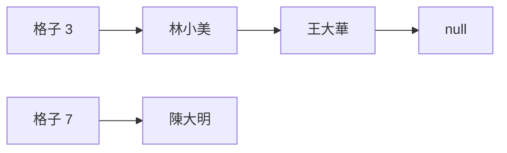

# [dsa-3-2] 雜湊碰撞與解法：鏈結法、開放定址、為什麼要好的雜湊函式

> **本章目標**：理解雜湊表的核心挑戰——「碰撞」（不同 key 算到同一格），以及兩種主流解法，並認識「負載因子」這個影響效能的關鍵。

## 你會學到

- 碰撞是什麼、為什麼一定會發生
- 解法一：鏈結法（separate chaining）
- 解法二：開放定址（open addressing）
- 負載因子與「為什麼雜湊表會擴容」

## 概念說明

### 碰撞：不同 key 撞同一格

[dsa-3-1] 說雜湊函式把 key 算成索引。但問題來了——**不同的 key，可能算出「同一個索引」**，這叫**碰撞（collision）**：

```
hash("林小美") → 3
hash("王大華") → 3    ← 撞了！兩個都想放第 3 格
```

碰撞**一定會發生**，無法完全避免。原因很簡單：key 的可能性是無限的（任意字串），但陣列格子是有限的——把無限塞進有限，必然有重複（這叫鴿籠原理）。所以雜湊表的設計重點不是「消除碰撞」，而是「**怎麼優雅地處理碰撞**」。有兩種主流解法。

### 解法一：鏈結法（separate chaining）

**鏈結法**：每個格子不直接存一個值，而是存一個「**鏈結串列**（[dsa-2-3]）」——撞到同一格的，就串在那一格的串列上：



這張圖在說：撞到第 3 格的「林小美」和「王大華」，串成一個小串列掛在格子 3 上。查找時：算出索引 3 → 走那一格的小串列、逐一比對 key。

```
碰撞少時：每格的串列很短（通常 0~1 個）→ 查找仍接近 O(1)
碰撞多時：串列變長 → 退化成在串列裡逐一找 → 趨向 O(n)
→ 所以「碰撞要少」才能維持 O(1)，這靠好的雜湊函式 + 控制負載因子（下面）。
```

### 解法二：開放定址（open addressing）

**開放定址**：不用串列，而是「**撞到了就找下一個空格放**」：

```
hash("王大華") → 3，但第 3 格已被「林小美」佔了
   → 往後找：第 4 格空嗎？空 → 放第 4 格
查找「王大華」：算出 3 → 第 3 格不是他 → 往後找 → 第 4 格找到
（這種「往後找」叫線性探測，還有其他探測方式）
```

```
鏈結法 vs 開放定址：
   鏈結法：實作簡單、刪除容易，但每格要額外的串列指標（多花空間、快取較不友善）
   開放定址：全存在連續陣列裡（快取友善 dsa-2-4），但刪除較麻煩、滿了問題大
→ 各有取捨，不同語言的標準庫選擇不同。
```

### 負載因子：為什麼雜湊表會擴容

雜湊表的效能，關鍵看它有多「擠」——這用**負載因子（load factor）** 衡量：

```
負載因子 = 已存的元素數 / 陣列總格子數
   接近 0：很空，碰撞少，查找快
   接近 1（或超過）：很擠，碰撞多，查找變慢
```

所以雜湊表會監控負載因子，**當太擠（例如超過某門檻如 0.75），就「擴容」**——開一個更大的陣列、把所有元素「重新雜湊（rehash）」放進去：

```
擴容（rehash）：
   陣列變大 → 格子變多 → 重新分散元素 → 碰撞變少 → 維持 O(1)
   代價：這次擴容要重算所有元素的位置 → O(n)
   但和動態陣列一樣（dsa-2-2），擴容少發生 → 攤銷後仍 O(1)
```

這就是為什麼雜湊表的操作是「**平均/攤銷 O(1)**」——靠好的雜湊函式（少碰撞）+ 控制負載因子（適時擴容）共同維持。

## 範例：碰撞如何影響效能

```
情境：把一百萬個 key 存進雜湊表

雜湊函式好 + 負載因子健康：
   每格平均 0~1 個元素，碰撞少 → 查找平均 O(1)，飛快 ✓

雜湊函式爛（例如全算到同一格）：
   一百萬個全擠在一格的串列裡 → 查找變成在百萬長的串列逐一找 → O(n) ✗
   雜湊表退化成「一個很慢的串列」

→ 這就是為什麼「好的雜湊函式」這麼重要。
  好消息：語言內建的 HashMap/Map 都用了精心設計的雜湊函式，
  你平常不用自己操心，但理解原理讓你知道「它為什麼快、何時可能變慢」。
```

## 小練習

1. 用「鴿籠原理」解釋為什麼碰撞「一定會發生」、無法完全避免。
2. 用自己的話比較「鏈結法」和「開放定址」處理碰撞的方式。
3. 思考題：「負載因子」是什麼？為什麼雜湊表「太擠」時要擴容（rehash）？這和動態陣列擴容（[dsa-2-2]）有什麼相似？

## 課外讀物

> 鏈結串列（鏈結法用到它）→ 複習 [dsa-2-3]；動態陣列擴容的類比 → [dsa-2-2]

> 一致性雜湊（分散式系統的雜湊）→ **快取課程 Part 5**

> 下一步：TypeScript 內建的雜湊結構 Map 與 Set → [dsa-3-3]
