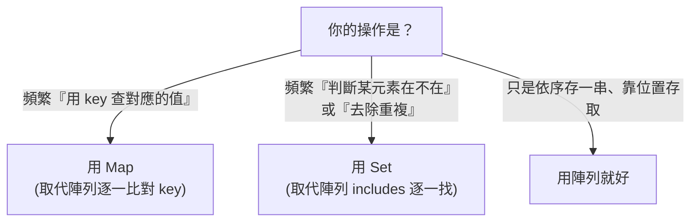

# [dsa-3-3] TypeScript 的 `Map` 與 `Set`：內建雜湊結構怎麼用、何時用

> **本章目標**：學會實際使用 TypeScript 內建的 `Map`（鍵值對）和 `Set`（集合），並掌握「什麼時候該用它們」的判斷——這是把雜湊知識用在日常的關鍵。

## 你會學到

- `Map`：鍵值對的雜湊結構
- `Set`：不重複元素的集合
- 用 Map/Set 取代「陣列逐一找」的時機
- 常見的實戰用法（去重、計數、查找）

## 概念說明

### Map 與 Set：雜湊表的兩種面貌

[dsa-3-1]、[dsa-3-2] 講了雜湊表的原理。TypeScript 把它包裝成兩個好用的內建結構：

```
Map：「鍵 → 值」的對應（雜湊表的完整形態）
   像字典：用 key 查 value
   例：學號 → 學生資料

Set：「只存 key、不存 value」的集合（雜湊表的簡化形態）
   像一袋「不重複」的東西，只關心「在不在裡面」
   例：記錄「看過哪些 ID」
```

兩者都靠雜湊，所以**查找、插入、刪除都是平均 O(1)**。

### 什麼時候用它們？取代「陣列逐一找」

最重要的判斷——**當你發現自己在「陣列裡逐一找某個東西」時，往往該換成 Map 或 Set**：


```mermaid
graph TB
    Q["你的操作是？"]
    Q -->|"頻繁『用 key 查對應的值』"| MAP["用 Map<br/>(取代陣列逐一比對 key)"]
    Q -->|"頻繁『判斷某元素在不在』<br/>或『去除重複』"| SET["用 Set<br/>(取代陣列 includes 逐一找)"]
    Q -->|"只是依序存一串、靠位置存取"| ARR["用陣列就好"]
```

這張圖是選擇關鍵。看到 `arr.includes(x)`、`arr.find(...)` 在迴圈裡反覆出現（O(n) × 很多次 = 很慢），就是「該換 Set/Map」的訊號——把 O(n) 的查找變成 O(1)。

## 程式碼範例

### Map：用 key 查 value

```typescript
const userAges = new Map<string, number>();

userAges.set("小美", 28);       // 設定 key → value
userAges.set("大明", 35);

console.log(userAges.get("小美"));   // 28（O(1)）
console.log(userAges.has("大明"));   // true
userAges.delete("大明");
console.log(userAges.size);          // 1

// 走訪
for (const [name, age] of userAges) {
  console.log(`${name}: ${age}`);
}
```

說明：`Map` 用 `set`/`get`/`has`/`delete`/`size`。對比用「物件 `{}`」當字典，`Map` 更適合「動態的鍵值對」（key 可以是任何型別、保留插入順序、好取 size）。

### Set：去重與「在不在」

Set 最常見的兩個用途——**去重**和**快速判斷存在**：

```typescript
// 用途一：去除重複
const numbers = [1, 2, 2, 3, 3, 3, 4];
const unique = [...new Set(numbers)];   // [1, 2, 3, 4]
// 一行去重！Set 自動不存重複的

// 用途二：快速判斷「看過沒」
const seen = new Set<number>();
function isFirstTime(id: number): boolean {
  if (seen.has(id)) return false;   // O(1) 判斷存在
  seen.add(id);
  return true;
}
```

說明：`[...new Set(arr)]` 是 TypeScript 去重的經典慣用法。而「用 Set 記住看過的」——還記得 [dsa-1-3] 的 `twoSum_B` 嗎？就是這招「用空間換時間」的實際應用。

### 對比：陣列 vs Set 的效能差

```typescript
// ❌ 慢：陣列 includes 在迴圈裡 → O(n) × n = O(n²)
function hasDuplicates_slow(arr: number[]): boolean {
  const seen: number[] = [];
  for (const x of arr) {
    if (seen.includes(x)) return true;   // includes 是 O(n)！
    seen.push(x);
  }
  return false;
}

// ✅ 快：用 Set → O(1) × n = O(n)
function hasDuplicates_fast(arr: number[]): boolean {
  const seen = new Set<number>();
  for (const x of arr) {
    if (seen.has(x)) return true;        // has 是 O(1)！
    seen.add(x);
  }
  return false;
}
```

說明：兩個函式邏輯一樣，但 `seen.includes`（陣列，O(n)）換成 `seen.has`（Set，O(1)），整體就從 O(n²) 降到 O(n)。**這是「用對資料結構」最常見、最有感的優化之一**——也是面試與實務的高頻技巧。

## 小練習

1. 用 `Map` 寫一個「統計一句話裡每個字出現幾次」的函式（提示：字當 key、次數當 value）。
2. 用 `Set` 一行去除一個陣列裡的重複元素。
3. 把一個「用陣列 + includes 判斷重複」的 O(n²) 函式，改成「用 Set」的 O(n) 版本，說明為什麼變快。

<details>
<summary>參考解答</summary>

**第 1 題：用 `Map` 統計每個字出現幾次**

思路：把每個字當 key、目前的次數當 value。走訪字串時，看這個字在不在 Map 裡——在就把次數 +1，不在就從 1 開始。`get`/`set`/`has` 都是平均 O(1)，所以整體 O(n)（n 是字串長度）。

```typescript
function countChars(text: string): Map<string, number> {
  const counts = new Map<string, number>();
  for (const char of text) {
    // 取現有次數，沒有就當 0，再 +1
    counts.set(char, (counts.get(char) ?? 0) + 1);
  }
  return counts;
}

const result = countChars("banana");
console.log(result.get("a")); // 3
console.log(result.get("n")); // 2
console.log(result.get("b")); // 1
```

小技巧：`counts.get(char) ?? 0` 用 `??`（nullish coalescing）處理「第一次看到、還沒有值」的情況——`get` 回傳 `undefined` 時就當作 0。

**第 2 題：用 `Set` 一行去重**

`Set` 本身就不存重複元素，把陣列丟進 `new Set(...)` 就自動去重，再用展開語法 `[...]` 攤回陣列：

```typescript
const numbers = [1, 2, 2, 3, 3, 3, 4];
const unique = [...new Set(numbers)]; // [1, 2, 3, 4]
```

這是 TypeScript / JavaScript 去重的經典慣用法。

**第 3 題：把 O(n²) 改成 O(n)，並說明為什麼變快**

原本用陣列 + `includes` 判斷重複：

```typescript
// ❌ 慢：O(n²)
function hasDuplicates_slow(arr: number[]): boolean {
  const seen: number[] = [];
  for (const x of arr) {
    if (seen.includes(x)) return true; // includes 是 O(n)
    seen.push(x);
  }
  return false;
}
```

改用 `Set`：

```typescript
// ✅ 快：O(n)
function hasDuplicates(arr: number[]): boolean {
  const seen = new Set<number>();
  for (const x of arr) {
    if (seen.has(x)) return true; // has 是平均 O(1)
    seen.add(x);
  }
  return false;
}
```

**為什麼變快**：兩個版本的邏輯完全一樣——都是「一邊走訪、一邊記住看過的，遇到看過的就代表有重複」。差別只在「判斷看過沒」這一步：

- 陣列的 `includes` 要從頭逐一比對，是 **O(n)**。它被放在迴圈裡（也是 n 次），所以整體 O(n) × n = **O(n²)**。
- `Set` 的 `has` 靠雜湊直接算位址，是**平均 O(1)**。放在迴圈裡就是 O(1) × n = **O(n)**。

也就是說，我們用「多開一個 Set 的空間」換到「查找從 O(n) 降到 O(1)」——這是**用空間換時間**的典型，也是「看到迴圈裡的 `arr.includes` / `arr.find` 就想換成 Set / Map」這個高頻優化訊號的實際應用。

</details>

## 課外讀物

> 雜湊表原理 → 複習 [dsa-3-1]、[dsa-3-2]；用空間換時間 → [dsa-1-3]

> Rust 的對應結構 → **rust 課程 [rust-6-3] HashMap**

> 本 Part 完成！下一步：從線性進化到分支的樹狀結構 → 本書 Part 4
