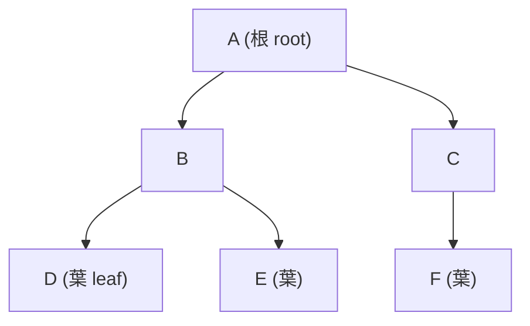
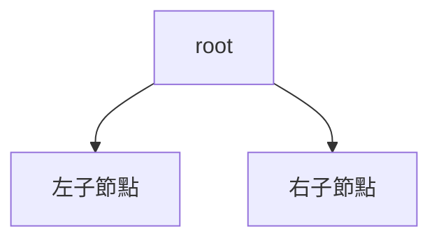

# [dsa-4-1] 樹是什麼：根、節點、葉——階層式結構與術語

> **本章目標**：認識樹這種「階層分支」的資料結構，掌握它的術語，並理解為什麼樹能高效表達「層級關係」與「有序查找」。

## 你會學到

- 樹的結構：從線性到分支
- 樹的核心術語（根、節點、葉、父子、深度）
- 樹在哪裡用到（檔案系統、DOM、決策…）
- 二元樹：最常見的樹

## 概念說明

### 從「一條線」到「分支」

前面的線性結構（陣列、串列、堆疊、佇列）都是「**一條線**」——元素排成一列。但很多資料的本質是「**階層、分支**」的：

```
公司組織：CEO 下有幾個主管，每個主管下有幾個員工
家族族譜：一個人有子女，子女又有子女
檔案系統：資料夾裡有資料夾，裡面又有檔案（cs 課程 Part 5-6）
```

這種「一個東西下面分出好幾個」的結構，用**樹（tree）** 表達最自然。它像一棵**倒過來的樹**——根在最上面，往下分支：



這張圖在說：樹從一個「根」開始，往下分支成多個節點，最底層沒有再分支的叫「葉」。和線性結構不同——**樹的一個節點可以連到「多個」下層節點**。

### 核心術語

學樹要先會這些詞（看著上圖理解）：

```
節點（node）：樹上的每個「點」（A、B、C…）
根（root）：最頂端、唯一的起點（A）
葉（leaf）：沒有再往下分支的節點（D、E、F）
父節點 / 子節點：A 是 B 的父節點，B 是 A 的子節點
邊（edge）：連接父子的線
深度 / 高度：從根到某節點的層數 / 整棵樹的總層數
子樹（subtree）：任一節點與它下面的全部，自成一棵小樹
```

一個關鍵性質：**樹沒有「環」**——你不會繞一圈回到原點，從根往下走永遠是「越走越深」。這讓樹適合表達「階層」與「包含」關係。

### 樹無所不在

樹是超級常用的結構，你天天接觸：

```
檔案系統：資料夾的樹狀結構（cs 課程 Part 5-6）
網頁 DOM：HTML 元素的巢狀結構就是一棵樹（basic 課程）
公司組織圖、分類目錄、家族樹
決策過程：if-else 的分支、遊戲 AI 的決策樹
編譯器的「語法樹」（cs 課程 Part 4-3）
→ 凡是「階層、巢狀、分支」的東西，背後常是樹。
```

### 二元樹：最常見的樹

樹的節點可以有任意多個子節點，但最常用、最重要的是**二元樹（binary tree）**——**每個節點「最多兩個子節點」**（稱為左子節點、右子節點）：



為什麼二元樹特別重要？因為「最多分兩邊」這個限制，剛好能實現一個強大的點子——**「比目標小走左邊、比目標大走右邊」**，讓查找變成像二分搜尋一樣快（O(log n)）。這就是 [dsa-4-3] 的「二元搜尋樹」，也是樹這麼有價值的核心原因。接下來幾章都圍繞二元樹展開。

## 程式碼範例

用 TypeScript 定義一個二元樹節點（和 [dsa-2-3] 的鏈結串列節點很像，只是有兩個「下一個」）：

```typescript
class TreeNode {
  value: number;
  left: TreeNode | null = null;     // 左子節點
  right: TreeNode | null = null;    // 右子節點
  constructor(value: number) {
    this.value = value;
  }
}

// 手動建一棵小樹：
//        10
//       /  \
//      5    15
const root = new TreeNode(10);
root.left = new TreeNode(5);
root.right = new TreeNode(15);
```

說明：每個 `TreeNode` 有 `value` 加上 `left`、`right` 兩個指標（指向子節點或 null）。對比鏈結串列只有一個 `next`，樹節點有「兩個（或多個）方向」——這就是「分支」的來源。（呼應 **rust 課程 [rust-8-1]** 用 `Box` 處理這類遞迴樹狀型別。）

## 小練習

1. 畫一棵小樹表達「你的家族三代」，標出哪個是根、哪些是葉、誰是誰的父/子節點。
2. 說出這些術語的意思：根、葉、父節點、深度。
3. 思考題：為什麼「二元樹（每節點最多兩個子節點）」特別重要？（提示：「比小走左、比大走右」能做什麼？）

## 課外讀物

> 樹的真實應用：檔案系統 → **cs 課程 Part 5-6**；語法樹 → **cs 課程 Part 4-3**

> 樹節點的遞迴型別實作 → **rust 課程 [rust-8-1]：Box**

> 下一步：怎麼「走訪」一棵樹的每個節點 → [dsa-4-2]
