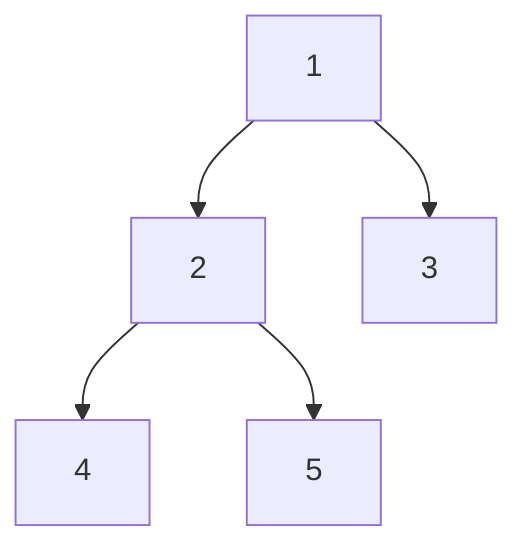

# [dsa-4-2] 二元樹與走訪：前序 / 中序 / 後序 / 層序

> **本章目標**：學會「走訪」一棵樹——用系統化的方式拜訪每個節點，認識前序、中序、後序、層序四種走訪，以及它們各自的用途。

## 你會學到

- 「走訪」是什麼、為什麼樹的走訪比線性複雜
- 三種深度優先走訪：前序、中序、後序
- 層序走訪（廣度優先）
- 各種走訪的用途

## 概念說明

### 走訪：拜訪每個節點

**走訪（traversal）** 就是「**有系統地拜訪樹的每一個節點各一次**」——例如要印出所有值、要搜尋、要計算。

線性結構（陣列）走訪很簡單：從頭到尾一個個來。但樹是**分支**的——到一個節點，它有左右兩個子樹，**先走哪邊？** 不同的選擇，產生不同的走訪順序。主要分兩大類：**深度優先**（先一路往深處走）和**廣度優先**（一層一層走）。

### 深度優先：前序、中序、後序

**深度優先走訪（DFS）**：到一個節點，**先一路鑽到底，再回頭**。依「什麼時候處理『自己』這個節點」分三種：

```
對每個節點，有三件事：處理自己(根)、走左子樹、走右子樹
依「處理自己」的時機不同：
   前序（Pre-order）： 自己 → 左 → 右   （先處理根）
   中序（In-order）：  左 → 自己 → 右   （根在中間）
   後序（Post-order）：左 → 右 → 自己   （最後處理根）
```

以這棵樹為例：



```
前序（自己→左→右）：1, 2, 4, 5, 3
中序（左→自己→右）：4, 2, 5, 1, 3
後序（左→右→自己）：4, 5, 2, 3, 1
```

這三種都是「遞迴」的自然應用（[dsa-6-1]）——處理一個節點，就遞迴地用同樣方式處理它的左右子樹。

### 層序：一層一層走（廣度優先）

**層序走訪（level-order）**，也就是**廣度優先走訪（BFS）**：**不鑽深，而是「一層一層、由上到下、由左到右」拜訪**：

```
上面那棵樹的層序：1（第一層）→ 2, 3（第二層）→ 4, 5（第三層）
即：1, 2, 3, 4, 5
```

層序的實作需要用到**佇列（[dsa-2-6]）**——這是佇列在樹/圖的經典應用（[dsa-5-3] 圖的 BFS 也用它）：

```
層序走訪用佇列：
   把根放進佇列
   重複：從佇列取出一個節點 → 處理它 → 把它的子節點放進佇列
   → 因為佇列「先進先出」，自然就「先進來的（上層的）先處理」
```

### 各種走訪的用途

不同走訪適合不同任務：

| 走訪 | 順序 | 典型用途 |
|------|------|---------|
| 前序 | 自己→左→右 | 「複製一棵樹」、印出階層結構（先處理父再子）|
| **中序** | 左→自己→右 | **對二元搜尋樹（[dsa-4-3]）走中序 → 得到「排序好」的結果！** |
| 後序 | 左→右→自己 | 「刪除/釋放一棵樹」（先處理子再父）、算資料夾總大小 |
| 層序 | 一層層 | 找「最近的」、按層處理（像 BFS 找最短路徑 [dsa-5-3]）|

中序走訪有個漂亮性質值得記住——**對「二元搜尋樹」做中序走訪，會剛好得到由小到大排序的結果**（下一章會看到為什麼）。

## 程式碼範例

用遞迴實作三種深度優先走訪（簡潔優雅）：

```typescript
class TreeNode {
  value: number;
  left: TreeNode | null = null;
  right: TreeNode | null = null;
  constructor(value: number) { this.value = value; }
}

// 中序走訪：左 → 自己 → 右
function inorder(node: TreeNode | null): void {
  if (node === null) return;        // 走到底，停
  inorder(node.left);               // 1. 先走左子樹
  console.log(node.value);          // 2. 處理自己
  inorder(node.right);              // 3. 再走右子樹
}

// 前序：把「處理自己」移到最前；後序：移到最後。就這個差別！
function preorder(node: TreeNode | null): void {
  if (node === null) return;
  console.log(node.value);          // 自己先
  preorder(node.left);
  preorder(node.right);
}
```

說明：注意三種走訪的程式碼**幾乎一樣，只差「`console.log(處理自己)` 那行放哪裡」**——放最前是前序、中間是中序、最後是後序。這展現了遞迴處理樹的優雅（[dsa-6-1] 會深入遞迴）。走訪每個節點各一次，所以複雜度是 **O(n)**。

## 小練習

1. 對這棵樹寫出前序、中序、後序的順序：根 8，左子 3、右子 10，3 的左子是 1、右子是 6。
2. 用自己的話解釋「深度優先」和「廣度優先（層序）」走訪的差別。
3. 思考題：為什麼三種深度優先走訪的程式碼「幾乎一樣，只差一行的位置」？這說明了什麼？

## 課外讀物

> 走訪用到的遞迴 → 本書 [dsa-6-1]；層序用到的佇列 → 複習 [dsa-2-6]

> 廣度優先在圖的應用 → 本書 [dsa-5-3]

> 下一步：讓查找變 O(log n) 的二元搜尋樹 → [dsa-4-3]
