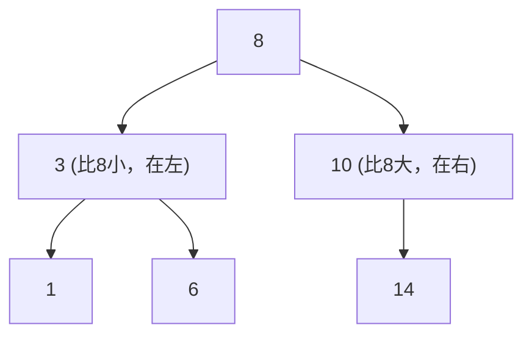
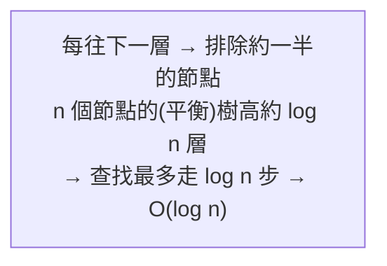

# [dsa-4-3] 二元搜尋樹（BST）：有序的樹，查找為什麼是 O(log n)

> **本章目標**：認識二元搜尋樹——一種「有排序規則」的二元樹，理解它怎麼讓查找、插入像二分搜尋一樣快（O(log n)）。

## 你會學到

- 二元搜尋樹的排序規則
- 為什麼查找是 O(log n)（像二分搜尋）
- 插入怎麼維持規則
- 中序走訪為什麼得到排序結果

## 概念說明

### 一個有規則的二元樹

[dsa-4-1] 的二元樹只是「每節點最多兩個子節點」，沒有特別規則。**二元搜尋樹（BST，Binary Search Tree）** 加上一條關鍵規則，讓它變得超有用：

```
BST 規則：對「每個」節點來說——
   左子樹的所有值，都「比它小」
   右子樹的所有值，都「比它大」
```



這張圖是一棵 BST：根是 8，左邊全是比 8 小的（3,1,6），右邊全是比 8 大的（10,14）。而且這規則對每個節點都成立（3 的左邊 1 比 3 小、右邊 6 比 3 大）。**這個「左小右大」的規則，就是 BST 威力的來源。**

### 為什麼查找是 O(log n)：像二分搜尋

有了「左小右大」，查找一個值就能像 [dsa-0-1] 的二分搜尋一樣——**每一步都能排除一半**：

```
在上面的 BST 找 6：
   從根 8 開始：6 < 8 → 往左走（右邊整個排除！）
   到 3：6 > 3 → 往右走（3 的左邊排除）
   到 6：找到了！
→ 只走了 3 步。每往下一層，就排除了「一整邊的子樹」。
```



這張圖點出關鍵：因為每步排除一半，查找的步數就是「樹的高度」，而一棵「平衡」的 BST 高度約 `log n`——所以查找是 **O(log n)**，和二分搜尋一樣快！插入、刪除也是 O(log n)（都要先找到位置）。

對比一下查找的複雜度：

```
未排序陣列 / 鏈結串列：O(n)（逐一找）
雜湊表：O(1)（但不保持順序！）
BST：O(log n)，而且「保持有序」 ← 這是 BST 相對雜湊表的優勢
```

### 插入：照規則找位置放

插入一個新值，就是「**照查找的方式往下走，走到底（null）就放那裡**」：

```
插入 7 到上面的 BST：
   7 < 8 → 往左到 3
   7 > 3 → 往右到 6
   7 > 6 → 往右，6 的右邊是空的 → 放這裡！
→ 自動維持「左小右大」的規則。
```

### 中序走訪 = 排序結果

還記得 [dsa-4-2] 說「對 BST 中序走訪會得到排序結果」嗎？現在你懂為什麼了——**中序是「左→自己→右」，而 BST 是「左小→自己→右大」**：

```
中序走訪上面的 BST：1, 3, 6, 8, 10, 14
→ 剛好由小到大排序！
因為中序「先走完所有比自己小的，再自己，再比自己大的」，
正好對應 BST 的大小規則。
```

這是個漂亮的性質——**BST 天生就「有序」**，這是它相對雜湊表（無序）的獨特價值。需要「又要快查找、又要保持有序」（例如範圍查詢「找出 5 到 10 之間所有值」）時，BST（或其變體）比雜湊表更適合。

## 程式碼範例

```typescript
class TreeNode {
  value: number;
  left: TreeNode | null = null;
  right: TreeNode | null = null;
  constructor(value: number) { this.value = value; }
}

// 查找：利用「左小右大」，每步排除一半
function search(node: TreeNode | null, target: number): boolean {
  if (node === null) return false;        // 走到底沒找到
  if (target === node.value) return true; // 找到！
  if (target < node.value) {
    return search(node.left, target);     // 比較小 → 往左
  } else {
    return search(node.right, target);    // 比較大 → 往右
  }
}

// 插入：照規則往下走到空位
function insert(node: TreeNode | null, value: number): TreeNode {
  if (node === null) return new TreeNode(value);   // 找到空位，放新節點
  if (value < node.value) {
    node.left = insert(node.left, value);
  } else {
    node.right = insert(node.right, value);
  }
  return node;
}
```

說明：`search` 完美展現「每步往一邊走、排除另一邊」——這就是 O(log n) 的來源。注意它的結構和 [dsa-0-1] 的二分搜尋神似，因為本質相同：**利用「有序」每次砍一半**。

## 小練習

1. 用自己的話說出 BST 的規則（左、右各放什麼）。
2. 對一棵 BST 查找一個值時，為什麼「每往下一層就排除約一半」？這怎麼導致 O(log n)？
3. 思考題：BST 和雜湊表都能快速查找，BST 有什麼雜湊表沒有的優勢？（提示：和「順序」有關。）

## 課外讀物

> 二分搜尋的同源思想 → 複習 [dsa-0-1]、本書 [dsa-6-5]

> 但 BST 有個隱憂（會「退化」）→ 下一章 [dsa-4-4]：為什麼樹要平衡
