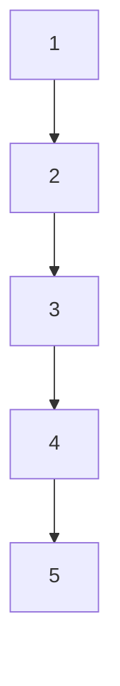
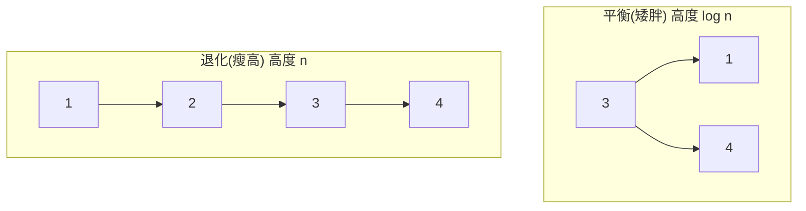

# [dsa-4-4] 為什麼樹要「平衡」：AVL / 紅黑樹的概念（不平衡會退化成串列）

> **本章目標**：理解二元搜尋樹的致命隱憂——「退化」，以及「平衡樹」怎麼解決它，認識 AVL 樹、紅黑樹的核心概念（不需背實作細節）。

## 你會學到

- BST 的隱憂：插入順序不好會「退化」
- 退化後為什麼變回 O(n)
- 「平衡」是什麼、為什麼能保證 O(log n)
- AVL 樹、紅黑樹的概念

## 概念說明

### 隱憂：BST 可能「退化」

[dsa-4-3] 說 BST 查找是 O(log n)——但我特別寫了「**平衡的** BST」。問題來了：**如果插入順序不好，BST 會「退化」成一條線！**

看一個災難案例——**依序插入已排序的 1, 2, 3, 4, 5**：

```
插入 1 → 1 當根
插入 2 → 2 比 1 大，放右邊
插入 3 → 3 比 1、2 都大，一路往右
... 結果：
   1
    \
     2
      \
       3
        \
         4
          \
           5
→ 變成一條「只往右的斜線」！這根本就是個鏈結串列。
```



這張圖在說：最壞情況下，BST 退化成一條線（高度 = n，而非 log n）。這時查找要一個個往下走——**O(log n) 退化成 O(n)**，BST 的優勢全沒了！這是 BST 的致命弱點。

### 解法：保持「平衡」

問題的根源是「**樹長歪了、太高了**」。解法是讓樹保持**平衡（balanced）**——**確保左右子樹的高度不會差太多，整棵樹「矮胖」而非「瘦高」**：

```
不平衡（瘦高）：高度接近 n → 查找 O(n) ✗
平衡（矮胖）：  高度約 log n → 查找 O(log n) ✓
```



這張圖對比：同樣 4 個值，「平衡」的樹矮、查找快；「退化」的樹高、查找慢。**只要保持平衡，就能保證 O(log n)**。

### 平衡樹：會「自我調整」的 BST

怎麼保持平衡？**平衡樹（self-balancing tree）** 在每次插入/刪除後，**自動做一些「旋轉」調整，把長歪的部分扳正**，維持矮胖。兩種著名的平衡樹：

```
AVL 樹：嚴格平衡（左右高度差不超過 1）
   → 查找最快，但插入/刪除時要較多調整
紅黑樹（Red-Black Tree）：較寬鬆的平衡（用「紅黑染色」規則）
   → 平衡稍差但調整較少，插入/刪除更有效率
   → 實務上更常用（很多語言的有序 Map/Set 底層就是紅黑樹）
```

**你不需要背 AVL/紅黑樹怎麼旋轉**——那是進階細節。重點是理解：

```
核心觀念：平衡樹 = 「會自動保持矮胖的 BST」
   → 它犧牲「每次插入多花一點功夫調整」
   → 換來「永遠保證 O(log n)」的查找/插入/刪除
   → 這是個划算的取捨（呼應 dsa-0-3 權衡）
```

### 實務上你會用到它

好消息——**平衡樹通常已經幫你實作好了**：

```
很多語言的「有序」資料結構，底層就是平衡樹（常是紅黑樹）：
   Java 的 TreeMap / TreeSet
   C++ 的 std::map / std::set
   Rust 的 BTreeMap / BTreeSet（rust 課程提過，雖然是 B-tree 變體）
→ 當你需要「保持有序 + 快速查找/範圍查詢」，就用這些。
  你不用自己實作平衡，但理解原理讓你知道「它為什麼能保證高效」。
```

對比一下選擇（呼應 [dsa-3-1] 雜湊表）：

```
要「最快查找、不在乎順序」→ 雜湊表（O(1)，但無序）
要「快速查找 + 保持有序 + 範圍查詢」→ 平衡樹（O(log n)，有序）
→ 各有所長，看你需不需要「順序」。
```

## 範例：退化的真實風險

```
危險情境：你寫了一個 BST，從資料庫「依排序好的順序」一筆筆插入。
   → BST 直接退化成鏈結串列，查找變 O(n)，效能災難！

這就是為什麼「自己手刻的 BST」在實務上很危險——
   你無法控制資料的插入順序，很容易退化。
解法：用語言內建的「平衡樹」結構，它自動保證不退化。
→ 這也呼應 dsa-2-4 的建議：能用內建、可靠的就別自己造輪子。
```

## 小練習

1. 為什麼「依序插入 1,2,3,4,5」會讓 BST 退化？退化後查找變成什麼複雜度？
2. 用「矮胖 vs 瘦高」解釋「平衡」為什麼能保證 O(log n)。
3. 思考題：平衡樹「每次插入要多花功夫調整」，但換來「保證 O(log n)」——為什麼這個取捨通常划算？

## 課外讀物

> BST 的基礎 → 複習 [dsa-4-3]；雜湊表（無序但 O(1)）的對比 → [dsa-3-1]

> 「別自己造輪子、用可靠的內建結構」 → 複習 [dsa-2-4]

> 下一步：另一種特殊的樹——擅長取最大/最小的堆積 → [dsa-4-5]
