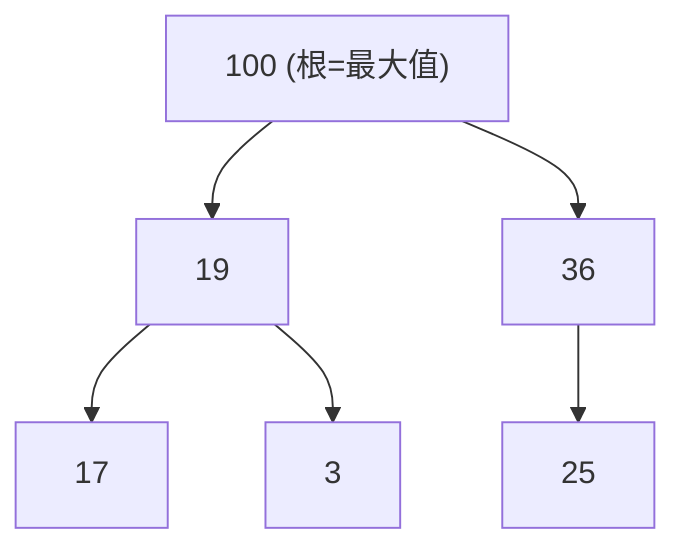

# [dsa-4-5] 堆積（Heap）與優先佇列：總是能快速取出最大/最小

> **本章目標**：認識堆積——一種「總是能 O(1) 看到、O(log n) 取出最大或最小值」的樹狀結構，以及它支撐的「優先佇列」。

## 你會學到

- 堆積解決什麼問題（一直取最大/最小）
- 堆積的規則：父節點總是比子節點大（或小）
- 為什麼取出最值快、加入也快
- 優先佇列與它的應用

## 概念說明

### 問題：一直要取「最大/最小」

有一類需求是「**反覆地取出目前最大（或最小）的東西**」：

```
醫院急診：總是先處理「最嚴重」的病人（不是先到先看）
任務排程：總是先做「優先級最高」的任務
找前 K 大：從一堆數字裡一直取最大的
```

用前面的結構不夠好：排序好的陣列取最大 O(1)，但「插入新元素還要維持排序」是 O(n)；雜湊表根本不管順序。有沒有結構能「**取最值快、插入也快**」？有——**堆積（heap）**。

### 堆積的規則：父大於子（或父小於子）

堆積是一種特殊的二元樹，規則是——**每個父節點都「大於等於」它的子節點**（這叫「最大堆積」），或反過來「小於等於」（「最小堆積」）：



這張圖是一個「最大堆積」：**每個父節點都比子節點大**。注意關鍵性質——**根節點一定是整堆的最大值！**（因為它比子大、子比孫大…層層遞推）。

```
最大堆積：根 = 最大值 → 看最大值是 O(1)（瞧一眼根就好）
最小堆積：根 = 最小值 → 看最小值是 O(1)
```

注意堆積**不像 BST 那樣「左小右大」全排序**——它只保證「父子之間」的大小關係，兄弟之間沒規定。所以堆積「沒有完全排序」，但它對「取最值」這件事做到了極致高效。

### 為什麼取出最值、插入都快（O(log n)）

```
看最大值：直接看根 → O(1)

取出最大值：拿走根後，要「重新整理」讓堆積規則維持
   做法：把最後一個元素移到根，再讓它「往下沉」到對的位置
   → 只需沿著一條路往下調整 → O(log n)

插入新元素：放到最後，再讓它「往上浮」到對的位置
   → 只需沿著一條路往上調整 → O(log n)
```

關鍵在於——調整只沿著「一條從根到葉的路」進行，而樹高是 log n，所以這些操作都是 **O(log n)**。比「維持完全排序」（O(n)）高效多了，因為堆積「只維持必要的秩序」。

### 一個巧妙實作：用陣列存樹

堆積有個漂亮的實作——**用陣列存，不用真的建節點和指標**！因為堆積是「完整的」二元樹（從上到下、從左到右填滿），父子關係能用「索引算」出來：

```
把堆積按層、從左到右放進陣列：
   對索引 i 的節點：
      左子節點在索引 2i+1
      右子節點在索引 2i+2
      父節點在索引 (i-1)/2
→ 用簡單的算式就能在「父子」間跳轉，不用指標！
  又省空間、又快取友善（dsa-2-4）。
```

### 優先佇列：堆積的主要應用

堆積最常用來實作**優先佇列（priority queue）**——一種「**取出時，總是先取出優先級最高的**」的佇列：

```
普通佇列（dsa-2-6）：先進先出（依到達順序）
優先佇列：依「優先級」出（不管到達順序，最重要的先出）
   用堆積實作：插入 O(log n)、取出最高優先 O(log n)
```

優先佇列應用超廣：作業系統的任務排程（[cs 課程 Part 5-3]）、[dsa-5-4] 的 Dijkstra 最短路徑演算法、各種「總是先處理最重要的」場景，都靠它。

## 程式碼範例

概念示意（多數語言要自己實作堆積或用函式庫）：

```typescript
// 概念：一個最小堆積的介面長相
class MinHeap {
  private items: number[] = [];   // 用陣列存（如上述索引技巧）

  peek(): number {                // 看最小值：O(1)
    return this.items[0];         // 根就是最小值
  }

  insert(value: number): void {   // 插入：O(log n)
    this.items.push(value);       // 先放最後
    this.bubbleUp();              // 再「往上浮」到對的位置
  }

  extractMin(): number {          // 取出最小值：O(log n)
    const min = this.items[0];
    this.items[0] = this.items.pop()!;   // 最後一個移到根
    this.bubbleDown();            // 再「往下沉」到對的位置
    return min;
  }
  // bubbleUp / bubbleDown 用上述「索引算父子」沿一條路調整
}
```

說明：重點理解「**peek 看最值 O(1)、insert/extract 是 O(log n)（沿一條路調整）**」這個效能特性，以及「用陣列 + 索引算父子」的巧妙實作。實務上若語言沒內建，常用現成的優先佇列函式庫。

## 小練習

1. 用「醫院急診」的例子，解釋「優先佇列」和「普通佇列」的差別。
2. 為什麼「最大堆積」的根一定是最大值？看最大值為什麼是 O(1)？
3. 思考題：堆積「沒有完全排序」（兄弟間沒規定），為什麼這反而讓它對「取最值」更高效（比維持完全排序快）？

## 課外讀物

> 優先佇列用於 Dijkstra 最短路徑 → 本書 [dsa-5-4]；用於排程 → **cs 課程 Part 5-3**

> 用陣列存樹的「索引算父子」呼應陣列的 O(1) 存取 → 複習 [dsa-2-1]

> 下一步：處理字串的特殊樹——Trie → [dsa-4-6]
