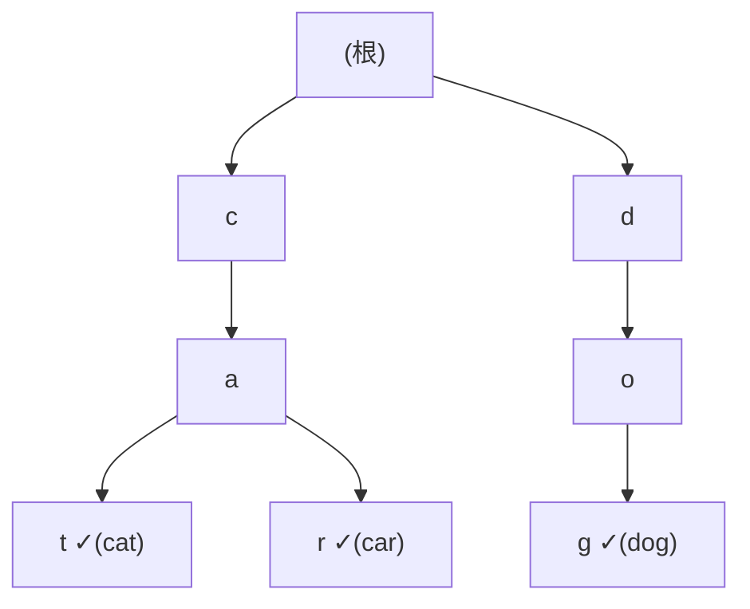

# [dsa-4-6] Trie（字典樹）：處理字串前綴的好朋友

> **本章目標**：認識 Trie——一種專為「字串、前綴」設計的樹，理解它怎麼讓「自動補全、前綴搜尋」變得高效。

## 你會學到

- Trie 解決什麼問題（前綴相關）
- Trie 的結構：用「字元」當路徑
- 為什麼前綴查找這麼快
- Trie 的應用與取捨

## 概念說明

### 問題：前綴相關的查找

有一類需求是關於「**字串的前綴**」：

```
自動補全：你打「prog」，要列出所有以「prog」開頭的詞（program, progress…）
拼字檢查：這個詞在字典裡嗎？
電話簿前綴搜尋：輸入區碼開頭，找符合的號碼
```

用雜湊表（[dsa-3-1]）能查「完整的詞在不在」，但**不擅長「前綴」**——它沒辦法快速找出「所有以某前綴開頭的詞」。這時 **Trie（讀作 "try"，字典樹/前綴樹）** 登場。

### Trie 的結構：字元當路徑

Trie 的核心點子——**不把整個字串存在一個節點，而是「一個字元一個節點」，沿著樹往下拼出字串**：



這張圖是一個存了 "cat"、"car"、"dog" 的 Trie。讀法：**從根沿著字元往下走，拼出單字**。`c→a→t` 拼出 "cat"，`c→a→r` 拼出 "car"。注意關鍵——**"cat" 和 "car" 共用了 "ca" 這段路徑！** 標 ✓ 的節點表示「一個完整單字在此結束」。

### 為什麼前綴查找快

Trie 的威力在前綴操作：

```
查「某個詞在不在」：沿著字元往下走，能走到底且標記 ✓ → 在
   複雜度 O(L)（L = 單字長度），和「字典裡有幾個詞」無關！

找「所有以 prog 開頭的詞」（自動補全的核心）：
   先沿著 p→r→o→g 走到「prog 那個節點」
   然後它「底下的所有分支」就是所有符合的詞！
   → 一次定位，輕鬆列出所有同前綴的詞。
```

```
對比：
   雜湊表查「完整詞」O(1)，但「找所有前綴符合的」要掃全部 → 慢
   Trie：天生就把「同前綴的詞」放在同一條路徑下 → 前綴操作超高效
→ 這就是為什麼搜尋引擎、輸入法的「自動補全」愛用 Trie。
```

### 取捨：空間換前綴效率

Trie 不是免費的——它的取捨是**比較花空間**：

```
每個字元一個節點，每個節點可能有很多子節點（每個可能的下一個字元）
→ 比起把整個字串存在一起，Trie 用了更多節點和指標
→ 用「較多空間」換「高效的前綴操作」（又是空間換時間 dsa-1-3 的味道）
```

所以選擇：

```
只需要「查完整的詞在不在」、不在乎前綴 → 雜湊表（更省空間、O(1)）
需要「前綴搜尋、自動補全、按字典序」 → Trie 是專門工具
```

## 程式碼範例

Trie 節點的概念結構：

```typescript
class TrieNode {
  children: Map<string, TrieNode> = new Map();   // 字元 → 子節點
  isEndOfWord: boolean = false;                  // 是否有單字在此結束
}

class Trie {
  private root = new TrieNode();

  insert(word: string): void {
    let node = this.root;
    for (const char of word) {            // 一個字元一個字元往下
      if (!node.children.has(char)) {
        node.children.set(char, new TrieNode());   // 沒這條路就建
      }
      node = node.children.get(char)!;
    }
    node.isEndOfWord = true;              // 標記單字結束
  }

  // 查詢「是否存在以 prefix 開頭的詞」
  startsWith(prefix: string): boolean {
    let node = this.root;
    for (const char of prefix) {
      if (!node.children.has(char)) return false;   // 走不下去 → 沒有
      node = node.children.get(char)!;
    }
    return true;        // 能走完前綴 → 存在這個前綴
  }
}
```

說明：`insert` 沿字元往下「鋪路」、結尾標記 `isEndOfWord`；`startsWith` 沿前綴走，走得通就代表有這個前綴。每個操作的複雜度是 O(L)（字串長度），和「存了幾個詞」無關——這就是 Trie 對前綴操作的高效。

## 小練習

1. 畫一個存了 "to"、"tea"、"ted"、"in" 的 Trie，標出哪些節點是「單字結束」。
2. 用自己的話解釋：為什麼 Trie 能高效地「找出所有以某前綴開頭的詞」？
3. 思考題：什麼情況該用 Trie 而非雜湊表？什麼情況反過來？（提示：和「需不需要前綴操作」有關。）

## 課外讀物

> Trie 的「空間換時間」取捨 → 複習 [dsa-1-3]；雜湊表的對比 → [dsa-3-1]

> 本 Part 完成！下一步：表達「萬物關係」的圖 → 本書 Part 5
