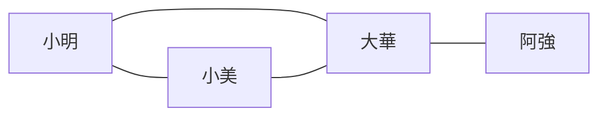
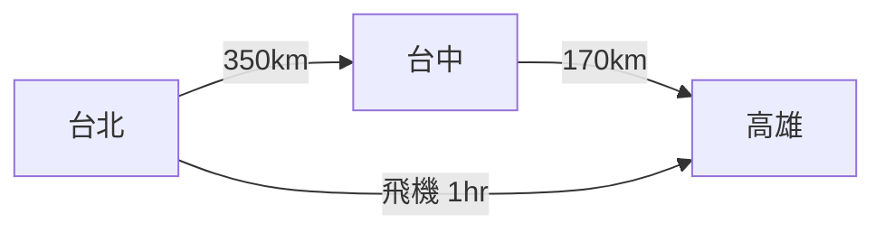

# [dsa-5-1] 圖是什麼：點與邊、有向/無向、加權、與樹的關係

> **本章目標**：認識圖——表達「萬物之間關係」最通用的資料結構，掌握它的術語與分類，理解它和樹的關係。

## 你會學到

- 圖的本質：點（頂點）與邊（關係）
- 有向 vs 無向、加權 vs 無權
- 圖和樹的關係（樹是特殊的圖）
- 圖在真實世界的應用

## 概念說明

### 圖：表達「關係」

前面的樹（[dsa-4-1]）是「階層」結構——有上下、有根。但很多關係**沒有上下之分、可以互相連、甚至成環**：

```
社群網路：你和朋友互相是朋友（沒有誰是「根」）
地圖：城市之間有道路相連，可以繞圈
網頁：網頁之間用連結互指
捷運路線：站點之間有路線連接
```

這種「**一堆東西，彼此之間有各種連接關係**」的結構，用**圖（graph）** 表達。圖由兩個東西組成：

```
頂點（vertex / node）：圖上的「點」（一個人、一個城市、一個網頁）
邊（edge）：連接兩個頂點的「關係」（朋友關係、道路、連結）
```



這張圖在說：四個人（頂點）之間的朋友關係（邊）。和樹不同——**圖沒有「根」，頂點之間可以任意連、可以成環**（小明-小美-大華-小明 繞一圈）。圖是最自由、最通用的結構。

### 圖的分類

圖依「邊的性質」分幾種：

**有向 vs 無向**：

```
無向圖：邊沒有方向，是「雙向關係」
   例：facebook 好友（你是我朋友 ⟺ 我是你朋友）
有向圖：邊有方向（用箭頭），是「單向關係」
   例：instagram 追蹤（你追蹤我 ≠ 我追蹤你）、網頁連結（A 連到 B）
```

**加權 vs 無權**：

```
無權圖：邊就是「有沒有連接」
加權圖：邊上有「數值（權重）」
   例：地圖上城市間的「距離」或「車程」、網路連線的「延遲」
   → 加權圖讓「找最短/最便宜路徑」這類問題成為可能（dsa-5-4）
```



這張圖是一個「有向加權圖」——箭頭表示方向、數字表示權重（距離）。這類圖能回答「從台北到高雄最短路線」這種問題。

### 圖和樹的關係

有趣的是——**樹其實是一種「特殊的圖」**：

```
樹 = 「沒有環、且連通」的圖
   （從根往下、不會繞回來，任兩點間恰好一條路徑）
圖 = 更一般化：可以有環、可以不連通、可以任意連
→ 所以樹是圖的「子集合」。你學過的樹，是圖的一種特例。
```

這也意味著——**圖的走訪方法（[dsa-5-3] 的 BFS/DFS），和樹的走訪是同源的**（樹的走訪其實就是「在特殊的圖上走」）。學過樹，圖會更好上手。

### 圖無所不在

圖是建模真實世界「關係」的終極工具：

```
社群網路（人與關係）、地圖導航（地點與道路）
網際網路（網頁與連結、路由器與線路 cs 課程 Part 6）
推薦系統（用戶與商品的關係）
相依關係（任務 A 要先於 B，編譯/部署順序 dsa-5-5）
→ 凡是「一堆東西 + 它們之間的關係」，就是圖。
```

## 程式碼範例

圖的兩個基本元素，先看怎麼描述（實際儲存方式是 [dsa-5-2] 的主題）：

```typescript
// 概念：一個圖 = 頂點集合 + 邊集合
// 例如用「鄰接串列」表示（每個頂點記著「它連到誰」）

const graph: Map<string, string[]> = new Map();
graph.set("小明", ["小美", "大華"]);    // 小明連到小美、大華
graph.set("小美", ["小明", "大華"]);    // 無向圖：關係是雙向的
graph.set("大華", ["小明", "小美", "阿強"]);
graph.set("阿強", ["大華"]);

// 查「小明的朋友有誰」
console.log(graph.get("小明"));   // ["小美", "大華"]
```

說明：這裡用 `Map` 記錄「每個頂點連到哪些頂點」——這叫「鄰接串列」，是圖最常見的存法（下一章 [dsa-5-2] 詳細比較各種存法）。注意「無向圖」要兩邊都記（小明記小美、小美也記小明）。

## 小練習

1. 用「頂點」和「邊」描述你的社群關係（畫個小圖，幾個朋友互相連）。
2. 判斷這些該用「有向」還「無向」圖：Facebook 好友、Instagram 追蹤、城市間道路、網頁連結。
3. 思考題：為什麼說「樹是一種特殊的圖」？樹比一般的圖多了什麼限制？

## 課外讀物

> 樹（圖的特例）→ 複習 [dsa-4-1]；網路也是圖 → **cs 課程 Part 6-3（路由）**

> 下一步：圖在電腦裡怎麼存 → [dsa-5-2]
