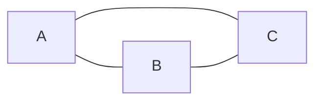
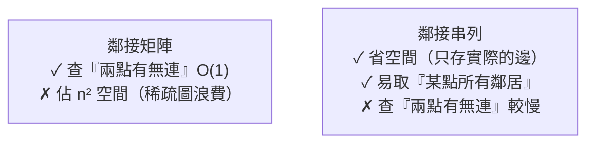

# [dsa-5-2] 圖的表示：鄰接矩陣 vs 鄰接串列（取捨）

> **本章目標**：學會在電腦裡「儲存」一個圖的兩種主要方式——鄰接矩陣與鄰接串列，並理解它們的取捨。

## 你會學到

- 圖怎麼存進電腦
- 鄰接矩陣：用二維表格記「誰連誰」
- 鄰接串列：每個頂點記「它連到誰」
- 兩者的取捨與選用

## 概念說明

### 怎麼把「關係」存起來

[dsa-5-1] 的圖有頂點和邊。但在電腦裡怎麼存「頂點 A 連到頂點 B」這種關係？有兩種主流方法：**鄰接矩陣**和**鄰接串列**。以這個圖為例：



（A 連 B、A 連 C、B 連 C，無向圖）

### 方法一：鄰接矩陣（adjacency matrix）

**鄰接矩陣**用一個「**二維表格**」記錄「任兩個頂點之間有沒有邊」：

```
     A   B   C
   A 0   1   1     ← A 連到 B(1)、C(1)，不連自己(0)
   B 1   0   1     ← B 連到 A、C
   C 1   1   0     ← C 連到 A、B

格子 [i][j] = 1 表示「頂點 i 連到頂點 j」，0 表示不連。
（無向圖的矩陣會對稱；加權圖則存「權重」而非 1）
```

特點：

```
查「A 和 B 有沒有連」→ 直接看 matrix[A][B] → O(1)，超快
但：要 n×n 的空間（不管實際有幾條邊）
   → 頂點多但邊少時（稀疏圖），浪費大量空間存 0
```

### 方法二：鄰接串列（adjacency list）

**鄰接串列**讓「**每個頂點記一個串列，列出它連到誰**」（就是 [dsa-5-1] 程式碼用的方式）：

```
A → [B, C]
B → [A, C]
C → [A, B]

每個頂點配一個串列，存「它的鄰居」。
```

特點：

```
省空間：只存「實際存在的邊」（稀疏圖很省）
查「A 連到哪些」→ 直接看 A 的串列 → 快
但：查「A 和 B 有沒有連」→ 要掃 A 的串列找 B → O(該頂點的鄰居數)
```

### 取捨對照



| | 鄰接矩陣 | 鄰接串列 |
|---|------|------|
| 空間 | O(n²) | O(頂點 + 邊) |
| 查「兩點有無連」 | O(1) | O(鄰居數) |
| 取「某點所有鄰居」 | O(n) | O(鄰居數) |
| 適合 | 稠密圖（邊很多）| **稀疏圖（邊較少，最常見）** |

**怎麼選？** 關鍵看圖「稠密」還「稀疏」：

```
稀疏圖（邊遠少於 n²，大多數真實圖如此）→ 鄰接串列（省空間，最常用）
稠密圖（邊接近 n²，幾乎兩兩相連）或 常查「兩點有無連」→ 鄰接矩陣
→ 實務上「鄰接串列」更常見，因為真實的圖（社群、地圖）大多很稀疏
  （你的朋友數遠少於全世界人數）。
```

## 程式碼範例

```typescript
// 鄰接串列（最常用）：用 Map<頂點, 鄰居陣列>
const adjList = new Map<string, string[]>();
adjList.set("A", ["B", "C"]);
adjList.set("B", ["A", "C"]);
adjList.set("C", ["A", "B"]);

// 取得 A 的所有鄰居：直接拿，很快
console.log(adjList.get("A"));        // ["B", "C"]

// 鄰接矩陣：用二維陣列
// 頂點編號 A=0, B=1, C=2
const adjMatrix = [
  [0, 1, 1],   // A 連 B、C
  [1, 0, 1],   // B 連 A、C
  [1, 1, 0],   // C 連 A、B
];
// 查 A 和 B 有沒有連：直接看，O(1)
console.log(adjMatrix[0][1]);         // 1（有連）
```

說明：兩種表示各有程式上的便利——鄰接串列用 `Map` 自然表達「每個頂點的鄰居」；鄰接矩陣用二維陣列、查連接 O(1)。接下來的圖演算法（[dsa-5-3] 起）大多以**鄰接串列**為基礎，因為走訪時「取某點的所有鄰居」是核心操作，鄰接串列做這個很順。

## 小練習

1. 給一個圖：A-B、A-C、C-D（無向），寫出它的鄰接串列。
2. 同上圖，寫出 4×4 的鄰接矩陣（頂點順序 A,B,C,D）。
3. 思考題：一個「社群網路」有十億用戶，但每人平均只有幾百個朋友——這是稀疏還稠密圖？該用鄰接矩陣還串列？為什麼？

## 課外讀物

> 鄰接串列用到的 Map → 複習 [dsa-3-3]

> 下一步：怎麼「走訪」一個圖——BFS 與 DFS → [dsa-5-3]
