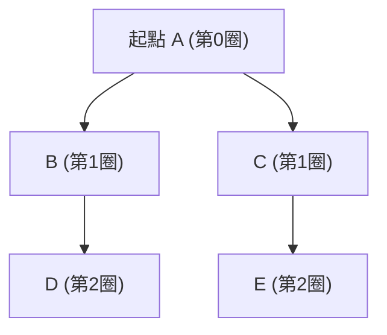
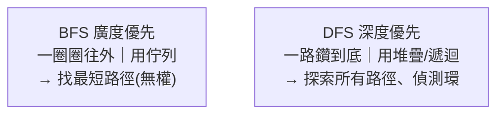

# [dsa-5-3] 圖的走訪：廣度優先（BFS）與深度優先（DFS）

> **本章目標**：學會走訪圖的兩大演算法——廣度優先（BFS）與深度優先（DFS），理解它們的差別、實作，以及各自適合的問題。

## 你會學到

- 圖走訪的挑戰：避免「繞圈重複拜訪」
- 廣度優先（BFS）：一圈一圈往外擴
- 深度優先（DFS）：一路往深處鑽
- 兩者的實作與用途

## 概念說明

### 走訪圖的挑戰：別重複拜訪

走訪圖（拜訪每個頂點）比走訪樹麻煩——因為**圖可能有環**（[dsa-5-1]）！如果不小心，會繞圈圈無限重複拜訪。所以圖走訪的關鍵是——**記住「拜訪過誰」，不重複拜訪**：

```
用一個「visited 集合」（Set，dsa-3-3）記錄拜訪過的頂點
每次要拜訪前先檢查：已經拜訪過了嗎？是 → 跳過
→ 這就避免了在環裡無限繞圈。
```

有了這個前提，兩大走訪策略——BFS 和 DFS——本質和 [dsa-4-2] 樹的層序/深度走訪一脈相承（因為樹是特殊的圖）。

### 廣度優先（BFS）：一圈一圈往外

**廣度優先搜尋（BFS，Breadth-First Search）**：從起點開始，**先拜訪「所有鄰居」，再拜訪「鄰居的鄰居」**——像水波一圈一圈往外擴：



這張圖在說：BFS 先拜訪離起點「最近的一圈」，再往外一圈。它用**佇列（[dsa-2-6]）** 實作（先進先出，自然達成「先進來的先處理」）——這正是佇列的經典應用：

```
BFS 用佇列：
   起點放進佇列、標記已拜訪
   重複：從佇列取出一個 → 把它「還沒拜訪的鄰居」都標記並放進佇列
   → 因為佇列先進先出 → 近的先處理 → 一圈圈往外
```

**BFS 的招牌用途：找「最短路徑」（無權圖）**——因為它「由近到遠」探索，第一次到達某個頂點時，走的一定是「最少步數」的路。

### 深度優先（DFS）：一路鑽到底

**深度優先搜尋（DFS，Depth-First Search）**：從起點，**選一條路一路往深處走到底，走不下去再「回頭」換另一條**——像走迷宮「一路走到撞牆才回頭」：

```
DFS：A → B → D（D 走到底）→ 回頭 → 換 A 的另一條 → C → E
```

DFS 用**堆疊（[dsa-2-5]）** 實作，或更自然地用**遞迴**（[dsa-6-1]，遞迴本身就用呼叫堆疊）：

```
DFS 用遞迴：
   拜訪一個頂點、標記
   對它每個「還沒拜訪的鄰居」→ 遞迴地 DFS 下去
   → 自然形成「一路鑽到底再回頭」
```

**DFS 的招牌用途：探索所有路徑、偵測環、走迷宮、[dsa-5-5] 的拓樸排序**。

### BFS vs DFS



| | BFS | DFS |
|---|-----|-----|
| 順序 | 由近到遠（一圈圈）| 一路到底再回頭 |
| 工具 | 佇列 | 堆疊 / 遞迴 |
| 招牌用途 | 最短路徑（無權圖）| 路徑探索、偵測環、拓樸排序 |

兩者都會拜訪所有可達頂點，複雜度都是 **O(頂點數 + 邊數)**——因為每個頂點和每條邊都處理一次。選哪個看需求：「要最短/最近」用 BFS，「要走遍/找路徑/偵測環」用 DFS。

## 程式碼範例

```typescript
const graph = new Map<string, string[]>([
  ["A", ["B", "C"]],
  ["B", ["A", "D"]],
  ["C", ["A", "E"]],
  ["D", ["B"]],
  ["E", ["C"]],
]);

// BFS：用佇列，一圈圈往外
function bfs(start: string): void {
  const visited = new Set<string>();
  const queue: string[] = [start];
  visited.add(start);

  while (queue.length > 0) {
    const node = queue.shift()!;          // 從佇列前端取出
    console.log(node);
    for (const neighbor of graph.get(node) ?? []) {
      if (!visited.has(neighbor)) {       // 沒拜訪過才處理（避免繞圈）
        visited.add(neighbor);
        queue.push(neighbor);             // 加進佇列尾端
      }
    }
  }
}

// DFS：用遞迴，一路鑽到底
function dfs(node: string, visited = new Set<string>()): void {
  if (visited.has(node)) return;          // 拜訪過就停（避免繞圈）
  visited.add(node);
  console.log(node);
  for (const neighbor of graph.get(node) ?? []) {
    dfs(neighbor, visited);               // 遞迴往深處
  }
}
```

說明：兩者結構相似，核心差別是「**用佇列（BFS，一圈圈）還是遞迴/堆疊（DFS，鑽到底）**」，以及都用 `visited` 集合避免重複拜訪。這兩個演算法是圖論的基石，後面的最短路徑、拓樸排序都建立在它們之上。

## 小練習

1. 用「水波擴散」和「走迷宮撞牆回頭」分別比喻 BFS 和 DFS。
2. BFS 用什麼資料結構？DFS 用什麼？為什麼這樣選能達成各自的走訪順序？
3. 思考題：為什麼圖走訪一定要用 `visited` 集合，但樹走訪（[dsa-4-2]）不用？（提示：和「環」有關。）

## 課外讀物

> BFS 用的佇列 → [dsa-2-6]；DFS 用的堆疊/遞迴 → [dsa-2-5]、[dsa-6-1]

> BFS/DFS 是樹走訪（[dsa-4-2]）在圖上的推廣

> 下一步：加權圖的最短路徑——Dijkstra → [dsa-5-4]
