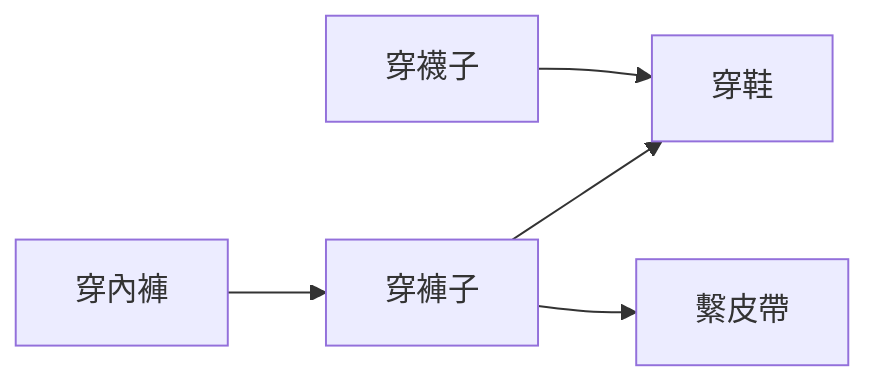

# [dsa-5-5] 拓樸排序：有相依關係的工作怎麼排

> **本章目標**：認識拓樸排序——在「有相依關係」的有向圖上，找出一個「合法的執行順序」，理解它怎麼解決「先做什麼、後做什麼」的問題。

## 你會學到

- 相依關係問題：什麼要先於什麼
- 拓樸排序是什麼
- 為什麼需要「無環」（DAG）
- 真實應用（建置、課程、任務排程）

## 概念說明

### 問題：先後順序的相依

很多事情有「**必須先做完 A，才能做 B**」的相依關係：

```
穿衣服：要先穿襪子，才能穿鞋
修課：要先修完「程式設計入門」，才能修「資料結構」
專案建置：要先編譯模組 A，才能編譯依賴它的模組 B
做菜：要先備料，才能下鍋
```

這些相依關係，可以用**有向圖**（[dsa-5-1]）表達——**箭頭 A → B 表示「A 要先於 B」**。問題是：**怎麼從這些相依關係，排出一個「合法的執行順序」**（任何一件事，都排在它所有的「前置」之後）？這就是**拓樸排序（topological sort）**。


```mermaid
graph LR
    SOCK["穿襪子"] --> SHOE["穿鞋"]
    UNDIES["穿內褲"] --> PANTS["穿褲子"]
    PANTS --> SHOE
    PANTS --> BELT["繫皮帶"]
```

這張圖在說：穿衣有相依（襪子先於鞋、褲子先於鞋和皮帶）。拓樸排序就是要找出一個「合法的穿衣順序」，例如：襪子 → 內褲 → 褲子 → 鞋 → 皮帶（只要每件都在它的前置之後即可，答案可能不只一種）。

### 必須「無環」：DAG

拓樸排序有個前提——**圖必須無環**（沒有循環相依）。這種「有向且無環」的圖叫 **DAG（Directed Acyclic Graph，有向無環圖）**。為什麼必須無環？

```
如果有循環相依：A 要先於 B，B 要先於 C，C 又要先於 A
   → 那到底誰先做？無解！像「先有雞還是先有蛋」的死循環
→ 所以拓樸排序只對「無環」的圖有意義。
  如果排序時發現「排不出來」，就代表「有循環相依」——這本身也是有用的偵測！
```

### 怎麼做拓樸排序

兩種常見方法，都基於 [dsa-5-3] 的圖走訪：

**方法一：找「沒有前置」的先做（Kahn 演算法）**

```
1. 找出所有「沒有任何前置」的頂點（入度為 0）→ 它們可以先做
2. 做掉它們，並「移除它們指出的邊」
   → 這可能讓某些頂點變成「沒有前置」了
3. 重複，直到全部排完
   （如果中途卡住、還有頂點沒排 → 代表有環！）
```

**方法二：用 DFS**

```
對圖做 DFS（dsa-5-3），在「一個頂點的所有後代都處理完」時，
把它加到結果的「最前面」（類似後序走訪的逆序）
→ 自然得到拓樸順序。
```

兩種都是 O(頂點 + 邊)。重點理解「**拓樸排序 = 尊重所有相依關係的線性順序**」，實作細節用到時再查。

### 真實應用

拓樸排序在工程上非常實用，你天天間接用到：

```
建置系統（編譯）：依「模組相依」決定編譯順序
   （rust 的 cargo、各種 build 工具，背後就靠這個決定先編什麼）
套件管理：安裝套件前先裝它依賴的套件（npm、cargo 解依賴順序）
任務排程：有相依的任務，排出執行順序
課程規劃：依先修要求排出修課順序
試算表：儲存格公式的計算順序（A1 依賴 B1，先算 B1）
```

> 你在 **infra / aws 課程**的部署相依、**rust 課程 [rust-7-2]** 的 crate 依賴解析，背後都有拓樸排序的身影。

## 範例：建置專案的順序

```
一個專案有四個模組，相依關係（A→B 表示 B 依賴 A，要先編 A）：
   工具庫 → 資料層 → 業務邏輯 → 介面層
   工具庫 → 業務邏輯（業務也直接用工具庫）

拓樸排序找出合法編譯順序：
   工具庫 → 資料層 → 業務邏輯 → 介面層 ✓
   （每個模組都排在它依賴的模組之後）

→ 這就是 build 工具「知道該先編什麼」的原理。
  如果你不小心造成「循環依賴」（A 依賴 B、B 又依賴 A），
  build 工具會報錯「circular dependency」——正是拓樸排序偵測到了環！
```

## 小練習

1. 用「穿衣服」的例子，自己排出一個合法的拓樸順序。
2. 為什麼拓樸排序要求圖「無環」？有循環相依會發生什麼？
3. 思考題：你看過「circular dependency（循環依賴）」這種錯誤嗎？用拓樸排序的角度，解釋為什麼它無解。

<details>
<summary>參考解答</summary>

**1.**
沿用本章圖裡的相依關係：穿襪子 → 穿鞋、穿內褲 → 穿褲子、穿褲子 → 穿鞋、穿褲子 → 繫皮帶。合法順序的唯一規則是「每一件事都排在它所有前置之後」。一組合法答案：

```
穿內褲 → 穿褲子 → 穿襪子 → 繫皮帶 → 穿鞋
```

檢查每個前置條件都滿足：穿褲子排在穿內褲後 ✓；穿鞋排在穿襪子、穿褲子都之後 ✓；繫皮帶排在穿褲子後 ✓。

要注意的是——**答案不只一種**。因為「穿襪子」和「穿內褲/穿褲子」之間沒有相依關係，它們的先後可以隨意調換。例如下面這個也完全合法：

```
穿襪子 → 穿內褲 → 穿褲子 → 穿鞋 → 繫皮帶
```

只要沒有違反任何一條「A 要先於 B」，就是一個正確的拓樸順序。

**2.**
因為**有環就代表「循環相依」，而循環相依邏輯上無解**。拓樸排序要產生的是「每件事都排在它前置之後」的線性順序，但如果存在一個環，例如 A 要先於 B、B 要先於 C、C 又要先於 A，那麼：

- A 必須排在 C 之後（因為 C 先於 A）；
- C 必須排在 B 之後；
- B 必須排在 A 之後。

推下去會得到「A 要排在 A 自己之後」的矛盾——就像「先有雞還是先有蛋」，沒有任何一件能當「第一個做」的起點。所以拓樸排序只對**無環的有向圖（DAG，Directed Acyclic Graph）** 有意義。

補充一個實用觀點：這個限制反而是個好用的功能。如果你跑拓樸排序（例如用 Kahn 演算法）跑到一半發現「還有頂點沒排，卻再也找不到入度為 0 的點」，那就直接證明了「這張圖有環」——換句話說，**拓樸排序本身就是一種偵測循環相依的工具**。

**3.**
很常見——最典型的就是程式裡兩個模組互相 import：`a.ts` 需要 `b.ts` 的東西，而 `b.ts` 又需要 `a.ts` 的東西；或是套件管理時，套件 X 依賴 Y、Y 又（間接）依賴回 X。build 工具或打包器這時就會報「circular dependency」。

用拓樸排序的角度看：build 工具想排出一個「編譯 / 載入順序」，讓每個模組都在它依賴的模組**之後**才被處理。這正是在對「模組相依圖」做拓樸排序。但 a↔b 互相依賴形成了一個環——

- 要處理 a，得先處理好 b（a 依賴 b）；
- 要處理 b，又得先處理好 a（b 依賴 a）。

於是找不到任何一個「不依賴別人、可以第一個處理」的模組當起點，排序卡死、無解。這就是為什麼工具只能放棄並報錯，而不是硬排一個順序——因為在有環的圖上，合法的順序根本不存在。解法通常是打破這個環：抽出共用部分成第三個模組、或改變依賴方向，讓相依圖重新變回 DAG。

</details>

## 課外讀物

> 拓樸排序基於圖走訪 → 複習 [dsa-5-3]；DAG 也用於分散式 → **課外讀物 E-13**

> 套件依賴解析 → **rust 課程 [rust-7-2]**；部署相依 → **infra / aws 課程**

> 本 Part 完成！下一步：演算法思維——遞迴與經典策略 → 本書 Part 6
