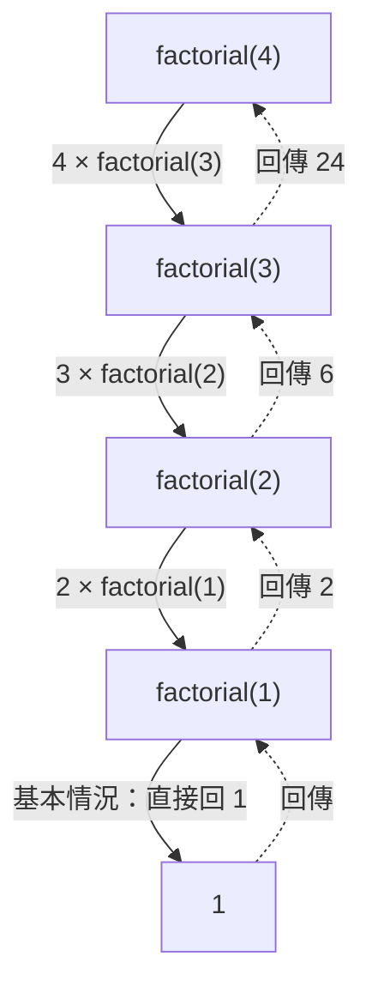

# [dsa-6-1] 遞迴（Recursion）：自己呼叫自己，與呼叫堆疊

> **本章目標**：掌握遞迴——「函式自己呼叫自己」的強大思維，理解它的兩個必備要素，以及它和「呼叫堆疊」的關係。

## 你會學到

- 遞迴是什麼：把問題拆成「更小的同類問題」
- 遞迴的兩個必備要素：基本情況 + 遞迴情況
- 遞迴怎麼用到呼叫堆疊
- 遞迴的優雅與風險

## 概念說明

### 遞迴：自己呼叫自己

**遞迴（recursion）** 是一種解題思維——**把一個問題，拆解成「規模更小的同類問題」，然後函式「自己呼叫自己」來解決那個更小的**，直到小到可以直接回答。

比喻：

```
俄羅斯娃娃：打開一個，裡面是「更小的同款娃娃」，
   一直打開，直到最小的那個（打不開了）。
遞迴：解決一個問題 = 解決「更小的同款問題」+ 一點處理，
   一直縮小，直到「最小、能直接答」的情況。
```

經典例子——算階乘 `n!`（= n × (n-1) × ... × 1）：

```
觀察：n! = n × (n-1)!
   也就是「n 的階乘」= n 乘以「(n-1) 的階乘」
   → 一個問題(n!)變成更小的同類問題((n-1)!)！這就能遞迴。
```

### 兩個必備要素

遞迴一定要有兩個東西，缺一不可：

```
① 基本情況（base case）：「最小、不用再遞迴」的情況，直接回答
   階乘：0! = 1（或 1! = 1）→ 不用再往下，直接回傳
② 遞迴情況（recursive case）：把問題縮小，呼叫自己
   階乘：n! = n × (n-1)!  → 呼叫自己算 (n-1)!
```



這張圖在說：遞迴「往下拆解」到基本情況（factorial(1)=1），再「一層層回傳」算出答案。**最關鍵的是「基本情況」**——它是遞迴的「煞車」。

```
⚠️ 沒有基本情況（或永遠到不了）→ 無窮遞迴 → 一直呼叫自己 → 堆疊爆掉！
   這就是「stack overflow」（dsa-2-5 提過）的常見原因。
```

### 遞迴與呼叫堆疊

還記得 [dsa-2-5] 的「呼叫堆疊」嗎？**遞迴正是呼叫堆疊的極致應用**：

```
每次遞迴呼叫，就在呼叫堆疊上「疊一層」（記住「算到哪、等什麼結果」）
factorial(4) 呼叫 factorial(3) → 疊一層
factorial(3) 呼叫 factorial(2) → 再疊一層
...到基本情況 → 開始「一層層彈出、回傳」
→ 後呼叫的先返回（後進先出）——完全是堆疊的行為！
```

這也解釋了遞迴的風險——**遞迴太深，呼叫堆疊會堆爆（stack overflow）**。所以遞迴雖優雅，但對「很深」的問題要小心（或改用迴圈/其他方法）。

### 遞迴的優雅

遞迴的價值在於——**對「本質上會分解成同類子問題」的問題，遞迴的程式碼極其簡潔優雅**：

```
樹的走訪（dsa-4-2）：處理一個節點 = 處理它 + 遞迴處理左右子樹
圖的 DFS（dsa-5-3）：拜訪一個點 = 標記 + 遞迴拜訪鄰居
分治、DP、回溯（本 Part 後面）：全都是遞迴的應用
→ 很多漂亮的演算法，骨子裡都是遞迴。
  學會「用遞迴思考」（把問題縮小成同類），是演算法的重要思維。
```

## 程式碼範例

```typescript
// 階乘：經典遞迴
function factorial(n: number): number {
  if (n <= 1) return 1;              // ① 基本情況：煞車
  return n * factorial(n - 1);       // ② 遞迴情況：呼叫自己（更小的）
}
console.log(factorial(4));           // 24

// 費氏數列：另一個經典（但有效率問題，dsa-6-7 會優化）
function fib(n: number): number {
  if (n <= 1) return n;              // 基本情況：fib(0)=0, fib(1)=1
  return fib(n - 1) + fib(n - 2);    // 遞迴：拆成兩個更小的
}
console.log(fib(6));                 // 8

// 對比：用遞迴 vs 迴圈算階乘
function factorialLoop(n: number): number {
  let result = 1;
  for (let i = 2; i <= n; i++) result *= i;   // 迴圈版
  return result;
}
```

說明：注意遞迴版 `factorial` 多簡潔——一個基本情況 + 一行遞迴。費氏數列 `fib` 也很優雅，但它有個隱藏的效率災難（重複計算），這正是 [dsa-6-7] 動態規劃要解決的。遞迴和迴圈常可互換，各有適合的場景。

## 小練習

1. 用「俄羅斯娃娃」解釋遞迴，並說出遞迴必備的兩個要素。
2. 寫一個遞迴函式 `sum(n)` 算 `1 + 2 + ... + n`（提示：sum(n) = n + sum(n-1)，基本情況 sum(0)=0）。
3. 思考題：如果一個遞迴函式「忘了寫基本情況」，會發生什麼？這和 [dsa-2-5] 的哪個概念有關？

## 課外讀物

> 遞迴與呼叫堆疊、堆疊溢位 → [dsa-2-5]、**cs 課程 Part 5-2**、**rust 課程 [rust-2-1]**

> 遞迴在樹/圖的應用 → 複習 [dsa-4-2]、[dsa-5-3]

> 下一步：遞迴的威力應用——分治法 → [dsa-6-2]
