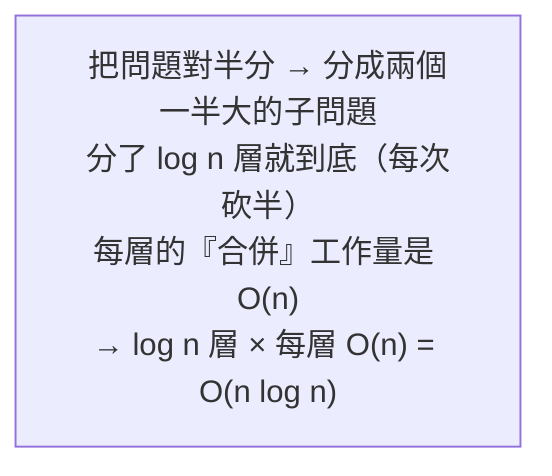

# [dsa-6-2] 分治法（Divide and Conquer）：大問題拆成小問題

> **本章目標**：認識分治法——「把大問題分成小問題、各自解決、再合併」的強大策略，理解它為什麼能讓很多問題變高效。

## 你會學到

- 分治法的三個步驟
- 它和遞迴的關係
- 為什麼分治常能達到 O(n log n)
- 經典的分治演算法

## 概念說明

### 分而治之

**分治法（Divide and Conquer）** 是一種解題策略，核心是「**分而治之**」——把一個大問題，**拆成幾個規模較小的同類子問題**，分別解決，再把結果**合併**成大問題的答案。三個步驟：

```
① 分（Divide）：把大問題拆成幾個更小的同類子問題
② 治（Conquer）：遞迴地解決每個子問題（小到能直接解就直接解）
③ 合（Combine）：把子問題的答案合併成原問題的答案
```

比喻：

```
數一大疊鈔票：
   一個人從頭數到尾很慢（O(n)，但常數大、易出錯）
   分治：分成幾疊，找幾個人各數一疊（分 + 治），最後加總（合）
   → 把大任務拆小、分頭處理、再合併
```

分治和遞迴（[dsa-6-1]）是天生一對——**「治」那一步通常就是遞迴地對子問題再用分治**，直到子問題小到能直接解（基本情況）。

### 為什麼分治常常高效

分治的威力在於——**很多問題用分治，能從 O(n²) 降到 O(n log n)**。直覺是：



這張圖點出分治達到 O(n log n) 的原因：「對半分」讓層數是 `log n`（呼應二分搜尋 [dsa-0-1] 的砍半），每層處理 O(n)，相乘就是 O(n log n)。這比樸素的 O(n²) 好太多——這就是為什麼高效排序（[dsa-6-4]）都用分治。

### 經典分治演算法

你已經見過或即將見到好幾個分治的例子：

```
二分搜尋（dsa-0-1, 6-5）：把搜尋範圍對半分，只往一半找
   （嚴格說是「減治」——只處理一半，不用合併，但精神相通）

合併排序（merge sort, dsa-6-4）：
   分：把陣列對半切成兩半
   治：遞迴排序每一半
   合：把兩個「已排序的半」合併成一個排序好的整體
   → 經典分治，O(n log n)

快速排序（quick sort, dsa-6-4）：也是分治
```

合併排序是最純粹的分治範例，[dsa-6-4] 會詳講。

## 程式碼範例

用分治算「陣列總和」（教學示範分治結構，實際求和用迴圈更簡單）：

```typescript
function sumDivideConquer(arr: number[], left: number, right: number): number {
  // 基本情況：只剩一個元素，直接回傳
  if (left === right) return arr[left];

  // ① 分：找中點，分成左右兩半
  const mid = Math.floor((left + right) / 2);

  // ② 治：遞迴解決左右兩半
  const leftSum = sumDivideConquer(arr, left, mid);
  const rightSum = sumDivideConquer(arr, mid + 1, right);

  // ③ 合：合併兩半的結果
  return leftSum + rightSum;
}

const arr = [1, 2, 3, 4, 5, 6, 7, 8];
console.log(sumDivideConquer(arr, 0, arr.length - 1));   // 36
```

說明：這清楚展示分治三步驟——分（找 mid 切兩半）、治（遞迴算左右）、合（相加）。雖然求和用這個是殺雞用牛刀，但它讓你看清分治的「骨架」。把這個骨架套到「排序」「找最大子陣列」等問題，就成了強大的演算法。

> 分治很適合「平行化」——子問題互相獨立，能分給不同 CPU 核心同時算（呼應 cs 課程 Part 5-3 平行、rust 課程並行）。這是分治的另一個現代優勢。

## 小練習

1. 說出分治法的三個步驟，並用「數一大疊鈔票」的例子對應它們。
2. 為什麼分治常能達到 O(n log n)？（提示：對半分 → 幾層？每層多少工作？）
3. 思考題：為什麼分治法「很適合用遞迴實作」？（提示：「治」那步在做什麼？）

## 課外讀物

> 分治用到的遞迴 → [dsa-6-1]；對半分的同源思想 → 二分搜尋 [dsa-0-1]

> 分治的經典應用——合併排序、快速排序 → [dsa-6-4]

> 分治適合平行化 → **cs 課程 Part 5-3**、**rust 課程 Part 8（並行）**

> 下一步：排序演算法（上）——O(n²) 家族 → [dsa-6-3]
