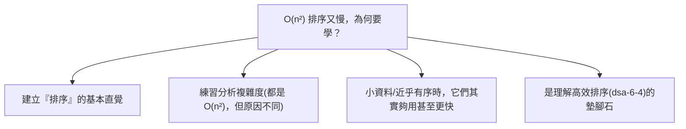

# [dsa-6-3] 排序（上）：氣泡、選擇、插入——O(n²) 家族與它們的意義

> **本章目標**：認識三個最基礎的排序演算法，理解它們的原理與為什麼是 O(n²)，以及「雖然慢但值得學」的原因。

## 你會學到

- 為什麼排序這麼重要
- 氣泡排序、選擇排序、插入排序的原理
- 為什麼它們都是 O(n²)
- 這些「慢」演算法的學習價值

## 概念說明

### 為什麼排序重要

**排序（sorting）**——把一堆資料「由小到大（或大到小）排好」——是電腦最常做的事之一。為什麼重要？

```
排序好之後，很多事變簡單又快：
   二分搜尋（dsa-0-1）：必須先排序才能用，O(log n) 查找
   找最大/最小/中位數、找重複、合併資料… 都更容易
→ 「先排序」常是解決問題的第一步。
  所以排序演算法被研究得極透徹，是 DSA 的核心主題。
```

這一章先看三個「基礎但較慢（O(n²)）」的排序，下一章看「高效（O(n log n)）」的。

### 氣泡排序（Bubble Sort）

**氣泡排序**：反覆地「比較相鄰兩個，順序不對就交換」，讓大的元素像氣泡一樣「浮」到尾端：

```
原理：一輪輪掃過陣列，每次比較相鄰兩個、不對就換。
   每跑完一輪，最大的就「浮」到最後面。
   重複 n 輪 → 全部排好。
例：[3,1,2] → 比3,1換→[1,3,2] → 比3,2換→[1,2,3] ...
```

```
為什麼 O(n²)？要跑約 n 輪，每輪比較約 n 次 → n × n = O(n²)
```

氣泡排序最直覺、最好懂，但效率差，實務幾乎不用——它主要是「教學入門」用。

### 選擇排序（Selection Sort）

**選擇排序**：每一輪「從還沒排的部分，選出最小的，放到已排好部分的後面」：

```
原理：
   第 1 輪：從全部找最小的，放第 1 位
   第 2 輪：從剩下的找最小的，放第 2 位
   ...重複，每輪「選一個最小的歸位」
例：[3,1,2] → 選最小1放前→[1,3,2] → 從剩下選最小2→[1,2,3]
```

```
為什麼 O(n²)？要選 n 次，每次找最小要掃約 n 個 → O(n²)
```

### 插入排序（Insertion Sort）

**插入排序**：像「整理手上的撲克牌」——把每張新牌，**插入到前面已排好的牌中正確的位置**：

```
原理：
   把陣列看成「已排序部分」+「未排序部分」
   每次拿未排序的第一個，往前找到對的位置「插進去」
   （前面的元素往後挪，騰出空位）
例：整理 [3,1,2]：3已排好｜拿1插到3前→[1,3]｜拿2插到中間→[1,2,3]
```

```
為什麼 O(n²)？n 個元素要插入，每次插入最壞要往前比/挪約 n 個 → O(n²)
```

插入排序有個優點——**對「幾乎已排好」的資料特別快**（每次插入只要挪一點點，接近 O(n)）。所以它在「小資料」或「近乎有序」的場景其實實用，有些高效排序在小區段也會切換成插入排序。

### 為什麼學這些「慢」演算法？



這張圖回答「為什麼學慢的」：它們是**理解排序、練習複雜度分析的基礎**，且在特定場景（小資料、近乎有序）仍有價值。學會它們，下一章的高效排序會更好懂。

## 程式碼範例

```typescript
// 氣泡排序：相鄰比較、交換
function bubbleSort(arr: number[]): number[] {
  const a = [...arr];
  for (let i = 0; i < a.length; i++) {
    for (let j = 0; j < a.length - 1 - i; j++) {
      if (a[j] > a[j + 1]) {                  // 順序不對
        [a[j], a[j + 1]] = [a[j + 1], a[j]];  // 交換
      }
    }
  }
  return a;
}

// 插入排序：把每個元素插入前面已排好的部分
function insertionSort(arr: number[]): number[] {
  const a = [...arr];
  for (let i = 1; i < a.length; i++) {
    const current = a[i];
    let j = i - 1;
    while (j >= 0 && a[j] > current) {   // 前面比 current 大的往後挪
      a[j + 1] = a[j];
      j--;
    }
    a[j + 1] = current;                  // 插入正確位置
  }
  return a;
}

console.log(bubbleSort([3, 1, 4, 1, 5]));      // [1, 1, 3, 4, 5]
console.log(insertionSort([3, 1, 4, 1, 5]));   // [1, 1, 3, 4, 5]
```

說明：注意這兩個都有「巢狀迴圈」（一個迴圈裡套另一個），這就是 O(n²) 的視覺特徵（呼應 [dsa-1-1]）。看到雙層迴圈掃同一份資料，警鈴就該響起——資料一大會慢。下一章的高效排序會用分治擺脫這個 O(n²)。

## 小練習

1. 用「整理撲克牌」解釋插入排序。
2. 為什麼這三個排序都是 O(n²)？從「迴圈結構」說明（提示：巢狀迴圈）。
3. 思考題：插入排序對「幾乎已經排好」的資料特別快，為什麼？（提示：每次插入要挪動幾個？）

## 課外讀物

> O(n²) 的複雜度分析 → 複習 [dsa-1-1]、[dsa-1-2]

> 下一步：用分治達到 O(n log n) 的高效排序 → [dsa-6-4]
