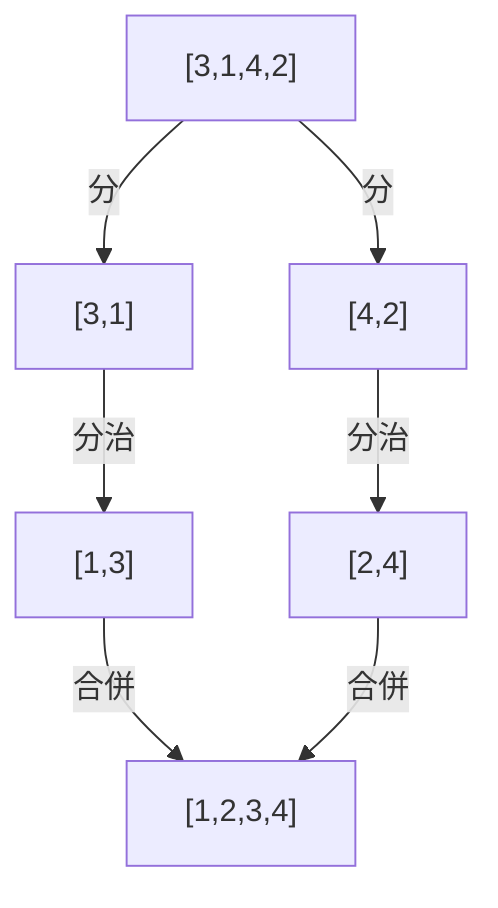

# [dsa-6-4] 排序（下）：合併排序、快速排序——O(n log n) 家族

> **本章目標**：認識兩個高效排序演算法——合併排序與快速排序，理解它們怎麼用分治達到 O(n log n)，以及實務上排序的選擇。

## 你會學到

- 合併排序：純粹的分治，穩定的 O(n log n)
- 快速排序：實務最快，但有最壞情況
- 兩者的取捨
- 實務上你該怎麼排序

## 概念說明

### 用分治突破 O(n²)

[dsa-6-3] 的基礎排序都是 O(n²)，資料一大就慢。這一章的兩個排序用**分治（[dsa-6-2]）** 達到 **O(n log n)**——這是「**基於比較的排序」理論上的最佳等級**。在一百萬筆資料時，O(n log n) 比 O(n²) 快約五萬倍（[dsa-1-2]），差別巨大。

### 合併排序（Merge Sort）：純粹的分治

**合併排序**是分治的教科書範例（[dsa-6-2] 提過）：

```
① 分：把陣列「對半切」成兩半
② 治：遞迴地排序每一半（直到只剩一個元素，天然有序）
③ 合：把「兩個已排序的半」合併成一個排序好的整體
```



這張圖在說：合併排序「對半分到底，再兩兩合併回來」。關鍵是「**合併兩個已排序陣列**」很有效率（兩邊各放一個指標，比較較小的先放進結果，O(n)）。

```
複雜度：分了 log n 層，每層合併共 O(n) → O(n log n)
特點：穩定（相同值保持原順序）、複雜度「保證」O(n log n)（無最壞退化）
   代價：需要 O(n) 額外空間（合併時要暫存）
```

### 快速排序（Quick Sort）：實務最快

**快速排序**是另一種分治，實務上通常**最快**，思路不同——用「基準點」分割：

```
① 選一個「基準（pivot）」元素
② 分割（partition）：把陣列重排成「比 pivot 小的都在左、大的都在右」
   （pivot 歸位到它最終的正確位置）
③ 遞迴：對「左半」和「右半」各自再快速排序
```

```
例：[3,1,4,2] 選 pivot=3
   分割成 → [1,2] 3 [4]  （3 歸位，左邊都比它小、右邊都比它大）
   再遞迴排左邊 [1,2] 和右邊 [4]
```

```
複雜度：
   平均 O(n log n)，而且「常數因子小」→ 實務上通常比合併排序快
   最壞 O(n²)！（如果 pivot 每次都選得很爛，像對已排序資料選第一個當 pivot）
   → 實務用「隨機選 pivot」等技巧，幾乎總能避開最壞情況
特點：原地排序（省空間，不像合併要 O(n) 額外空間）、不穩定
```

注意快速排序的「最壞 O(n²)」——這呼應 [dsa-1-4] 的「最壞 vs 平均情況」：它最壞很糟，但平均很好且實務上極快，所以靠隨機化避開最壞，成為最常用的排序。

### 兩者對照與實務選擇

| | 合併排序 | 快速排序 |
|---|------|------|
| 平均 | O(n log n) | O(n log n) |
| 最壞 | O(n log n) ✓ 保證 | O(n²)（可用隨機化規避）|
| 空間 | O(n) 額外 | O(log n)（原地）|
| 穩定性 | 穩定 | 不穩定 |
| 實務速度 | 快 | 通常更快 |

**實務上你該怎麼排序？答案是——用語言內建的排序就好！**

```typescript
// 別自己手刻排序！語言內建的都是高度優化的 O(n log n)
const arr = [3, 1, 4, 1, 5, 9, 2, 6];
arr.sort((a, b) => a - b);    // 由小到大；TypeScript 內建排序
console.log(arr);             // [1, 1, 2, 3, 4, 5, 6, 9]
```

語言內建的 `sort` 通常是精心優化的混合演算法（例如結合快速排序、合併排序、插入排序的優點）。**你學這些演算法的目的，不是自己重寫，而是：理解內建排序「為什麼是 O(n log n)」、知道「排序的成本」、面試會考、以及培養分治思維。**（呼應 [dsa-2-4] 「用可靠的內建，別造輪子」。）

## 小練習

1. 用自己的話說合併排序的三步驟（分、治、合），重點解釋「合」怎麼有效率。
2. 快速排序的「pivot 分割」在做什麼？為什麼它平均是 O(n log n)？
3. 思考題：快速排序最壞是 O(n²)，為什麼實務上還是最常用的排序之一？（提示：平均表現 + 隨機化規避最壞，呼應 dsa-1-4。）

## 課外讀物

> 分治（兩者的基礎）→ [dsa-6-2]；最壞 vs 平均情況 → [dsa-1-4]；O(n log n) 的意義 → [dsa-1-2]

> 「用內建、別造輪子」 → 複習 [dsa-2-4]

> 下一步：搜尋演算法——線性 vs 二分 → [dsa-6-5]
