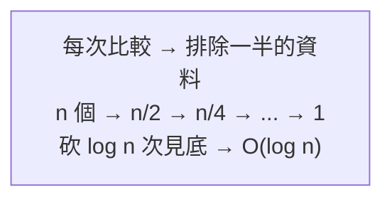

# [dsa-6-5] 搜尋：線性搜尋 vs 二分搜尋（為什麼二分要先排序）

> **本章目標**：完整理解兩種基本搜尋——線性搜尋與二分搜尋，搞懂二分搜尋的威力與它的前提，把全書多次提到的二分搜尋徹底講清楚。

## 你會學到

- 線性搜尋：最簡單的逐一找
- 二分搜尋：每次砍一半的 O(log n)
- 為什麼二分搜尋「必須先排序」
- 搜尋與排序的關係

## 概念說明

### 線性搜尋：逐一找

**線性搜尋（linear search）** 是最直覺的搜尋——**從頭到尾一個個檢查，直到找到（或找完）**：

```
在 [3, 1, 4, 1, 5] 找 4：
   看 3 → 不是 → 看 1 → 不是 → 看 4 → 找到！
最壞情況：目標在最後或不存在 → 看完全部 → O(n)
```

線性搜尋的優點是**簡單、且不需要資料排序**（任何順序都能找）。缺點是慢（O(n)）。當資料沒排序、或資料量小，線性搜尋就夠了。

### 二分搜尋：每次砍一半

**二分搜尋（binary search）** 是這門課從 [dsa-0-1] 就反覆提到的明星——**對「已排序」的資料，每次看中間、排除一半**：

```
在「已排序」的 [1, 3, 5, 7, 9, 11] 找 7：
   看中間 5 → 7 > 5 → 目標在右半（左半全排除！）
   看右半中間 9 → 7 < 9 → 在 9 的左邊
   看 7 → 找到！
   → 6 個元素只看了 3 次。每次排除一半 → O(log n)
```



這張圖點出二分搜尋 O(log n) 的本質：每次砍一半。一百萬筆資料，二分搜尋只要約 20 次（[dsa-0-1] 算過）——比線性搜尋的一百萬次快五萬倍。

### 關鍵前提：必須先排序！

二分搜尋有個**絕對前提**——**資料必須「已排序」**。為什麼？

```
二分搜尋的每一步靠「看中間值，判斷目標在左半還右半」
   這個判斷成立的前提是「左邊都比中間小、右邊都比中間大」= 已排序！
如果資料沒排序：
   看中間值，根本無法判斷目標在哪半 → 二分搜尋失效、會找錯
→ 所以「沒排序的資料」不能用二分搜尋，只能線性搜尋。
```

這就是為什麼「搜尋」和「排序」關係密切——**想用快速的二分搜尋，得先付出排序的成本**。這帶出一個重要的權衡：

```
只搜尋一次：直接線性搜尋 O(n)，別為了二分特地排序（排序要 O(n log n)，更貴）
要搜尋很多次：先排序一次 O(n log n)，之後每次都二分 O(log n)
   → 排序的成本被「很多次快速搜尋」攤平，非常划算
```

這呼應 [dsa-4-3] 的二元搜尋樹、[dsa-3-1] 的雜湊表——它們都是「**用某種預先組織（排序/建樹/雜湊），換取之後快速的查找**」。

### 三種查找方式總覽

把全書的查找方式整理一下：

| 方式 | 複雜度 | 前提 | 特點 |
|------|--------|------|------|
| 線性搜尋 | O(n) | 無 | 最簡單，資料不用排序 |
| 二分搜尋 | O(log n) | **資料已排序** | 快，但要先排序 |
| 二元搜尋樹（[dsa-4-3]）| O(log n) | 維持樹結構 | 快又保持有序 |
| 雜湊表（[dsa-3-1]）| O(1) | 建雜湊表 | 最快，但無序 |

**選擇看需求**：要最快且不在乎順序 → 雜湊表；要快又要有序 → BST；資料已排序的陣列 → 二分搜尋；簡單或小資料 → 線性搜尋。

## 程式碼範例

```typescript
// 線性搜尋：逐一找，不需排序
function linearSearch(arr: number[], target: number): number {
  for (let i = 0; i < arr.length; i++) {
    if (arr[i] === target) return i;
  }
  return -1;
}

// 二分搜尋：必須「已排序」，每次砍一半
function binarySearch(sortedArr: number[], target: number): number {
  let low = 0;
  let high = sortedArr.length - 1;
  while (low <= high) {
    const mid = Math.floor((low + high) / 2);
    if (sortedArr[mid] === target) return mid;       // 找到
    else if (sortedArr[mid] < target) low = mid + 1;  // 在右半
    else high = mid - 1;                              // 在左半
  }
  return -1;       // 沒找到
}

console.log(binarySearch([1, 3, 5, 7, 9], 7));   // 3
console.log(linearSearch([5, 3, 9, 1], 9));      // 2（不用排序）
```

說明：對比兩者——線性搜尋一個迴圈逐一看（O(n)）；二分搜尋用 `low`/`high` 夾逼、每次取中點砍半（O(log n)），但**輸入必須是 `sortedArr`（已排序）**。這個 `binarySearch` 就是 [dsa-0-2] 出現過的那段，現在你完全理解它了。

## 小練習

1. 為什麼二分搜尋「必須先排序」？如果資料沒排序硬用二分會怎樣？
2. 什麼情況「值得先排序再二分」，什麼情況「直接線性搜尋就好」？（提示：搜尋幾次？）
3. 思考題：二分搜尋、二元搜尋樹、雜湊表都能快速查找，它們各自的「前提/代價」和「是否保持順序」是什麼？

## 課外讀物

> 二分搜尋的同源結構 → BST [dsa-4-3]、雜湊表 [dsa-3-1]；砍半 = O(log n) → [dsa-1-2]

> 排序（二分的前提）→ [dsa-6-3]、[dsa-6-4]

> 下一步：每步選當下最好的貪婪法 → [dsa-6-6]
