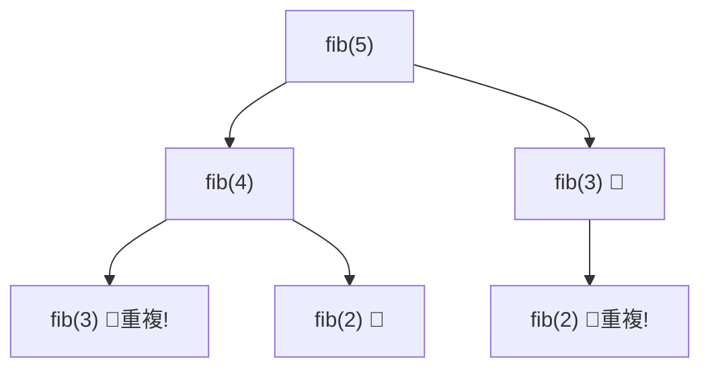

# [dsa-6-7] 動態規劃（DP）：記住算過的子問題，別重複算（從費氏數列入門）

> **本章目標**：認識動態規劃——「把子問題的答案記住、避免重複計算」的強大技巧，用費氏數列的例子直觀感受它怎麼把指數級暴力法變成線性。

## 你會學到

- 樸素遞迴的「重複計算」災難
- 動態規劃的核心：記住子問題答案
- 記憶化（top-down）vs 表格法（bottom-up）
- DP 適合的問題特徵

## 概念說明

### 問題：樸素遞迴的重複計算災難

還記得 [dsa-6-1] 的費氏數列遞迴嗎？`fib(n) = fib(n-1) + fib(n-2)`。它很優雅，但藏著一個**效率災難**——**大量重複計算**：

```
算 fib(5) 時的呼叫：
   fib(5) = fib(4) + fib(3)
   fib(4) = fib(3) + fib(2)     ← fib(3) 又要算一次！
   fib(3) = fib(2) + fib(1)     ← fib(2) 算好多次！
   ...
→ 同一個 fib(2)、fib(3) 被「重複算了無數次」
  fib(n) 的樸素遞迴是 O(2ⁿ)——指數級！fib(50) 就要算到天荒地老。
```



這張圖在說：`fib(3)`、`fib(2)` 在不同分支被**重複計算**——這是樸素遞迴的巨大浪費，導致指數級的慢。

### 動態規劃：記住算過的

**動態規劃（DP，Dynamic Programming）** 的核心點子超簡單——**把「算過的子問題答案」記下來，下次需要時直接拿，不重算**：

```
fib(2) 算過一次 → 記在表裡 → 下次要 fib(2) 直接查表，不再遞迴
→ 每個 fib(k) 只算「一次」
→ O(2ⁿ) 瞬間降到 O(n)！從「天荒地老」變「瞬間完成」
```

這正是 [dsa-1-3]「用空間換時間」的極致應用——**用一點記憶體（存子問題答案），換取免去大量重複計算**。也呼應「快取」的思想（記住結果避免重算）。

### 兩種實作風格

DP 有兩種寫法：

**① 記憶化（Memoization，top-down 由上而下）**：保留遞迴的寫法，但**加一個「備忘錄」存算過的結果**：

```
還是遞迴 fib(n)，但算之前先查備忘錄：
   有記錄 → 直接回傳
   沒記錄 → 算出來、存進備忘錄、再回傳
→ 遞迴的優雅 + 不重複算的高效
```

**② 表格法（Tabulation，bottom-up 由下而上）**：不用遞迴，**從最小的子問題開始，一步步往上填表**：

```
建一個表，從 fib(0)、fib(1) 開始，
   依序算 fib(2)=fib(1)+fib(0)、fib(3)=fib(2)+fib(1)...一路填到 fib(n)
→ 沒有遞迴、沒有重複，直接 O(n)
```

兩種都把 O(2ⁿ) 變 O(n)，選哪個看個人偏好與問題（記憶化保留遞迴直覺，表格法避免遞迴的堆疊開銷）。

### DP 適合什麼問題

DP 不是萬用的，它適合有這兩個特徵的問題：

```
① 重疊子問題：問題會反覆用到「相同的子問題」（像 fib 反覆用 fib(k)）
   → 才有「記住來避免重算」的價值
② 最優子結構：大問題的最優解，能由子問題的最優解組合出來
→ 符合這兩點 → DP 大顯身手
   經典 DP 問題：最長共同子序列、背包問題、最短編輯距離、找零錢最優解…
```

還記得 [dsa-6-6] 貪婪在 `[1,3,4]` 找零會出錯嗎？**那個問題用 DP 就能得到真正的最優解**——因為 DP 會「考慮所有子問題的組合」，不像貪婪只看眼前。DP 是比貪婪更全面（但更花空間/時間）的策略。

## 程式碼範例

```typescript
// 樸素遞迴：O(2ⁿ)，慢到爆（fib(50) 會卡很久）
function fibSlow(n: number): number {
  if (n <= 1) return n;
  return fibSlow(n - 1) + fibSlow(n - 2);   // 大量重複計算！
}

// DP 記憶化（top-down）：加備忘錄，O(n)
function fibMemo(n: number, memo= new Map<number, number>()): number {
  if (n <= 1) return n;
  if (memo.has(n)) return memo.get(n)!;     // 算過 → 直接拿
  const result = fibMemo(n - 1, memo) + fibMemo(n - 2, memo);
  memo.set(n, result);                      // 記住，避免重算
  return result;
}

// DP 表格法（bottom-up）：從小往大填表，O(n)
function fibTable(n: number): number {
  if (n <= 1) return n;
  const dp = [0, 1];
  for (let i = 2; i <= n; i++) {
    dp[i] = dp[i - 1] + dp[i - 2];          // 用前面算好的，直接填
  }
  return dp[n];
}

console.log(fibTable(50));    // 瞬間算出，fibSlow(50) 則要等很久
```

說明：三個版本算同樣的費氏數列，但 `fibSlow` 是 O(2ⁿ)（重複計算），兩個 DP 版本是 O(n)。差別只在「**有沒有把算過的記下來**」——這一個小改變，讓 fib(50) 從「卡死」變「瞬間」。這就是動態規劃的威力，也是面試最愛考的主題之一。

## 小練習

1. 用「fib(5) 的呼叫圖」解釋為什麼樸素遞迴有「重複計算」的浪費。
2. 動態規劃怎麼解決重複計算？它和 [dsa-1-3]「用空間換時間」、和「快取」有什麼共同點？
3. 思考題：DP 適合的兩個問題特徵是什麼？為什麼 [dsa-6-6] 貪婪會錯的找零問題，DP 能找到最優解？

## 課外讀物

> 用空間換時間 → [dsa-1-3]；遞迴 → [dsa-6-1]；貪婪的對比 → [dsa-6-6]

> 「記住結果避免重算」的快取思想 → **快取課程**、**rust 課程 [rust-6-4]（memoization）**

> 下一步：走不通就退回的回溯法 → [dsa-6-8]
