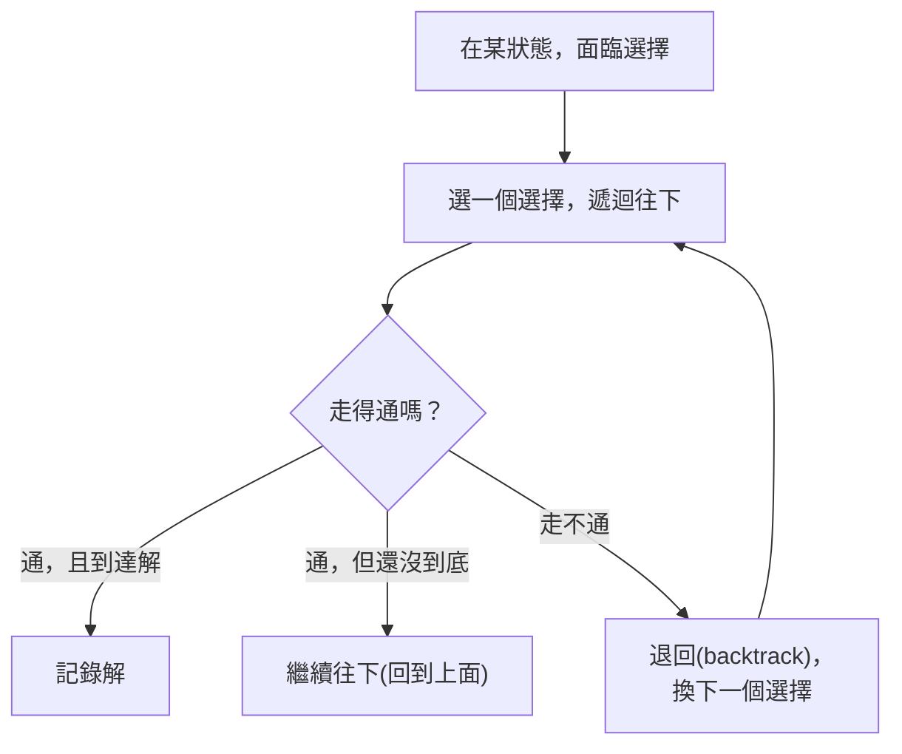

# [dsa-6-8] 回溯法（Backtracking）：走不通就退回（從走迷宮、排列組合入門）

> **本章目標**：認識回溯法——「嘗試一條路，走不通就退回換另一條」的系統化試誤策略，理解它怎麼解決「找出所有可能」或「找一個可行解」的問題。

## 你會學到

- 回溯法的核心：嘗試 → 走不通 → 退回 → 換一條
- 它和 DFS、遞迴的關係
- 「剪枝」怎麼讓回溯更高效
- 經典應用（排列組合、數獨、N 皇后）

## 概念說明

### 回溯：系統化的試誤

有一類問題是「**從許多選擇中，找出可行解（或所有解）**」——例如走迷宮、排出所有組合、解數獨。**回溯法（Backtracking）** 是解這類問題的系統化策略：

```
回溯的精神：
   嘗試一個選擇 → 往下走
   如果這條路「走得通」→ 繼續
   如果「走不通」（違反條件、或到死路）→ 「退回（backtrack）」上一步，換另一個選擇
   重複，直到找到解（或試完所有可能）
```

比喻最貼切的是**走迷宮**：

```
走迷宮：
   到一個岔路 → 選一條走
   走到死路 → 退回岔路，換另一條
   一直退一直試，直到走出迷宮
→ 「系統化地嘗試所有路，走不通就退回」——這就是回溯。
```

### 回溯 = DFS + 退回

回溯本質上是 **深度優先搜尋（DFS，[dsa-5-3]）** 的應用——**「一路往深處嘗試」（DFS），加上「走不通就退回上一步」**。它幾乎都用**遞迴（[dsa-6-1]）** 實作，因為遞迴的「呼叫 → 返回」天然對應「嘗試 → 退回」：



這張圖在說回溯的流程：嘗試一個選擇往下，通就繼續、不通就退回換下一個。「退回」是關鍵——它讓你能系統化地探索「所有可能的組合」，不漏掉也不重複。

### 剪枝：讓回溯更聰明

純回溯可能要試「所有組合」（最壞指數級 O(2ⁿ) 或更糟）。讓它變高效的關鍵技巧叫**剪枝（pruning）**——**一旦發現「這條路不可能成功」，就立刻退回，不浪費時間往下試**：

```
例：解數獨時，填了一個數字後立刻檢查「這樣有沒有違反規則」
   違反了 → 馬上退回換一個（剪掉這整條註定失敗的分支）
   而不是「填滿整盤才發現錯」
→ 好的剪枝能砍掉大量註定失敗的嘗試，讓回溯實際上跑得快很多。
```

剪枝就是「及早放棄沒希望的路」，是回溯能實用的關鍵。

### 經典應用

```
排列組合：列出一組元素的所有排列、所有子集合
數獨求解：每格嘗試填數，違反規則就退回
N 皇后問題：在棋盤放皇后使其互不攻擊（經典回溯題）
迷宮尋路：找出走出迷宮的路徑
→ 凡是「需要嘗試多種組合、找可行解或所有解」的問題，回溯都是利器。
```

## 程式碼範例

用回溯列出一個陣列的「所有排列」：

```typescript
function permutations(nums: number[]): number[][] {
  const result: number[][] = [];

  function backtrack(current: number[], remaining: number[]): void {
    // 基本情況：沒有剩餘元素 → current 是一個完整排列
    if (remaining.length === 0) {
      result.push([...current]);
      return;
    }
    // 嘗試每個「還沒用的元素」當下一個
    for (let i = 0; i < remaining.length; i++) {
      current.push(remaining[i]);                          // 嘗試：選這個
      const rest = [...remaining.slice(0, i), ...remaining.slice(i + 1)];
      backtrack(current, rest);                            // 遞迴往下
      current.pop();                                       // 退回：撤銷選擇 ← 回溯的關鍵！
    }
  }

  backtrack([], nums);
  return result;
}

console.log(permutations([1, 2, 3]));
// [[1,2,3],[1,3,2],[2,1,3],[2,3,1],[3,1,2],[3,2,1]] 全部 6 種排列
```

說明：注意那行 `current.pop()`——這就是**「退回（backtrack）」**！選了一個元素往下遞迴探索後，**撤銷這個選擇**，才能乾淨地嘗試下一個。這個「選擇 → 遞迴 → 撤銷」的模式，是回溯法的標準骨架。理解它，數獨、N 皇后等都是同個套路。

## 小練習

1. 用「走迷宮」解釋回溯法的「嘗試 → 走不通 → 退回」。
2. 回溯法和 DFS（[dsa-5-3]）、遞迴（[dsa-6-1]）是什麼關係？
3. 思考題：程式碼裡的 `current.pop()` 為什麼是「回溯的關鍵」？如果忘了它會怎樣？

## 課外讀物

> 回溯建立在 DFS、遞迴之上 → [dsa-5-3]、[dsa-6-1]

> 本 Part 完成！演算法策略大集合（分治/貪婪/DP/回溯）學完了 → 下一步：實戰整合 → 本書 Part 7
