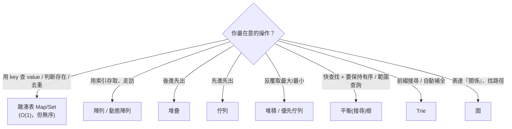

# [dsa-7-1] 怎麼選對資料結構：一張決策圖

> **本章目標**：把全書學的資料結構整合成一張「選擇決策圖」，讓你拿到需求時，能依「最常做的操作」快速選對工具。

## 你會學到

- 選資料結構的核心問題：你最常做什麼操作？
- 各資料結構的「拿手好戲」總整理
- 一張實用的決策流程圖
- 務實的選擇建議

## 概念說明

### 核心問題：你最常做什麼操作？

學完這麼多資料結構，實戰時最重要的能力是——**根據需求選對的那個**。選擇的核心問題只有一個：

> **「在這個問題裡，我『最頻繁、最在意』的操作是什麼？」**

然後選「**最擅長那個操作**」的資料結構。因為沒有「最好的資料結構」，只有「最適合某操作的」（[dsa-2-4] 強調過）。

### 各結構的拿手好戲總整理

把全書的資料結構，依「擅長什麼」整理成一張表：

| 資料結構 | 拿手好戲 | 關鍵複雜度 |
|---------|---------|-----------|
| **陣列 / 動態陣列**（[dsa-2-1,2]）| 索引隨機存取、走訪、快取友善 | 存取 O(1) |
| **鏈結串列**（[dsa-2-3]）| 頻繁在兩端/中間增刪 | 增刪 O(1) |
| **堆疊**（[dsa-2-5]）| 後進先出（撤銷、呼叫堆疊）| push/pop O(1) |
| **佇列**（[dsa-2-6]）| 先進先出（排隊、BFS）| 兩端 O(1) |
| **雜湊表 Map/Set**（[dsa-3]）| 用 key 快速查找、判斷存在、去重 | 查找 O(1) |
| **二元搜尋樹 / 平衡樹**（[dsa-4-3,4]）| 快查找 **且保持有序**、範圍查詢 | O(log n) |
| **堆積 / 優先佇列**（[dsa-4-5]）| 反覆取最大/最小值 | 取最值 O(log n) |
| **Trie**（[dsa-4-6]）| 前綴搜尋、自動補全 | O(字串長) |
| **圖**（[dsa-5]）| 表達關係、找路徑/連通 | 視演算法 |

### 決策流程圖

把上面整理成一張「拿到需求怎麼選」的流程圖：



這張圖是你實戰的「快速查詢手冊」——從「最在意的操作」出發，就能定位到合適的資料結構。多用幾次，這個判斷會變成直覺。

### 幾個常見的判斷要點

```
「要不要保持順序」是個常見分水嶺：
   不在乎順序、只要最快查找 → 雜湊表（O(1)）
   要保持有序、要範圍查詢 → 平衡搜尋樹（O(log n)）

「常在哪裡增刪」決定陣列 vs 鏈結串列：
   主要尾端增刪 + 隨機存取 → 動態陣列
   主要在開頭/中間增刪 → 鏈結串列（但實務上動態陣列因快取友善常仍勝出，dsa-2-4）

「看到自己在陣列裡逐一找」→ 警鈴！考慮換雜湊表（dsa-3-3）
```

### 務實建議

```
① 不確定時，預設用「動態陣列」或「雜湊表」——這兩個覆蓋了日常 90% 需求
   （陣列管「有序序列」、雜湊表管「查找」）
② 用語言內建的結構，別自己造輪子（dsa-2-4、6-4）
③ 先讓它「正確、簡單」地動起來，發現效能問題再針對性換結構（dsa-0-3）
   別過早為了「理論最佳」選複雜結構
```

## 範例：幾個需求的選擇

```
需求 1：記錄「使用者 ID → 使用者資料」，頻繁用 ID 查
   → 雜湊表 Map（O(1) 查找）

需求 2：實作「瀏覽器的上一頁」功能
   → 堆疊（後進先出，最後造訪的先回去）

需求 3：「待辦清單」依優先級處理，總是先做最緊急的
   → 優先佇列 / 堆積（反覆取最高優先）

需求 4：「輸入框自動補全」，依使用者打的前綴建議
   → Trie（前綴搜尋）

需求 5：要存一串資料、常依位置讀取、偶爾尾端新增
   → 動態陣列（索引存取 O(1)、push 攤銷 O(1)）

→ 每個需求，先問「最在意什麼操作」，再對照決策圖選工具。
```

## 小練習

1. 對這些需求各選一個資料結構：(a) 判斷一個 email 有沒有註冊過；(b) 一串待播放的歌曲依序播放；(c) 即時取出分數最高的玩家。
2. 「要不要保持順序」這個問題，怎麼幫你在「雜湊表」和「平衡搜尋樹」之間選擇？
3. 思考題：為什麼這門課一再建議「不確定時預設用動態陣列或雜湊表」？（呼應 [dsa-0-3]、[dsa-2-4]。）

## 課外讀物

> 各資料結構的細節 → 複習 Part 2~5；選擇哲學「夠好勝過最佳」→ [dsa-0-3]

> 下一步：拿到一個新問題，怎麼一步步想出解法 → [dsa-7-2]
