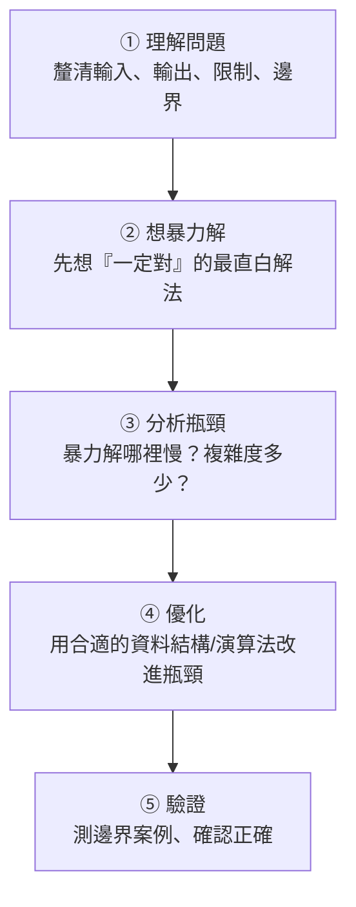

# [dsa-7-2] 解題框架：拿到題目怎麼拆解、怎麼一步步逼近

> **本章目標**：學會一套「拿到陌生問題該怎麼想」的系統化框架——這是比記住任何特定演算法都更有價值的能力，適用於面試、競賽與真實工作。

## 你會學到

- 一套通用的解題步驟
- 為什麼「先暴力解、再優化」是好策略
- 怎麼從問題特徵聯想到合適的工具
- 溝通與驗證的重要性

## 概念說明

### 比演算法更重要的：解題的思維

學完這麼多資料結構與演算法，最有價值的不是「背下每個演算法」，而是**「拿到一個沒看過的問題，知道怎麼下手」**。因為真實問題不會告訴你「請用動態規劃」——你得自己判斷。這一章給你一套框架。

### 五步解題框架



逐步說明：

**① 理解問題**：別急著寫！先確認——輸入是什麼、要輸出什麼、有什麼限制（資料量多大？）、邊界情況（空輸入？重複值？負數？）。**很多錯誤源於「沒搞懂題目就動手」**。面試時這步還包括「問清楚問題、和面試官確認」。

**② 想暴力解（brute force）**：先想出一個「**一定正確、但可能很慢**」的最直白解法。這呼應 [dsa-0-3]「先做對」——**有一個能動的解，遠勝於卡在「想最佳解」**。暴力解也讓你理解問題、有個改進的基準。

**③ 分析瓶頸**：算出暴力解的複雜度（[dsa-1-1]），找出「慢在哪」。是不是有重複計算？是不是在迴圈裡做了 O(n) 的查找（變成 O(n²)）？

**④ 優化**：針對瓶頸，用合適的工具改進。這是把全書知識用上的地方——下面有「聯想表」。

**⑤ 驗證**：用幾組案例測試，**特別測邊界**（空、單一元素、最大/最小、重複）。這些最容易藏 bug（[dsa-0-2] 強調過）。

### 從問題特徵聯想工具

優化時，怎麼知道用什麼？培養「**從問題特徵聯想到工具**」的直覺：

```
看到「在迴圈裡反覆查找/判斷存在」→ 想到雜湊表 Map/Set（把 O(n) 查找變 O(1)）
看到「重複計算相同子問題」→ 想到動態規劃（記住結果，dsa-6-7）
看到「反覆取最大/最小」→ 想到堆積/優先佇列（dsa-4-5）
看到「已排序」或「能排序」→ 想到二分搜尋（dsa-6-5）
看到「找所有組合/可行解」→ 想到回溯（dsa-6-8）
看到「關係、路徑、連通」→ 想到圖 + BFS/DFS（dsa-5）
看到「前綴、自動補全」→ 想到 Trie（dsa-4-6）
看到「能拆成更小的同類問題」→ 想到遞迴/分治（dsa-6-1,2）
```

這張「聯想表」是你解題的武器庫——**把問題特徵當成「線索」，反查該用什麼工具**。

### 一個常見的優化套路：用雜湊表降維

最常見、最有用的優化——**把「在迴圈裡逐一查找」（O(n²)）用雜湊表降成 O(n)**。這在 [dsa-1-3]、[dsa-3-3] 都見過，值得記牢：

```
暴力解常見的 O(n²)：「對每個元素，又掃一遍找另一個」
   for 每個 x：for 每個 y：檢查 x 和 y 的關係  ← O(n²)
優化：「用雜湊表記住看過的，邊掃邊查」
   for 每個 x：查雜湊表(O(1)) 有沒有需要的 → 有就解決，沒有就記下 x
   → O(n)！
這個套路解掉大量「兩數之和」類的問題。
```

## 範例：完整走一遍

```
題目：給一個整數陣列和一個目標值，找出「兩個數加起來等於目標」的索引。

① 理解：輸入陣列+目標，輸出兩個索引；可能無解嗎？有重複值嗎？（先問清楚）
② 暴力解：兩層迴圈，每對都試 → O(n²)，一定對但慢
③ 瓶頸：「對每個數，又掃一遍找『另一半』」這個內層查找是 O(n)
④ 優化：用雜湊表！邊掃邊記，對每個數查「target - 它」在不在表裡
   → 查找變 O(1)，整體 O(n)（這就是上面的降維套路）
⑤ 驗證：測「無解」「有重複值」「剛好頭尾兩個」等邊界

→ 從 O(n²) 到 O(n)，靠的是「辨認瓶頸 + 聯想到雜湊表」。
  這個思考過程，比記住答案重要得多。
```

## 小練習

1. 用自己的話複述五步解題框架。為什麼「先想暴力解」是好策略而非浪費時間？
2. 看到以下特徵，你會聯想到什麼工具：「重複計算子問題」「反覆取最小值」「在迴圈裡查找存在」？
3. 找一個你會的簡單題目（如「找陣列裡的重複元素」），用五步框架走一遍（暴力 → 找瓶頸 → 優化）。

## 課外讀物

> 複雜度分析（找瓶頸）→ [dsa-1-1]；先正確再優化 → [dsa-0-3]；驗證靠測試 → [課外讀物 E-9](../../../課外讀物/E-9-testing/E-9-1-why-test.md)

> 各種工具的聯想 → 複習 Part 2~6 的對應章節

> 下一步：用學到的一切，解一個真實問題 → [dsa-7-3] 整合專案
