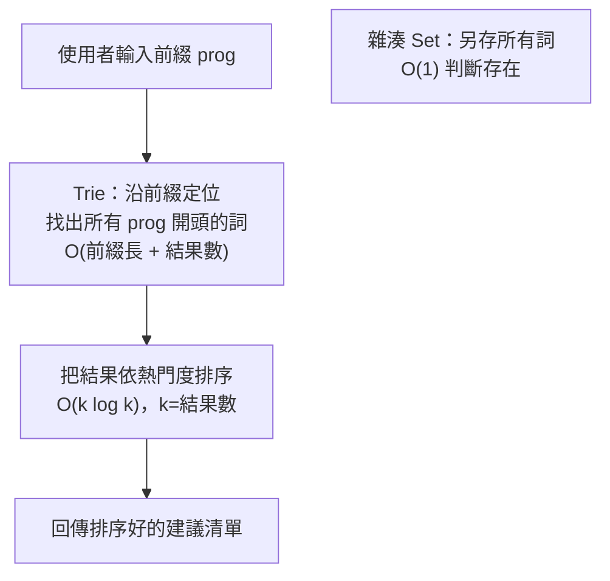

# [dsa-7-3] 🏆 整合專案：用學到的資料結構與演算法，解一個真實問題並分析複雜度

> **本章目標**：把整本書的知識整合起來，從零打造一個「自動補全搜尋系統」——綜合運用多種資料結構與演算法，並完整分析複雜度。這是你的 DSA 畢業專案。

## 你會學到

- 怎麼把多種資料結構組合解決真實問題
- 用解題框架（[dsa-7-2]）拆解需求
- 為每個選擇分析複雜度、說明理由
- 完整體驗「資料結構 + 演算法 = 解決方案」

## 概念說明

### 專案：自動補全搜尋系統

我們要做一個「**搜尋自動補全**」系統（像你在搜尋框打字時跳出的建議），需求：

```
功能需求：
   1. 載入一批詞彙（例如熱門搜尋詞）
   2. 使用者打一個「前綴」→ 回傳所有「以該前綴開頭」的詞
   3. 而且要依「熱門度（搜尋次數）」排序，最熱門的排前面
   4. 還要能「快速判斷某個詞存不存在」
```

這個專案剛好需要綜合運用多種我們學過的工具——正是整合練習的好題目。

### 用解題框架拆解（[dsa-7-2]）

**① 理解需求**：輸入是詞彙+熱門度，操作有「前綴搜尋」「依熱門排序」「判斷存在」。

**② 從特徵聯想工具**（[dsa-7-2] 的聯想表）：

```
「前綴搜尋、自動補全」→ Trie（dsa-4-6）！這是 Trie 的招牌用途
「依熱門度取前幾名」→ 排序（dsa-6-4）或堆積（dsa-4-5）
「快速判斷存在」→ 雜湊表 Set（dsa-3-3），或 Trie 也能做
```

**③④ 設計與選擇**：



這張圖是我們的設計：**用 Trie 做前綴搜尋**（它天生擅長），**找到結果後用排序依熱門度排**，另用 **雜湊 Set 做 O(1) 存在判斷**。多種資料結構各司其職、組合成完整方案——這正是真實系統的樣貌。

## 程式碼範例

```typescript
class AutoComplete {
  private root: TrieNode = new TrieNode();
  private wordSet: Set<string> = new Set();          // 快速判斷存在

  // 載入一個詞 + 它的熱門度
  insert(word: string, popularity: number): void {
    let node = this.root;
    for (const char of word) {                        // Trie 插入（dsa-4-6）
      if (!node.children.has(char)) {
        node.children.set(char, new TrieNode());
      }
      node = node.children.get(char)!;
    }
    node.word = word;
    node.popularity = popularity;
    this.wordSet.add(word);                           // 同時記進 Set
  }

  // 判斷詞是否存在：O(1)（用雜湊 Set）
  exists(word: string): boolean {
    return this.wordSet.has(word);
  }

  // 自動補全：回傳所有以 prefix 開頭的詞，依熱門度排序
  suggest(prefix: string): string[] {
    // 1. 沿前綴在 Trie 走到對應節點：O(前綴長度)
    let node = this.root;
    for (const char of prefix) {
      if (!node.children.has(char)) return [];        // 沒有這前綴
      node = node.children.get(char)!;
    }
    // 2. 從該節點往下蒐集所有完整詞（DFS，dsa-5-3 / 樹走訪 dsa-4-2）
    const matches: { word: string; popularity: number }[] = [];
    this.collect(node, matches);
    // 3. 依熱門度排序（dsa-6-4），取前幾名
    matches.sort((a, b) => b.popularity - a.popularity);
    return matches.map((m) => m.word);
  }

  // 遞迴蒐集一個節點底下的所有完整詞（遞迴，dsa-6-1）
  private collect(node: TrieNode, result: { word: string; popularity: number }[]): void {
    if (node.word !== null) {
      result.push({ word: node.word, popularity: node.popularity });
    }
    for (const child of node.children.values()) {
      this.collect(child, result);                    // 遞迴往下
    }
  }
}

class TrieNode {
  children: Map<string, TrieNode> = new Map();
  word: string | null = null;        // 若有完整詞在此結束
  popularity: number = 0;
}

// 使用
const ac = new AutoComplete();
ac.insert("program", 100);
ac.insert("progress", 80);
ac.insert("project", 120);
console.log(ac.suggest("prog"));     // ["program", "progress"]（依熱門排序）
console.log(ac.exists("project"));   // true（O(1)）
```

說明：這個專案綜合用上了——**Trie**（前綴搜尋）、**雜湊 Set**（O(1) 存在判斷）、**遞迴/DFS**（蒐集子樹所有詞）、**排序**（依熱門度）。每個工具都用在它最擅長的地方，這就是「**選對資料結構與演算法**」的實戰展現。

### 複雜度分析

為每個操作分析複雜度（呼應 [dsa-1] 全書地基）：

```
insert（插入一個詞）：O(L)，L = 詞長度（Trie 沿字元插入）
exists（判斷存在）：O(1)（雜湊 Set）
suggest（自動補全）：
   走到前綴節點：O(P)，P = 前綴長度
   蒐集所有匹配的詞：O(匹配數 × 詞長)
   排序結果：O(k log k)，k = 匹配數
→ 整體高效，且每部分都能說清楚「為什麼是這個複雜度」。
這就是工程師該有的能力——不只「做出來」，還能「分析它、解釋它」。
```

## 小練習

1. 為這個系統加一個功能：`suggest` 只回傳「前 N 個最熱門」的建議（提示：排序後取前 N，或用堆積 [dsa-4-5] 取前 N 更高效——想想哪個好）。
2. 分析你加的功能的複雜度。
3. 用 [dsa-7-2] 的解題框架，挑一個你有興趣的小問題（如「LRU 快取」「找出文章中最常出現的詞」），設計它該用哪些資料結構，並說明理由。

## 課外讀物

> 🎓 **恭喜你完成資料結構與演算法！** 你已經掌握了從複雜度分析、各種資料結構，到經典演算法策略，以及「拿到問題怎麼想」的完整能力。

> 把這些用在實戰 → **rust 課程**（用 Rust 實作這些結構）、**basic 課程**（應用開發）

> 系統層的效能與「用空間換時間」的極致 → **快取課程**、**cs 課程 Part 3-4**

> 演算法效率對真實系統的影響 → [課外讀物 E-11：效能與快取](../../../課外讀物/E-11-performance/E-11-1-frontend-performance.md)、**sre 課程**
