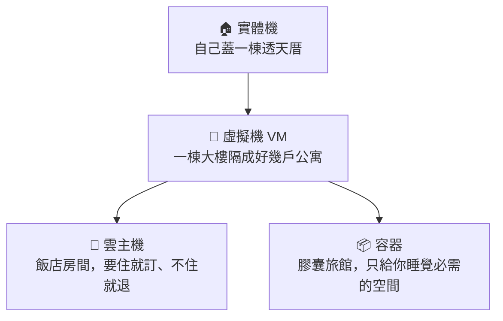

# [infra-1-3] 伺服器住在哪？實體機 / 虛擬機 / 雲主機 / 容器

> **本章目標**：搞懂同樣是「一台伺服器」，背後可能是實體機、虛擬機、雲主機或容器，並理解它們的差別與適用場景。

## 你會學到

- 實體機（Physical Machine）、虛擬機（VM）、雲主機、容器（Container）各是什麼
- 用「住的地方」一個類比把四者一次串起來
- 它們在成本、彈性、隔離程度上的取捨
- 你手上那台 Linux 伺服器，屬於哪一種

## 概念說明

### 同樣叫「伺服器」，底下可能很不一樣

前一章我們說「伺服器就是一台一直開著的電腦」。但這台「電腦」實際上可能是:

- 一台真的摸得到的機器
- 一台「假裝成獨立電腦」的軟體
- 跟別人共用一棟大樓的一間房
- 一個輕量到只裝了必要東西的小盒子

這四種，對應到 infra 的四個關鍵概念。用「住的地方」來類比最好懂。

---

### 用「住的地方」理解四種伺服器



| 類比 | 技術名稱 | 是什麼 | 特點 |
|------|---------|--------|------|
| 自己蓋透天厝 | **實體機**（Physical / Bare Metal） | 一台真實、完整屬於你的硬體 | 性能最強、完全掌控，但貴、要自己維護、擴充慢 |
| 大樓隔成多戶 | **虛擬機**（Virtual Machine, VM） | 用軟體把一台實體機切成多台「假電腦」 | 一台硬體養多個系統、互相隔離，但有少許效能損耗 |
| 飯店房間 | **雲主機**（Cloud Instance） | 雲端商（如 AWS）提供的 VM，隨開隨用、用多少付多少 | 不用自己買硬體、幾分鐘開好、彈性最高 |
| 膠囊旅館 | **容器**（Container） | 只打包「應用程式 + 它需要的東西」，共用底層作業系統 | 超輕量、啟動只要幾秒、一台機器能塞很多個 |

---

### 一個一個看清楚

**實體機（Bare Metal）**：一台貨真價實的伺服器，整台都是你的。性能榨到最滿、沒有人跟你搶資源。缺點是貴、要自己處理壞掉的硬碟、要再加一台得等採購到貨。

**虛擬機（VM）**：這是個聰明的發明——用一種叫 **Hypervisor（虛擬機監控器）** 的軟體，把一台強大的實體機「切」成好幾台獨立的虛擬電腦。每台 VM 都以為自己是一台完整的電腦，有自己的作業系統，彼此隔離。這樣一台昂貴的硬體就能服務很多用途，不浪費。

**雲主機**：本質上就是 VM，只是這台 VM 是**別人（AWS、GCP…）幫你準備好**的。你不用買硬體、不用進機房，在網頁上點幾下，幾分鐘後就有一台伺服器可用；不用了就關掉，**只付你用到的時間**。這就是「雲端」最迷人的地方。

**容器（Container）**：VM 是「連作業系統都自己一套」，比較重。容器則更聰明——**大家共用同一個作業系統核心**，每個容器只裝「應用程式 + 它真正需要的函式庫」。所以容器超輕、幾秒就能啟動、一台機器能跑幾十個。代價是隔離程度沒 VM 那麼徹底。容器是現代部署的主流，這門課 Part 5 會專門教 Docker。

---

### 它們不是互斥的，而是「疊起來」的

很重要的觀念：這四種常常**同時存在、層層堆疊**。一個很典型的真實情況長這樣：

```
一台實體機（在 AWS 的機房裡）
  └── 用 Hypervisor 切成多台 VM
        └── 其中一台 VM 就是「你租的雲主機」
              └── 你在這台雲主機上跑了 Docker
                    └── 裡面有 5 個容器（你的網站、資料庫、快取…）
```

所以當有人問你「伺服器是哪種」，答案常常是「以上皆是，只是在不同層」。理解這個堆疊，你就不會被名詞搞混。

---

### 怎麼選？一個簡單的判斷

| 你的情況 | 適合的選擇 |
|---------|-----------|
| 學習、個人專案、小網站 | **雲主機**（便宜、隨開隨用，你的 Linux 伺服器多半是這種） |
| 需要榨乾每一分效能、有特殊硬體需求 | **實體機** |
| 要在一台機器跑很多獨立服務 | **VM 或容器** |
| 要快速部署、頻繁更新、大量複製 | **容器** |

對剛入門的你來說，**雲主機 + 容器**是最常見、最實用的組合，也是這門課主要的練習環境。

## 程式碼範例

怎麼知道你登入的機器是實體機還是虛擬的？有指令可以「探聽」。下面這個先看，第 4 章會在你的伺服器上實際跑。

```bash
systemd-detect-virt
```

這個指令會告訴你目前所在的環境是不是虛擬化的。可能的回答：

```
kvm        ← 你在一台 VM 上（KVM 是一種常見的虛擬化技術）
```

或

```
none       ← 你在實體機上（沒有偵測到虛擬化）
```

或

```
docker     ← 你其實在一個容器裡面
```

> 小提醒：大部分人租的「雲主機」跑這個指令會得到 `kvm`、`xen` 之類的答案，這完全正常——因為雲主機本質上就是雲端商幫你開的一台 VM。

## 小練習

### 練習 1：把類比講完整

用「住的地方」的類比，向一個完全不懂技術的朋友解釋：實體機、VM、雲主機、容器的差別。如果能讓對方點頭，代表你真的懂了。

<details>
<summary>參考解答</summary>

可以這樣講給朋友聽（口語版）：

- **實體機＝自己蓋一棟透天厝**：整棟都是你的，想怎麼用就怎麼用、住起來最爽最有力，但很貴、要自己修水電、想再多一棟得等好久。
- **虛擬機（VM）＝把一棟大樓隔成好幾戶公寓**：一棟大樓（一台強大的硬體）用軟體隔成好幾戶，每戶自成一格、互不打擾，各有各的門牌和裝潢。這樣一棟樓就能住很多家，不浪費，代價是牆是隔出來的、多少有一點點損耗。
- **雲主機＝住飯店房間**：其實也是「大樓裡的一戶」，只是這戶是別人（AWS 之類的飯店）幫你準備好的。你不用買房、不用裝潢，上網點幾下、幾分鐘就 check-in，用多久付多久，不住了退房就好。
- **容器＝膠囊旅館**：只給你「睡覺真正需要的空間」，大家共用同一棟樓的水電（同一個作業系統核心），所以超便宜、幾秒就能入住、一間房能塞好多顆膠囊。代價是隔間比較薄，隱私（隔離）沒公寓那麼徹底。

一句話總結：**從透天 → 公寓 → 飯店 → 膠囊，越往後越輕、越便宜、越快，但「完全屬於自己、隔得越死」的程度越低。** 能讓朋友聽懂這條「由重到輕」的軸線，就代表你抓到重點了。

</details>

---

### 練習 2：判斷該住哪

下面幾個情境，你會建議用哪一種？為什麼？

1. 一個只有你自己用的部落格
2. 一間遊戲公司，要應付每晚尖峰時段暴增的玩家
3. 一個需要在「開發、測試、正式」三個環境都一模一樣的應用程式

> 提示：想想「成本」「彈性」「一致性」哪個最重要。

<details>
<summary>參考解答</summary>

沒有唯一正解，但有最合理的選擇與理由：

1. **只有你自己用的部落格** → **雲主機**。流量小、預算有限，最在意的是「便宜、隨開隨用、不用自己買硬體」。開一台最小規格的雲主機就綽綽有餘，甚至有些場景用容器 / 免費託管服務更省。重點是不需要為了一個小部落格去買整台實體機。
2. **遊戲公司要應付每晚尖峰暴增的玩家** → **雲主機 ＋ 容器**。最在意的是**彈性**——尖峰時快速多開很多台機器 / 很多個容器來扛流量，離峰時收掉以省錢。容器啟動只要幾秒，特別適合這種「要快速大量複製、又要隨時伸縮」的場景。買固定數量的實體機反而會「尖峰不夠、離峰浪費」。
3. **要在開發、測試、正式三個環境都一模一樣的應用程式** → **容器**。最在意的是**一致性**。容器把「應用程式 ＋ 它需要的所有東西」打包成同一個映像檔，三個環境跑的是同一包，徹底解決「在我電腦上明明可以跑」的問題。

一句話：**成本優先 → 雲主機；彈性優先 → 雲主機＋容器；一致性優先 → 容器。** 現實中這三者常常疊在一起用（雲主機上跑容器）。

</details>

---

### 練習 3：認識你自己的伺服器

如果你已經有一台 Linux 伺服器（雲主機），先猜猜它是哪一種、背後可能疊了幾層。下一章我們就會登入它，用指令驗證你的猜測。

<details>
<summary>參考解答</summary>

這是「先猜、下一章驗證」的暖身題，示範一個合理的猜測與推理：

如果你的伺服器是跟 AWS、GCP、Vultr、Linode、DigitalOcean 這類雲端商租的，那它幾乎一定是**雲主機**，而本質上就是一台 **VM**。背後大概疊了這幾層：

```
雲端商機房裡的一台實體機（Bare Metal）
  └── 用 Hypervisor 切成很多台 VM
        └── 其中一台 VM 就是「你租的這台雲主機」
              └──（如果之後你在上面裝 Docker，還會再多一層容器）
```

所以合理的猜測是：**它是雲主機（＝一台 VM），底下疊在某台實體機上**，目前還沒有容器那一層（除非你自己裝了 Docker）。

**怎麼驗證**：下一章（infra-1-4）會教你登入後跑 `systemd-detect-virt`。如果回傳 `kvm`、`xen` 之類，就證實你在一台 VM 上（也就是雲主機）；如果回傳 `none`，才是實體機。這題重點是先建立猜測，下一章實機驗證時你會更有感。

</details>

## 課外讀物

> 容器多到一台機器放不下時要怎麼管理？想先一窺容器編排與 Kubernetes 的全貌 → [課外讀物 E-13-3：Kubernetes 概念入門](../../../課外讀物/E-13-scaling/E-13-3-kubernetes-intro.md)
