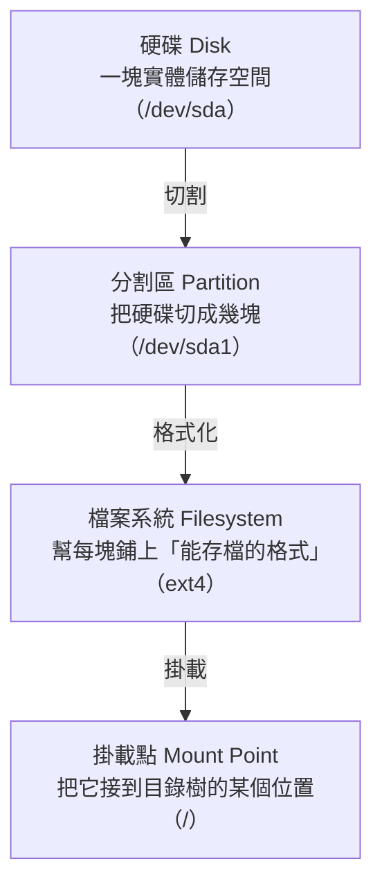

# [infra-2-4] 磁碟與掛載：硬碟空間與「掛載」是什麼

> **本章目標**：搞懂硬碟、分割區、掛載點的關係，學會用 `df`、`du`、`lsblk` 看空間，並能在「硬碟快滿了」時找出元兇。

## 你會學到

- 硬碟、分割區（Partition）、檔案系統、掛載點的關係
- 「掛載（Mount）」這個 Linux 特有概念到底在做什麼
- 用 `df` 看整體空間、`du` 找出誰佔最多
- 「硬碟空間用完」這個常見事故怎麼排查

## 概念說明

### 為什麼磁碟值得單獨講一章？

因為「**硬碟空間用完**」是 infra 工程師最常遇到的事故之一。日誌檔默默長大、暫存檔沒清、資料庫爆量……某天硬碟塞滿，服務就會莫名其妙開始出錯、寫不進資料。能快速找出「是誰把空間吃光的」，是一個稱職 infra 的基本功。

---

### 硬碟 → 分割區 → 檔案系統 → 掛載點

一顆硬碟要能用，要經過幾個層次。用**蓋一棟出租公寓**來類比：



| 層次 | 公寓類比 | 說明 |
|------|---------|------|
| 硬碟 | 一整塊地 | 實體的儲存裝置，Linux 裡叫 `/dev/sda` 之類 |
| 分割區 | 把地切成幾棟 | 一顆硬碟可以切成好幾塊獨立使用 |
| 檔案系統 | 蓋好房子、隔好房間 | 「格式化」成能存檔的結構，常見的是 `ext4` |
| 掛載點 | 給這棟樓一個地址 | 把它「接」到目錄樹上某個資料夾，你才能用 |

---

### 「掛載（Mount）」是 Linux 最特別的概念

這是從 Windows 過來的人最容易卡住的地方，所以特別講清楚。

Windows 插隨身碟，會跳出一個 `E:` 磁碟。但 Linux **沒有磁碟代號**——它的做法是：把這個硬碟（或隨身碟）「**掛載**」到目錄樹的**某個資料夾**上，之後你進那個資料夾，就等於在用那顆硬碟。

用類比：掛載就像**把一節新車廂，接到一列火車上**。接上去之後，你在火車上一路走，根本感覺不到車廂的接縫——整列火車（整棵目錄樹）就是一個連續的整體。

所以在 Linux：

- 你的主硬碟通常掛載在 `/`（根）
- 如果另接一顆硬碟放資料，可能掛載在 `/data`
- 你進 `/data` 存的東西，其實是存到那第二顆硬碟上

你平常完全感覺不到「現在在用哪顆硬碟」——這正是掛載設計的優雅之處。

## 程式碼範例

### 看整體空間：`df`

`df`（disk free）看每個掛載點還剩多少空間，加 `-h`（human-readable）用人看得懂的單位：

```bash
df -h
```

輸出像這樣：

```
Filesystem      Size  Used Avail Use% Mounted on
/dev/sda1        25G   22G  1.8G  93% /
/dev/sdb1       100G   30G   65G  32% /data
```

重點看 **`Use%`** 那欄。上面第一行 `93%` 已經是警訊了——根目錄快滿了。第二行 `/data` 還很寬裕。這一眼就告訴你「問題出在哪個掛載點」。

---

### 找出誰佔最多：`du`

知道哪個掛載點滿了之後，要往裡面追「是哪個資料夾肥大」。用 `du`（disk usage）：

```bash
sudo du -h --max-depth=1 /var | sort -hr | head
```

這行指令拆開看：

- `du -h --max-depth=1 /var`：算出 `/var` 底下「每個子資料夾」各佔多大（`--max-depth=1` 只看一層，不然會列出太多細節）
- `| sort -hr`：把結果**由大到小**排序（`-h` 認得 GB/MB 單位、`-r` 反向）
- `| head`：只看最前面幾行（最肥的那幾個）

輸出會像：

```
18G   /var/log
3.2G  /var/lib
...
```

啊哈，`/var/log` 佔了 18G——日誌爆量，這就是元兇。找到後你就能針對它處理（清理或設定日誌輪替，Part 7 會教）。

---

### 看硬碟與分割區的全貌：`lsblk`

想看「這台機器有幾顆硬碟、各自怎麼分割、掛在哪」，用 `lsblk`（list block devices）：

```bash
lsblk
```

輸出像一棵樹：

```
NAME    SIZE MOUNTPOINT
sda      25G
└─sda1   25G /
sdb     100G
└─sdb1  100G /data
```

清楚呈現：`sda` 這顆硬碟切了一個分割區 `sda1`、掛在 `/`；`sdb` 切了 `sdb1`、掛在 `/data`。這就是前面那張概念圖的真實版。

## 小練習

### 練習 1：替你的硬碟做健康檢查

在伺服器上跑 `df -h`，回答：

1. 你的根目錄 `/` 用了百分之幾？算健康嗎？
2. 有沒有哪個掛載點的 `Use%` 超過 80%？（超過就該注意了）

<details>
<summary>參考解答</summary>

**需自行在你的伺服器上實際跑 `df -h`**，這裡說明怎麼判讀：

1. **看根目錄 `/`**：在輸出裡找「Mounted on」那欄是 `/` 的那一行，讀它的 **`Use%`**。一台剛開的雲主機通常用 10%～40% 左右，算**健康**、空間很寬裕。判斷基準：**80% 以下大致安心，超過 80% 開始要注意，90% 以上就該立刻處理**（清東西或擴充）。
2. **掃有沒有超過 80% 的掛載點**：把每一行的 `Use%` 掃過去。可以先忽略那些 Size 很小、名字像 `tmpfs`、`/dev`、`/run` 的行（那是記憶體暫存區，不是真硬碟）；重點看 `/`、`/data`、`/home` 這類真正存資料的掛載點。任何一個超過 80%，就記下它，下一題用 `du` 進去追是誰把空間吃掉的。

如果你的機器全都很空，這是好事，代表還沒有空間壓力。

</details>

---

### 練習 2：找出最肥的資料夾

用 `du` 找出你 `/var` 底下最佔空間的前三名：

```bash
sudo du -h --max-depth=1 /var | sort -hr | head -4
```

記下來。想想看：如果是 `/var/log` 最肥，代表什麼狀況？

<details>
<summary>參考解答</summary>

**需自行在你的伺服器上實際跑**，指令與判讀如下：

```bash
sudo du -h --max-depth=1 /var | sort -hr | head -4
```

- 用 `sudo` 是因為 `/var` 底下有些資料夾一般使用者沒權限讀。
- `--max-depth=1` 只算 `/var` 底下第一層每個子資料夾各多大；`sort -hr` 由大到小排；`head -4` 取最肥的前幾名（第一行通常是 `/var` 的總和，接著才是各子資料夾）。
- 常見的肥大戶是 `/var/log`（日誌）、`/var/lib`（資料庫、Docker 映像檔等）、`/var/cache`（套件快取）。

**如果 `/var/log` 最肥代表什麼？** 代表**日誌檔在爆量長大**。可能的原因：某個服務狂噴錯誤訊息（一直寫 log）、或日誌沒有設定「輪替（rotate）」自動清理，日積月累塞滿硬碟。這是 infra 很典型的事故來源——處理方式是找出是哪個服務在狂寫、修掉問題根源，並設定日誌輪替（logrotate）讓舊日誌自動壓縮／刪除（Part 7 會教）。

</details>

---

### 練習 3：理解掛載

跑 `lsblk`，畫出你伺服器的「硬碟 → 分割區 → 掛載點」對應圖。你有幾顆硬碟？根目錄 `/` 掛在哪個分割區上？

<details>
<summary>參考解答</summary>

**需自行在你的伺服器上實際跑 `lsblk`**，這裡教你怎麼讀它的輸出。假設你看到這樣：

```
NAME    SIZE MOUNTPOINT
sda      25G
└─sda1   25G /
```

判讀方式：

- **有幾顆硬碟**：看最左邊「沒有縮排、沒有 `└─`」的名字，每一個是一顆硬碟（block device）。上面只有 `sda` 一個，代表**只有一顆硬碟**。如果還有 `sdb`、`sdc`，就是多顆。（名字像 `loop0`、`loop1` 的可以忽略，那是系統的虛擬裝置，不是實體硬碟。）
- **分割區**：`sda` 底下用 `└─` 接的 `sda1`，就是從這顆硬碟切出來的分割區。
- **根目錄掛在哪**：找 MOUNTPOINT 那欄是 `/` 的那一行——上面是 `sda1`，所以**根目錄 `/` 掛在 `sda1` 這個分割區上**，而 `sda1` 屬於 `sda` 這顆硬碟。

對應到本章的概念圖就是：硬碟 `sda` → 分割區 `sda1` → 格式化成檔案系統 → 掛載到 `/`。多數單顆硬碟的雲主機都是這個最單純的結構。

</details>
