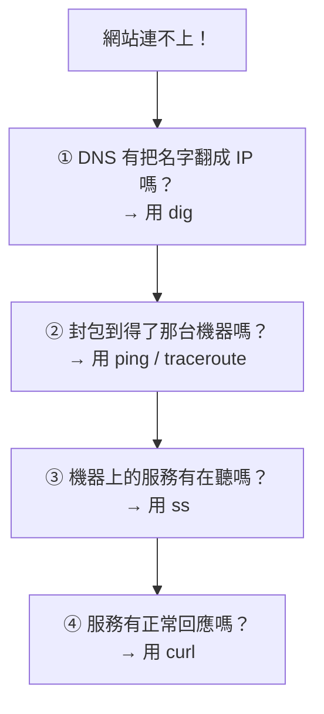

# [infra-3-4] 查線路的工具：ping、traceroute、dig、ss、curl

> **本章目標**：學會五個網路除錯工具，並用「分層排查」的思路，把「網站連不上」這種模糊問題，一步步縮小到真正的元兇。

## 你會學到

- `ping`、`traceroute`、`dig`、`ss`、`curl` 各自回答什麼問題
- 把它們當成醫生的「聽診器與 X 光」
- 一套「網站連不上」的系統化排查流程
- 怎麼判斷問題出在 DNS、網路、還是服務本身

## 概念說明

### 別用猜的，用工具一層層排查

「網站連不上」是 infra 最常被丟過來的問題。新手會慌、會亂猜；老手會**冷靜地一層一層往下查**，因為他手上有一組工具，每個都能回答一個明確的問題。

回想 Part 3-1 的請求旅程：DNS（查地址）→ 網路（送封包到機器）→ Port/服務（敲對的門）。問題只可能出在這幾層，而每一層都有對應的檢查工具：



這張圖就是這一章的核心——一套照順序往下走的排查地圖。每個工具下面詳細說。

---

### 五個工具，五個問題

| 工具 | 它回答的問題 | 醫生類比 |
|------|------------|---------|
| `dig` | 這個網域名稱，DNS 查得到 IP 嗎？ | 查病歷（名字對得上人嗎） |
| `ping` | 我的封包到得了那台機器、它有回應嗎？ | 把脈（還有心跳嗎） |
| `traceroute` | 封包是走哪條路過去的、卡在哪一站？ | X 光（看路徑哪裡阻塞） |
| `ss` | 這台機器上，服務有在聽那個 port 嗎？ | 聽診器（內部器官在動嗎） |
| `curl` | 服務真的有正常回應內容嗎？ | 抽血化驗（功能正常嗎） |

## 程式碼範例

### `dig`：DNS 查得到嗎？

```bash
dig +short myapp.com
```

如果回了一串 IP，DNS 正常。如果**什麼都沒回**，問題就在第一層——網域名稱解析失敗（可能網域設定錯了、或 DNS 還沒生效）。先排除這層，再往下。

---

### `ping`：機器活著、到得了嗎？

```bash
ping -c 4 203.0.113.10
```

`-c 4` 是送 4 個封包就停（不加會一直送）。正常會看到一行行 `time=12.3 ms`，代表封包來回通了、機器有回應。如果全部「逾時（timeout）」，代表封包到不了那台機器——可能機器掛了、或防火牆把 ping 擋了。

> 小提醒：有些伺服器或防火牆會**故意不回應 ping**（基於安全）。所以 ping 不通，不一定是真的掛了，要搭配其他工具一起看。

---

### `traceroute`：封包走到哪一站卡住？

```bash
traceroute 203.0.113.10
```

它會列出封包從你這裡到目的地，**中間經過的每一站（每一跳）**。如果在某一跳之後全是 `* * *`（沒回應），代表封包大概卡在那附近。這對診斷「中間網路出問題」特別有用。

---

### `ss`：服務有在聽嗎？（在伺服器上跑）

當你能登入伺服器，要確認「服務本身有沒有起來、有沒有在聽 port」：

```bash
ss -tlnp
```

（這個你 Part 3-1 用過。）如果你預期 443 該開著，卻在清單裡**找不到 `:443`**，那問題就清楚了——**服務根本沒在聽**，可能是服務沒啟動、或設定錯誤。這時該去查服務本身（Part 4 的 systemd / Nginx）。

---

### `curl`：服務回應正常嗎？

`curl` 可以直接「打一個請求」測試服務有沒有正常回應：

```bash
curl -I http://localhost
```

`-I` 只抓回應的「標頭（header）」，不抓整個內容，適合快速測試。正常會看到：

```
HTTP/1.1 200 OK
...
```

`200 OK` 代表服務健康。如果看到 `502 Bad Gateway`、`503` 或連不上，代表服務有問題。在伺服器上先連 `localhost` 測——這樣能區分「是服務本身壞了」還是「是外部網路/防火牆的問題」。

---

### 串起來：一次真實的排查

假設使用者說「`myapp.com` 打不開」，你會這樣走一遍：

1. `dig +short myapp.com` → 有回 IP 嗎？沒有 → **DNS 問題**，去查網域設定。
2. 有 IP → `ping` 那個 IP → 通嗎？不通 → **機器或網路問題**。
3. 通 → 登入機器 `ss -tlnp` → 服務在聽 443 嗎？沒在聽 → **服務沒起來**，去 `systemctl` 查。
4. 在聽 → `curl -I http://localhost` → 回 200 嗎？不是 → **服務內部錯誤**，去看日誌。
5. 本機 curl 正常、但外面連不到 → **防火牆問題**，回頭檢查 Part 3-3 的 `ufw` 和雲端 Security Group。

這套流程能讓你不慌不亂，**每一步都把範圍縮小一半**，最後精準定位。

## 小練習

### 練習 1：對每個工具配一個問題

不看表，寫出 `dig`、`ping`、`traceroute`、`ss`、`curl` 各自「回答什麼問題」。這是 infra 除錯的基本反射，要熟到不用想。

<details>
<summary>參考解答</summary>

- **`dig`** → 「這個網域名稱，DNS 查得到 IP 嗎？」查的是**第一層 DNS 解析**。有回 IP 就正常，什麼都沒回就是網域解析出問題。
- **`ping`** → 「我的封包到得了那台機器、它有回應嗎？」測的是**機器活著、網路通不通**。有 `time=xx ms` 就通，全逾時就是到不了（或機器/防火牆擋 ping）。
- **`traceroute`** → 「封包是走哪條路過去的、卡在哪一站？」列出**中間經過的每一跳**，某跳之後全是 `* * *` 就代表卡在那附近，用來抓中間網路的問題。
- **`ss`** → 「這台機器上，服務有在聽那個 port 嗎？」（在伺服器上跑）確認**服務本身有沒有起來、有沒有在監聽**。清單裡找不到該有的 port，就是服務沒起來。
- **`curl`** → 「服務真的有正常回應內容嗎？」直接打一個請求，看回應（例如 `200 OK` 代表健康、`502/503` 代表服務有問題）。

排查順序記法：**dig（名字）→ ping/traceroute（路）→ ss（服務在不在）→ curl（服務好不好）**，一層一層往下縮小範圍。

</details>

---

### 練習 2：在伺服器上實際跑一輪

對你自己的伺服器，依序跑：

```bash
dig +short 你的網域或用 google.com
ping -c 4 google.com
ss -tlnp
curl -I http://localhost
```

觀察每個輸出，確認你的伺服器「DNS 正常、出得了門、服務在聽、本機回得了 200」。

<details>
<summary>參考解答</summary>

> ⚠️ 實機題，實際輸出依你的機器而定，以下是「正常長怎樣、怎麼判讀」。

依序在你的伺服器上跑，逐一對照：

```bash
dig +short google.com
```
→ **正常**：回一串 IP（例如 `142.250.x.x`）。代表 DNS 解析正常。若什麼都沒回，是 DNS 出問題。

```bash
ping -c 4 google.com
```
→ **正常**：看到 4 行 `time=xx ms`、最後統計 `0% packet loss`。代表你的機器「出得了門」、連得到外網。（`-c 4` 是送 4 個就停。）

```bash
ss -tlnp
```
→ **正常**：至少看到 `:22`（SSH 在聽，不然你進不來）。若有裝網頁伺服器，還會看到 `:80` / `:443`。這是機器「有哪些服務在聽」的清單。

```bash
curl -I http://localhost
```
→ **正常**：第一行是 `HTTP/1.1 200 OK`（`-I` 只抓標頭）。代表本機的網頁服務健康。若這台沒裝網頁伺服器，會出現 `Connection refused`（沒有服務在聽 80），那是正常的——換成你實際在跑的 port 測即可。

**驗收點**：四個指令分別對應四個問題都得到「正常」的答案，就代表這台機器 DNS、對外網路、服務監聽、本機回應這四層都健康。

</details>

---

### 練習 3：模擬排查

假設你的網站突然連不上，你跑 `dig` 有回 IP、`ping` 也通，但 `ss -tlnp` 裡**找不到 443**。

1. 問題最可能出在哪一層？
2. 你接下來會去檢查什麼？

> 提示：DNS 和網路都正常，但服務沒在聽——元兇是服務本身。

<details>
<summary>參考解答</summary>

1. **問題最可能出在哪一層？→ 服務本身那一層。** 依排查地圖：`dig` 有回 IP（DNS 這層 ✅ 正常）、`ping` 也通（網路、機器到得了 ✅ 正常），但 `ss -tlnp` 裡**找不到 443**，代表**根本沒有服務在監聽 443**。前面兩層都排除了，元兇就是「服務沒起來 / 沒在聽」。

2. **接下來會去檢查什麼？**
   - 先確認服務程序有沒有在跑、有沒有掛掉：`sudo systemctl status nginx`（或你實際的服務名，如 `apache2`）。
   - 如果服務是 stopped / failed，用 `sudo systemctl start nginx` 啟動，並看 `journalctl -u nginx` 或服務日誌找它為什麼沒起來（常見：設定檔語法錯、port 被占用、憑證路徑錯）。
   - 修正後再跑一次 `ss -tlnp`，確認 `:443` 出現在清單裡，服務就恢復監聽了。
   - （這部分屬於 Part 4 的 systemd / Nginx 主題，這裡先知道「問題定位到服務本身」即可。）

</details>

## 課外讀物

> 想更深入理解 HTTP 請求、狀態碼（像 `200`、`502`）背後的協定細節 → [課外讀物 E-3-3：HTTP 協定詳解](../../../課外讀物/E-3-network/E-3-3-http-protocol.md)
