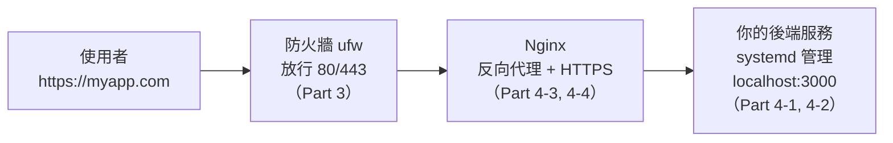

# [infra-4-5] 🏆 動手做：用 Nginx + systemd + HTTPS 跑起一個對外網站

> **本章目標**：把整個 Part 4 串起來——在你的伺服器上，從零部署一個真正對外、有 HTTPS、會自動重啟的網站。這是你第一個完整的 infra 成果。

## 你會學到

- 把 systemd、Nginx、HTTPS 三個技能整合成一條完整的部署流程
- 一個請求從使用者到你後端的完整路徑
- 部署後的驗證與基本除錯
- 建立一份可重複的「部署檢查清單」

## 概念說明

### 你要組裝的完整架構

前面四章學的每塊拼圖，這一章要拼成一張完整的圖。先看清楚最終長什麼樣：



這張圖就是這一章的藍圖。一個請求的旅程是：使用者 → 穿過防火牆（只有 80/443 開著）→ 到 Nginx（解開 HTTPS、依網址轉發）→ 交給躲在後面、由 systemd 顧著的後端服務。

每一段你都學過了，現在把它們接起來。

---

### 完整部署流程總覽

```
① 準備後端程式，跑在 localhost:3000
② 用 systemd 把它變成「常駐 + 自動重啟」的服務   ← Part 4-1, 4-2
③ 裝 Nginx，設定反向代理把請求轉給 :3000        ← Part 4-3
④ 確認防火牆放行 80/443                          ← Part 3-3
⑤ 用 certbot 加上 HTTPS                          ← Part 4-4
⑥ 驗證整條路徑都通
```

## 程式碼範例

> 以下假設你有一個網域並已指向伺服器 IP。沒有的話，前 4 步（到反向代理）仍可用 IP 測試，HTTPS 那步等有網域再補。

### ① 準備一個後端程式

用任何你會的語言都行。這裡用一個極簡的 Node 後端當例子，放在 `/home/deploy/myapp/server.js`：

```javascript
const http = require("http");

const server = http.createServer((req, res) => {
  res.writeHead(200, { "Content-Type": "text/plain; charset=utf-8" });
  res.end("我的網站上線了！這個回應來自 systemd 管理的後端服務。\n");
});

// 只聽 localhost，不直接對外——對外的事交給 Nginx
server.listen(3000, "127.0.0.1", () => {
  console.log("後端服務啟動，聽在 127.0.0.1:3000");
});
```

注意 `server.listen(3000, "127.0.0.1", ...)`——它**只聽 localhost**，刻意不直接對外，把「對外接客」這件事完全交給 Nginx（呼應 4-3 的「後端躲在 Nginx 後面」）。

---

### ② 用 systemd 讓它常駐

建立服務檔（做法同 Part 4-2）：

```bash
sudo vi /etc/systemd/system/myapp.service
```

```ini
[Unit]
Description=My web app backend
After=network.target

[Service]
ExecStart=/usr/bin/node /home/deploy/myapp/server.js
Restart=always
User=deploy

[Install]
WantedBy=multi-user.target
```

啟動並設開機自啟：

```bash
sudo systemctl daemon-reload
sudo systemctl enable --now myapp
systemctl status myapp
```

在伺服器上先自測後端有沒有活（用 Part 3-4 的 curl）：

```bash
curl http://localhost:3000
```

看到「我的網站上線了！」就代表 ② 完成。

---

### ③ 設定 Nginx 反向代理

建立網站設定（做法同 Part 4-3）：

```bash
sudo vi /etc/nginx/sites-available/myapp
```

```nginx
server {
    listen 80;
    server_name myapp.com;

    location / {
        proxy_pass http://localhost:3000;
        proxy_set_header Host $host;
        proxy_set_header X-Real-IP $remote_addr;
    }
}
```

啟用、測試、重載：

```bash
sudo ln -s /etc/nginx/sites-available/myapp /etc/nginx/sites-enabled/
sudo nginx -t
sudo systemctl reload nginx
```

---

### ④ 確認防火牆放行

```bash
sudo ufw allow 'Nginx Full'    # 一次開 80 + 443
sudo ufw status
```

現在從你自己電腦的瀏覽器連 `http://myapp.com`（或伺服器 IP），應該看到後端的回應——代表「使用者 → Nginx → 後端」整條通了。

---

### ⑤ 加上 HTTPS

```bash
sudo certbot --nginx -d myapp.com
```

certbot 會自動改好 Nginx 設定、加上 443 並把 HTTP 轉址到 HTTPS。完成後連 `https://myapp.com`，看到安全鎖頭就大功告成。

---

### ⑥ 驗證整條路徑

用 Part 3-4 的工具，從外到內驗證每一段：

```bash
# DNS 有指對嗎？
dig +short myapp.com

# HTTPS 回應正常嗎？（從你自己電腦）
curl -I https://myapp.com

# 後端服務還活著嗎？（在伺服器上）
systemctl status myapp

# Nginx 健康嗎？
systemctl status nginx
```

全部正常，你就完成了人生第一個「自架、對外、加密、會自動重啟」的網站部署。🎉

## 小練習

### 練習 1：完成部署

在你的伺服器上，從 ① 做到 ⑥，把網站完整部署上線。卡關時，用 Part 3-4 的分層排查（DNS → 網路 → 服務在聽嗎 → 服務回應嗎）定位問題。

<details>
<summary>參考解答</summary>

這是本章的大魔王動手題，需要你**在自己的伺服器上把整條流程實機跑完**。把上面的六步照做即可，這裡整理成一份可直接照抄的操作序與各步驗收點：

```bash
# ① 後端程式：放到 /home/deploy/myapp/server.js（只聽 127.0.0.1:3000）

# ② systemd 常駐
sudo vi /etc/systemd/system/myapp.service     # 貼入本章三段設定
sudo systemctl daemon-reload
sudo systemctl enable --now myapp
systemctl status myapp                          # 驗收：active (running)
curl http://localhost:3000                      # 驗收：看到「我的網站上線了！」

# ③ Nginx 反向代理
sudo vi /etc/nginx/sites-available/myapp        # 貼入 server 區塊，proxy_pass 到 :3000
sudo ln -s /etc/nginx/sites-available/myapp /etc/nginx/sites-enabled/
sudo nginx -t                                   # 驗收：syntax is ok / test is successful
sudo systemctl reload nginx

# ④ 防火牆
sudo ufw allow 'Nginx Full'                     # 開 80 + 443
sudo ufw status                                 # 驗收：80/443 有在放行清單

# 此時用瀏覽器連 http://你的網域（或IP）應看到後端回應

# ⑤ HTTPS
sudo certbot --nginx -d 你的網域                 # 自動加 443 並把 HTTP 轉址到 HTTPS

# ⑥ 驗證整條路徑
dig +short 你的網域                              # DNS 指對了嗎
curl -I https://你的網域                         # HTTPS 回應正常嗎（從你自己電腦）
systemctl status myapp                           # 後端還活著嗎
systemctl status nginx                           # Nginx 健康嗎
```

**卡關時的分層排查（Part 3-4 的思路，由外往內一層層縮小範圍）：**

| 現象 | 先查這層 | 怎麼查 |
|------|---------|--------|
| 瀏覽器連不到、網址打不開 | DNS | `dig +short 你的網域` 的 IP 是不是你的機器 |
| DNS 對，但還是連不到 | 網路／防火牆 | `sudo ufw status`、雲端安全群組有沒有開 80/443 |
| 外部連不到，但伺服器上 `curl localhost:3000` 通 | Nginx 這一段 | `sudo nginx -t`、`systemctl status nginx` |
| 連到 Nginx 卻回 502 Bad Gateway | 後端沒在聽 | `systemctl status myapp`、`curl localhost:3000` |

**關鍵心法**：502 通常代表「Nginx 活著，但它轉發的後端 3000 沒回應」——多半是後端服務掛了或沒起來，先查 `myapp` 服務。整條路徑的驗收，畫面上的鎖頭和回應**需要你自己實機確認**。

</details>

---

### 練習 2：驗證韌性

部署完成後，故意「破壞」再觀察自癒：

```bash
# 找出後端 PID 並砍掉
systemctl status myapp
sudo kill 那個PID
# 立刻重新整理網站——可能瞬斷一下，但很快又正常
# 因為 Restart=always 讓 systemd 自動把它救回來
```

體會一下：因為有 systemd，你的服務「死了會自己活過來」。這就是正式部署和「手動跑一下」的本質差別。

<details>
<summary>參考解答</summary>

這是動手驗證題，**在自己的伺服器上實機做**：

```bash
systemctl status myapp        # 記下 Main PID 的數字
sudo kill 那個PID             # 故意砍掉後端行程
# 立刻在瀏覽器重新整理你的網站
```

**你會觀察到：**

- 砍掉的瞬間，重新整理可能**瞬斷一下**（出現短暫的 502 Bad Gateway，或轉圈）——這是後端剛死、還沒被救回來的空窗。
- 但**過一兩秒再整理，網站又正常了**。因為 `myapp.service` 裡的 `Restart=always` 讓 systemd 一偵測到行程死掉，就自動重啟一個新的。
- 再跑一次 `systemctl status myapp`，會看到它又是 `active (running)`，而且 **Main PID 變成一個新數字**——證明是「新的一條命」被拉起來了。

**這在說明什麼？** 正式部署（systemd 管理）和「手動 `node server.js`」的本質差別就在這裡：手動跑的程式**死了就真的死了**，得有人守著、手動重啟；systemd 管的服務**死了會自己活過來**，半夜掛掉也能自癒，你不用一直盯著。這就是「把程式變成服務」的價值。

**驗收點**：砍掉 PID 後，網站在短暫瞬斷後自動恢復，且 `systemctl status myapp` 顯示新的 Main PID。

（進階想想：如果後端是因為「程式有 bug、一起來就 crash」而不斷被 kill，`Restart=always` 會讓它陷入不斷重啟的迴圈——這種情況該看 `journalctl -u myapp` 找出 crash 原因，而不是靠重啟硬撐。）

</details>

---

### 練習 3：寫下你的「部署檢查清單」

把這次部署的步驟，整理成一份你自己的 checklist（後端 → systemd → Nginx → 防火牆 → HTTPS → 驗證）。

> 提示：這份清單在 Part 5（容器化）和 Part 6（Ansible 自動化）會不斷進化——你會發現「手動做一次很有感，但做十次就該自動化」，這正是 infra 思維的成長軌跡。

<details>
<summary>參考解答</summary>

這題的重點是**你用自己的話整理**，內容能涵蓋整條路徑、每步附上「怎麼確認這步 OK」就算好清單。示範一份可以直接拿去用的版本：

**🚀 我的網站部署檢查清單**

```
① 後端程式
   □ 程式放到定位（如 /home/deploy/myapp/server.js）
   □ 只聽 127.0.0.1（不直接對外，交給 Nginx）
   ✅ 驗收：curl http://localhost:3000 有正確回應

② systemd 常駐
   □ 寫 /etc/systemd/system/myapp.service（Restart=always、User=deploy）
   □ daemon-reload → enable --now
   ✅ 驗收：systemctl status myapp 是 active (running)

③ Nginx 反向代理
   □ 寫 sites-available/myapp（proxy_pass 到 :3000）
   □ ln -s 到 sites-enabled
   □ nginx -t 先測試 → reload
   ✅ 驗收：nginx -t 過、瀏覽器連 IP 看到後端回應

④ 防火牆
   □ ufw allow 'Nginx Full'（80 + 443）
   □ 雲端安全群組也要放行
   ✅ 驗收：ufw status 看到 80/443、外部連得到

⑤ HTTPS
   □ certbot --nginx -d 網域
   □ 確認 certbot.timer active（自動續期）
   ✅ 驗收：https:// 出現鎖頭、http:// 自動轉址

⑥ 整條驗證
   □ dig +short 網域（DNS 指對）
   □ curl -I https://網域（HTTPS 正常）
   □ systemctl status myapp / nginx（都健康）
```

**重點觀念**：好的 checklist 不只列「做什麼」，每一步都要有「**怎麼確認它成功**」的驗收動作——這樣照著跑，不會有「以為做好了其實沒生效」的隱形漏洞。

**驗收點**：你的清單涵蓋 後端 → systemd → Nginx → 防火牆 → HTTPS → 驗證 六段，且每段都寫得出至少一個確認方式。這份清單之後在 Part 5／6 會被你逐步「自動化」掉——手動做一次是為了理解，重複多次就該交給工具。

</details>

## 課外讀物

> 想理解你這個網站背後，從使用者按下 Enter 到看到頁面的完整網路旅程 → [課外讀物 E-3-1：網際網路是怎麼運作的？](../../../課外讀物/E-3-network/E-3-1-how-internet-works.md)
