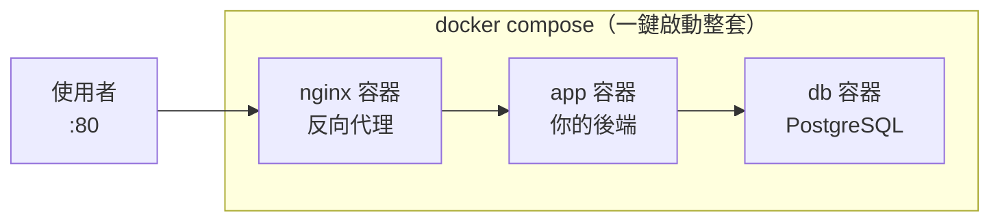

# [infra-5-5] 🔧 動手做：把你的網站容器化，一鍵啟動

> **本章目標**：把 Part 4 手動部署的網站，改造成「容器化 + Docker Compose」版本，用一行指令啟動整套，並親身比較兩種做法的差異。

## 你會學到

- 把整個 Part 5 串起來：Dockerfile + Compose + Nginx + 資料庫
- 用容器重現 Part 4-5 的網站，但變成「一鍵啟動、可重現」
- 親手對比「手動部署」與「容器化部署」的差別
- 容器化部署後的驗證與除錯

## 概念說明

### 你要做的改造

Part 4-5 你手動部署了一個網站：手動裝 Nginx、手動寫 systemd、手動設定。能跑，但**換台機器就得整套重來**。

這一章你要把同一個網站，改造成**容器化版本**：



差別在於：Part 4 的每個東西都「裝在主機上」，這次每個東西都**裝在容器裡**，由一個 `docker-compose.yml` 統一描述。最大的好處是——**這整套，在任何裝了 Docker 的機器上，一行指令就能重現。**

---

### 容器化前後對比

先有個心理準備，感受這次改造的價值：

| | Part 4-5 手動部署 | 這章 容器化部署 |
|---|------------------|----------------|
| 裝 Nginx | 手動 `apt install` + 設定 | 用官方 nginx image |
| 跑後端 | 手動寫 systemd service | 寫進 compose，自動管理 |
| 裝資料庫 | 手動安裝設定 | 用官方 postgres image |
| 啟動全部 | 一個個 systemctl start | `docker compose up` 一行 |
| 換台機器重來 | 整套重做，可能漏步驟 | 複製檔案 + 一行指令 |
| 自動重啟 | systemd 的 `Restart` | compose 的 `restart` |

## 程式碼範例

### 專案結構

在 `/home/deploy/myapp/` 整理出這樣的結構：

```
myapp/
├── server.js              ← 你的後端程式
├── package.json
├── Dockerfile             ← Part 5-3 寫的
├── .dockerignore
├── docker-compose.yml     ← 這章的主角
└── nginx/
    └── default.conf       ← 給 nginx 容器的設定
```

---

### 第一步：給 nginx 容器準備設定

建立 `nginx/default.conf`：

```bash
mkdir -p /home/deploy/myapp/nginx
vi /home/deploy/myapp/nginx/default.conf
```

```nginx
server {
    listen 80;
    server_name _;

    location / {
        proxy_pass http://app:3000;
        proxy_set_header Host $host;
        proxy_set_header X-Real-IP $remote_addr;
    }
}
```

注意 `proxy_pass http://app:3000`——主機名直接寫 `app`（服務名！還記得 Part 5-4 嗎），Nginx 容器就能找到後端容器。`server_name _` 是「接受任何網域」的意思。

---

### 第二步：寫 docker-compose.yml

```bash
vi /home/deploy/myapp/docker-compose.yml
```

```yaml
services:
  nginx:
    image: nginx:alpine
    ports:
      - "80:80"
    volumes:
      - ./nginx/default.conf:/etc/nginx/conf.d/default.conf:ro
    depends_on:
      - app
    restart: always

  app:
    build: .
    environment:
      DATABASE_URL: postgres://myuser:mypass@db:5432/mydb
    depends_on:
      - db
    restart: always

  db:
    image: postgres:16
    environment:
      POSTGRES_USER: myuser
      POSTGRES_PASSWORD: mypass
      POSTGRES_DB: mydb
    volumes:
      - dbdata:/var/lib/postgresql/data
    restart: always

volumes:
  dbdata:
```

幾個跟前一章不同、值得注意的點：

- **`nginx` 服務**：它才是對外開 80 的（`ports: 80:80`）。`app` 不開 port，只透過內部網路給 nginx 連——後端躲在 nginx 後面（呼應 Part 4-3）。
- `volumes: ./nginx/default.conf:/etc/nginx/conf.d/default.conf:ro` —— 把你寫的設定檔掛進 nginx 容器，`:ro` 是 read-only（唯讀，容器不能改它）。
- **`restart: always`** —— 三個服務都加上，等於 Part 4-2 systemd 的「掛掉自動重啟」，但這次是 Compose 幫你做。
- `app` 拿掉了對外 `ports`，因為它只需要被 nginx 連，不需要直接對外。

---

### 第三步：一鍵啟動整套

```bash
cd /home/deploy/myapp
docker compose up -d --build
```

`--build` 確保先 build 你的 app image。這一行會把 nginx、app、db 三個容器全部拉起來、串好網路。

確認三個都在跑：

```bash
docker compose ps
```

---

### 第四步：驗證

從伺服器本機測（Part 3-4 的 curl）：

```bash
curl http://localhost
```

應該透過「nginx → app」拿到你後端的回應。從你自己電腦的瀏覽器連伺服器 IP 也應該看得到（記得 Part 3-3 防火牆要開 80）。

看整套的日誌：

```bash
docker compose logs -f
```

---

### 第五步：體會「可重現」的威力

這是最有感的一步。想像你要換一台全新的伺服器：

**Part 4-5 的手動做法**：重新 SSH、裝 Nginx、寫 systemd、裝 Node、裝資料庫、一個個設定……可能花一兩小時，還可能漏步驟。

**容器化做法**：只要新機器裝了 Docker，把這個 `myapp/` 資料夾複製過去，然後：

```bash
docker compose up -d --build
```

**一行指令，整套網站在幾分鐘內重現，每次都一模一樣。** 這就是容器化最大的價值——也是為什麼它成為現代部署的標準。

## 小練習

### 練習 1：完成容器化改造

把你 Part 4 的網站，依本章步驟改造成 Compose 版本，用 `docker compose up -d --build` 一鍵啟動，並從瀏覽器確認能連到。

<details>
<summary>參考解答</summary>

這是動手／實機題，需要在你自己的伺服器上實作驗證。照本章步驟串起整套：

**1. 整理專案結構**（`/home/deploy/myapp/`）：`server.js`、`package.json`、`Dockerfile`、`.dockerignore`、`docker-compose.yml`，加上 `nginx/default.conf`。

**2. `nginx/default.conf`**（反向代理到 app 容器，主機名直接寫服務名 `app`）：

```nginx
server {
    listen 80;
    server_name _;
    location / {
        proxy_pass http://app:3000;
        proxy_set_header Host $host;
        proxy_set_header X-Real-IP $remote_addr;
    }
}
```

**3. `docker-compose.yml`**：三個服務 nginx / app / db，只有 nginx 對外開 80、app 不開 port（躲在 nginx 後面）、三個都加 `restart: always`、db 用 volume 存資料（內容照本章範例）。

**4. 一鍵啟動並驗證**：

```bash
cd /home/deploy/myapp
docker compose up -d --build   # --build 確保先 build app image
docker compose ps              # 三個服務都要 Up
curl http://localhost          # 從本機測，應透過 nginx→app 拿到回應
```

**驗收點**：

- `docker compose ps` 看到 `nginx`、`app`、`db` 三個都是 `Up`（running）。
- `curl http://localhost`（主機本機、走 80）要收到你後端的回應，代表 nginx → app 這條反向代理通了。
- **從你自己電腦的瀏覽器**連伺服器的公開 IP，也要看得到畫面——這一步需要**你親自用瀏覽器驗證**（agent 看不到畫面）。記得 Part 3-3 的防火牆要放行 80 埠，否則外部連不進來。
- 若連不到：先 `docker compose logs -f` 看是哪個容器出錯（常見是 app 沒起來、或 nginx 設定檔路徑掛錯）。

> 這是實機＋視覺驗證題，請以你自己伺服器與瀏覽器上的實際結果為準自行驗證。

</details>

---

### 練習 2：驗證自動重啟

故意砍掉 app 容器，觀察它自己回來（呼應 Part 4-5）：

```bash
docker compose ps           # 看 app 容器
docker kill myapp-app-1     # 砍掉它（名字以你的為準）
docker compose ps           # 過一下再看，它又起來了（restart: always）
```

<details>
<summary>參考解答</summary>

這是動手／實機題，需要在你自己的伺服器上實際操作驗證。做法：

```bash
docker compose ps                    # 先看 app 容器真正的名字（NAME 欄）
docker kill <你的 app 容器名>         # 例如 myapp-app-1，強制砍掉它
docker compose ps                    # 立刻看：app 可能顯示 restarting 或短暫消失
# 等個幾秒再看一次
docker compose ps                    # app 又回到 Up 了
```

**為什麼會自己回來**：yml 裡 app 服務有 `restart: always`。這等於 Part 4-2 systemd 的「掛掉自動重啟」——差別是這次由 Docker（Compose）幫你顧著，容器一掛就自動拉起來。

**驗收點**：

- 用 `docker compose ps` 先確認 app 容器**真正的名字**（不同專案／版本命名可能不一樣，別直接照抄 `myapp-app-1`）。
- `docker kill` 之後緊接著 `docker compose ps`，會看到 app 短暫離開（restarting / 不在 running）。
- 隔幾秒再看，app **STATUS 回到 `Up`**，代表 `restart: always` 生效、自動重啟成功。
- 進階驗證：重啟後再 `curl http://localhost` 應該又能正常拿到回應。

> 這是實機操作，請以你自己伺服器上的實際輸出為準自行驗證。

</details>

---

### 練習 3：寫下「兩種部署」的比較心得

你現在親手做過「手動部署」（Part 4-5）和「容器化部署」（這章）。用自己的話寫下：

1. 容器化在「換機器重現」上贏在哪？
2. 有沒有什麼是手動部署反而比較單純的情況？（提示：只有一個極簡服務、且不常變動時）

<details>
<summary>參考解答</summary>

這是開放／心得題，以下是示範答案與理由，你可依自己親手做過兩種部署的體會補充：

1. **容器化在「換機器重現」上贏在哪**：整套環境（Nginx、後端、資料庫、它們的設定與版本、彼此的連線）全部被描述在 `docker-compose.yml` 和 Dockerfile 裡，是**可版控、可複製的檔案**。換一台新機器時，只要它裝了 Docker，把 `myapp/` 資料夾複製過去，跑一行 `docker compose up -d --build`，幾分鐘就把一模一樣的整套重現出來——不會漏步驟、不會因為手動打指令而出錯、每次結果都一致。對照 Part 4-5 的手動做法：要重新 SSH、`apt install` Nginx、寫 systemd、裝 Node、裝資料庫、逐一設定，可能花一兩小時還可能漏掉某步，兩台機器容易長得不一樣。核心價值就是**「可重現」**。

2. **手動部署反而比較單純的情況**：當你只有**一個極簡、單一的服務**（例如就一支靜態網站或一個小 script），**不依賴資料庫等其他服務、也不常變動**時，手動裝一裝可能反而快——因為導入 Docker 本身有學習與維護成本（要寫 Dockerfile、compose、理解 image/volume/network、機器上還要裝 Docker）。當「要協調的東西很少、環境很固定」，這些額外成本就不划算。**判斷原則**：服務越多、相依越複雜、越常換機器／常改版，容器化的「可重現」價值越高；反之越單純、越靜態，手動的簡單就越有優勢。這也呼應課程一貫的「過早最佳化」提醒——沒有痛點時，別為了用而用。

</details>

> 提示：容器化解決了「可重現」，但「複製檔案 + 跑指令」這件事本身還是手動的。下一個 Part 6（Ansible）就要把「連複製和執行都自動化」——讓你對著一台全新機器，一鍵裝好 Docker、拉好程式碼、啟動整套。

## 課外讀物

> 當這套容器需要跨多台機器跑、自動擴縮、自我修復時，就需要容器編排 → [課外讀物 E-13-3：Kubernetes 概念入門](../../../課外讀物/E-13-scaling/E-13-3-kubernetes-intro.md)
