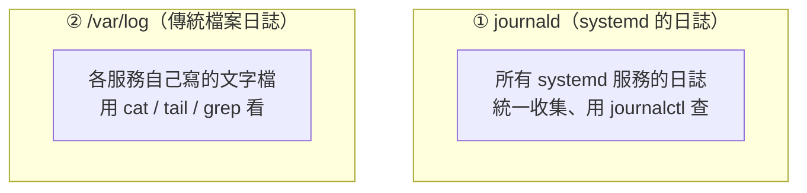

# [infra-7-1] 日誌在哪？journald、/var/log 與日誌輪替

> **本章目標**：知道伺服器的日誌都記在哪、怎麼查，並理解「日誌輪替（logrotate）」如何避免日誌檔默默把硬碟塞爆。

## 你會學到

- 日誌（log）是什麼、為什麼是 infra 除錯的命脈
- 兩套日誌系統：systemd 的 `journald` 與傳統的 `/var/log`
- 用 `journalctl` 和看檔案兩種方式查日誌
- 日誌輪替（logrotate）：自動切割、壓縮、刪除舊日誌

## 概念說明

### 日誌是伺服器的「行車記錄器」

當服務出問題——網站掛了、請求失敗、某個程式異常——你怎麼知道發生什麼事？答案幾乎都是：**去看日誌**。

**日誌（log）** 是系統和各種服務「邊跑邊寫下」的記錄：誰在什麼時間做了什麼、出了什麼錯。它就像汽車的**行車記錄器**——平常不會去看，但一出事，它是還原真相最重要的證據。

Part 1-1 說過 infra 工程師的日常之一是「線上出問題時怎麼找線索」。**看日誌就是找線索的第一招。**

---

### Linux 有兩套日誌系統，要分清楚

現代 Linux 同時存在兩套日誌系統，新手常搞混：



**① journald**：systemd（Part 4-1 的服務總管）內建的日誌系統。**所有由 systemd 管理的服務**，它們的輸出都被 journald 統一收集起來，用 `journalctl` 查詢（你在 Part 4-2 已經用過了）。

**② /var/log**：傳統的做法——各個服務把日誌寫成**文字檔**，放在 `/var/log/` 資料夾（還記得 Part 2-1 嗎？`/var` 是「會變動的資料」）。例如 Nginx 的存取記錄、系統的登入記錄。

兩套並存，不衝突。大原則：**systemd 服務先用 `journalctl` 查；特定應用（如 Nginx）的細節去 `/var/log` 對應的檔案看。**

---

### /var/log 裡的重要檔案

逛一下 `/var/log`，幾個你一定會用到的：

| 檔案 / 資料夾 | 記錄什麼 | 什麼時候看 |
|--------------|---------|-----------|
| `/var/log/syslog` | 系統整體的綜合日誌 | 系統層級的問題 |
| `/var/log/auth.log` | 登入、`sudo`、SSH 相關 | 查「誰登入了、有沒有人在猜密碼」 |
| `/var/log/nginx/access.log` | Nginx 每一筆請求 | 看誰來訪、流量狀況 |
| `/var/log/nginx/error.log` | Nginx 的錯誤 | 網站出錯時第一個看這 |

> 還記得 Part 2-1 練習要你記下 `auth.log` 嗎？這就是它派上用場的時候——Part 8 處理安全時，會回來看它揪出暴力破解的痕跡。

---

### 日誌輪替（logrotate）：別讓日誌撐爆硬碟

日誌有個隱藏的危險：**它會一直長大**。一個忙碌的網站，access.log 一天可能長好幾 GB。放著不管，遲早把硬碟塞滿——這正是 Part 2-4 說的「硬碟空間用完」最常見的元兇之一。

解法是 **logrotate（日誌輪替）**：一個系統內建的機制，會自動幫你「**輪替**」日誌：


logrotate 做三件事：**切割**（把當前日誌封存、開一個新的繼續寫）、**壓縮**（舊的壓成 `.gz` 省空間）、**刪除**（超過保留天數的自動清掉）。這樣日誌既保留了一段歷史，又不會無限長大。

大部分服務（如 Nginx）安裝時就會附帶 logrotate 設定，自動運作。你要懂的是「它存在、它在保護你的硬碟」，必要時能調整保留策略。

## 程式碼範例

### 用 journalctl 查 systemd 服務的日誌

（複習 Part 4-2，再加幾招）看某個服務的日誌：

```bash
journalctl -u nginx
```

只看「最近的、即時跟看」（除錯最常用）：

```bash
journalctl -u nginx -f
```

只看「今天」或「最近一小時」的：

```bash
journalctl -u nginx --since today
journalctl -u nginx --since "1 hour ago"
```

只看「錯誤等級以上」的訊息（過濾雜訊）：

```bash
journalctl -p err
```

`-p err` 是 priority = error，只留下錯誤級別。出大事想快速抓重點時很有用。

---

### 看 /var/log 的傳統日誌檔

看 Nginx 最新的錯誤（`tail` 是看檔案末尾，`-f` 是即時跟看）：

```bash
sudo tail -f /var/log/nginx/error.log
```

在登入記錄裡找「失敗的登入嘗試」（`grep` 過濾，Part 2-3 用過）：

```bash
sudo grep "Failed" /var/log/auth.log
```

如果這裡跑出一大堆失敗記錄，代表有人正在嘗試暴力破解你的 SSH——這就是 Part 8 加固要處理的。

---

### 看看 logrotate 的設定

各服務的輪替設定放在 `/etc/logrotate.d/`（又是 `/etc`）：

```bash
ls /etc/logrotate.d/
cat /etc/logrotate.d/nginx
```

你會看到類似 `rotate 14`（保留 14 份）、`daily`（每天輪替）、`compress`（壓縮）的設定。看懂這些，你就知道你的日誌會留多久、佔多少空間。

## 小練習

### 練習 1：分清兩套日誌

回答：

1. 你想看 Nginx 服務「有沒有正常啟動」，該用 `journalctl` 還是看 `/var/log`？
2. 你想看「每一筆訪客請求」，又該看哪裡？

<details>
<summary>參考解答</summary>

1. 用 **`journalctl`**。「服務有沒有正常啟動」屬於 systemd 管理服務的層級——啟動成功、失敗、卡在哪、噴什麼錯，全都被 journald 統一收走了。跑 `journalctl -u nginx` 就能看到 Nginx 這個 unit 的啟動過程。這是「systemd 服務先用 `journalctl` 查」這條大原則的直接應用。

2. 看 **`/var/log/nginx/access.log`**。「每一筆訪客請求」是 Nginx 這個應用自己的細節記錄，它會把每個進來的請求寫成一行文字到 `access.log`。這類「特定應用的細節」journald 不會幫你整理，要直接去 `/var/log` 對應的檔案看。可以用 `sudo tail -f /var/log/nginx/access.log` 即時跟看。

一句話總結：**服務層級的狀態（有沒有起來）看 journald，應用層級的細節（每筆請求）看 /var/log。**

</details>

---

### 練習 2：實際查日誌

在你的伺服器上：

1. 用 `journalctl -u ssh --since today` 看今天的 SSH 服務日誌。
2. 用 `sudo grep "Failed" /var/log/auth.log` 看看有沒有人嘗試亂登入你的機器（如果你的機器有公開 IP，通常會嚇到你——一堆機器人在敲門）。

<details>
<summary>參考解答</summary>

這題要實機操作，最終結果請自行在你的伺服器上驗證。做法與驗收點：

1. 執行 `journalctl -u ssh --since today`（有些系統的 unit 名叫 `sshd`，若查不到就改成 `journalctl -u sshd --since today`）。**驗收點**：能看到今天這個服務的日誌行，內容通常是登入接受（`Accepted`）、斷線（`Disconnected`）等記錄。如果今天沒任何 SSH 活動，可能是空的——可以拿掉 `--since today` 看歷史，或先自己 SSH 連一次再回來看。

2. 執行 `sudo grep "Failed" /var/log/auth.log`。**驗收點**：如果機器有公開 IP，你八成會看到一大串 `Failed password for ... from <某個 IP>`——這些就是全世界的機器人在對你的 SSH 暴力猜密碼。看到的行數越多，代表被敲得越兇。若是純內網或剛開的機器，可能一筆都沒有，那也正常。

補充：有些較新的系統改用 journald 而不寫 `auth.log`，那 `grep` 會說找不到檔案。這時改用 `sudo journalctl -u ssh | grep "Failed"` 也能達到同樣效果。這個「揪暴力破解」的線索，Part 8 加固時會正式用到。

</details>

---

### 練習 3：理解日誌輪替的必要

回答：

1. 如果完全不做日誌輪替，一個高流量網站長期下來會發生什麼事？（提示：回想 Part 2-4 的 `df`）
2. logrotate 的「切割、壓縮、刪除」三步驟，分別解決了什麼問題？

<details>
<summary>參考解答</summary>

1. 日誌檔會**無限長大，最後把硬碟塞爆**。一個忙碌網站的 `access.log` 一天可能長好幾 GB，放著不管，`df -h` 上那顆磁碟的 `Use%` 會一路往上爬，直到 100%。硬碟一滿，後果是連鎖的：新的日誌寫不進去、資料庫寫不了、服務開始報錯甚至整個掛掉——這正是 Part 2-4 講的「硬碟空間用完」最典型的元兇。而且諷刺的是，把硬碟塞爆的常常就是「用來除錯的日誌」本身。

2. 三步驟各自對應一個問題：
   - **切割（rotate）**：把當前一直在長大的日誌檔封存起來（例如改名成 `access.log.1`），另開一個新檔繼續寫。解決「單一檔案無限膨脹、大到難以處理」的問題，也讓日誌以「一天一份」之類的單位分段，好查。
   - **壓縮（compress）**：把封存的舊日誌壓成 `.gz`。文字日誌壓縮率很高，往往能省下 8~9 成空間。解決「保留歷史又不想佔太多磁碟」的矛盾。
   - **刪除（保留策略）**：超過保留天數（如 `rotate 14` 只留 14 份）的自動清掉。解決「就算壓縮了，累積夠久還是會爆」的問題——用一個上限把總佔用空間框住。

三步合起來，就達成「**保留一段夠用的歷史，又保證日誌永遠不會無限增長**」。

</details>
