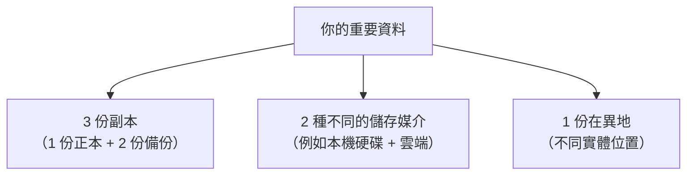

# [infra-8-1] 備份策略：3-2-1 原則

> **本章目標**：理解「為什麼備份這麼重要又這麼容易做錯」，學會 3-2-1 備份原則，並建立「沒演練過還原的備份，等於沒有」這個關鍵心態。

## 你會學到

- 為什麼備份是 infra 工程師的底線責任
- 3-2-1 備份原則是什麼
- 「備份」與「還原」的差別——為什麼後者才是重點
- 該備份什麼、不用備份什麼

## 概念說明

### 一個讓人睡不著的問題

問自己一個問題：**如果你的伺服器現在這一秒整台爆炸、硬碟燒毀，你會失去什麼？**

- 使用者上傳的所有檔案？
- 整個資料庫的資料？
- 那些你花好幾天手動調出來的設定？

如果答案是「全部都沒了、救不回來」，那就是一場災難。而這種災難**一定會發生**——硬碟會壞、人會手滑下錯指令、勒索軟體會加密你的檔案、雲端帳號可能被盜。問題從來不是「會不會」，而是「**什麼時候**」。

**備份（backup）就是你對抗這個必然災難的保險。** 它是 infra 工程師最基本、也最不能省的責任。

---

### 3-2-1 原則：業界公認的備份黃金法則

光「有備份」還不夠——備份本身也可能跟著一起掛掉。所以有個經典的 **3-2-1 原則**：



| 數字 | 意思 | 為什麼 |
|------|------|--------|
| **3** | 至少有 **3 份**資料副本 | 一份壞了還有兩份，多重保險 |
| **2** | 存在 **2 種不同媒介** | 同一批硬碟可能同時故障，分散風險 |
| **1** | 至少 **1 份放異地** | 機房失火/水災/被盜，異地那份還在 |

舉個落地的例子：資料庫資料在伺服器本機（第 1 份）→ 每天備份到另一顆硬碟或 NAS（第 2 份、第 2 種媒介）→ 再上傳一份到雲端 S3（第 3 份、異地）。這樣不管哪個環節出事，你都還有救。

> 你有 AWS 帳號——把備份上傳到 **S3** 正是實現「異地那份」最常見、最便宜的做法（這也預習了 AWS 課程 Part 5）。

---

### 最重要的一課：「能還原」才算數

這是這一章最想讓你記住的一句話：

> **沒有演練過「還原」的備份，等於沒有備份。**

無數真實慘案是這樣的：天天乖乖備份，出事時要還原，才發現——備份檔是壞的、或備份了錯的東西、或根本沒人知道怎麼還原。**備份的目的從來不是「備份」這個動作，而是「真的能救回來」。**

用類比：備份像買保險、買滅火器。你不能等到火災當下，才第一次拿起滅火器研究怎麼用。**平時就要演練還原**，確認整套流程真的可行，出事時才不會手忙腳亂、發現保險是假的。

所以「設定備份」永遠要搭配「**定期演練還原**」——這就是下一章 8-2 要動手做的事。

---

### 該備份什麼？

不是所有東西都要備份。分清楚才不會浪費空間、也不會漏掉重要的：

| 類型 | 要備份嗎 | 例子 |
|------|:---:|------|
| **使用者產生的資料** | ✅ 一定要 | 資料庫、上傳的檔案——**這些丟了就真的沒了** |
| **設定檔** | ✅ 要（或用 IaC） | `/etc` 下的設定（但更好的是用 Part 6 的 Ansible 管起來） |
| **程式碼** | ⚠️ 已在 Git 就不用 | 你的應用程式碼應該在 Git，那本身就是備份 |
| **系統 / 可重裝的東西** | ❌ 不用 | 作業系統、`apt` 裝的套件——重裝就有，備份它浪費空間 |

關鍵原則：**備份「無法重新生成」的東西**（使用者資料）；「能重建的東西」（系統、套件、程式碼）交給 IaC 和 Git 就好。這正呼應 Part 6 的「牲畜模式」——機器本身可拋棄可重建，真正寶貴的是那些不可重生的資料。

## 程式碼範例

備份最基礎的工具，你其實已經有概念了。先看「打包 + 壓縮」一個資料夾，這是備份的基本動作：

```bash
tar -czf backup-2026-06-21.tar.gz /home/deploy/myapp/uploads
```

`tar` 是打包工具，選項拆解：`c`（create 建立）、`z`（用 gzip 壓縮）、`f`（指定檔名）。這行把上傳資料夾打包壓縮成一個 `.tar.gz` 檔。

備份資料庫則通常用該資料庫的專用工具。例如 PostgreSQL（Part 5 你跑過）：

```bash
pg_dump -U myuser mydb > mydb-backup-2026-06-21.sql
```

`pg_dump` 把整個資料庫「匯出」成一個 SQL 檔，這個檔之後能用來完整還原資料庫。

把備份上傳到 AWS S3（異地那份，需先設定好 AWS CLI）：

```bash
aws s3 cp backup-2026-06-21.tar.gz s3://my-backup-bucket/
```

> 這幾個指令下一章會組合成「自動備份腳本 + 排程」。這裡先認識基本動作。

## 小練習

### 練習 1：盤點你的「不可重生資料」

針對你 Part 4/5 部署的網站，列出：

1. 哪些東西是「丟了就沒了」的（要備份）？
2. 哪些是「重建就有」的（不用備份）？

<details>
<summary>參考解答</summary>

判斷標準只有一句話：**這東西能不能重新生成？** 不能的就備份，能的就交給 Git／IaC。以一個典型的 Part 4/5 網站來盤點：

**要備份（丟了就沒了、無法重生）：**

- **資料庫**——使用者的帳號、貼文、訂單等，全在裡面，這是最不能丟的。
- **使用者上傳的檔案**——例如頭像、附件那些放在 `uploads` 資料夾的東西，這些不在 Git 裡，丟了就真的沒了。
- **手動調過、還沒納入 IaC 的設定檔**——如果 `/etc` 下有些設定是你手動改的、Ansible 還沒管起來，那也要備（但更好的做法是把它寫進 Ansible）。

**不用備份（重建就有）：**

- **應用程式碼**——已經在 Git（例如 GitHub）上，Git 本身就是它的備份。
- **作業系統、`apt` 裝的套件**——重裝一台機器就有，備份它只是浪費空間。
- **Docker image**——可以從 Dockerfile 或 registry 重新拉／重新 build。

核心原則：**備份「無法重新生成」的東西**（使用者資料）；能重建的（系統、套件、程式碼）交給 IaC 和 Git。這正呼應了 Part 6 的「牲畜模式」——機器可拋棄可重建，真正寶貴的是那些不可重生的資料。

</details>

---

### 練習 2：套用 3-2-1

幫你的網站設計一個符合 3-2-1 的備份方案：

1. 3 份副本分別放哪？
2. 用哪 2 種媒介？
3. 異地那份放哪？（提示：你有 AWS S3）

<details>
<summary>參考解答</summary>

一個符合 3-2-1 的落地方案（以你 Part 4/5 部署在 EC2 上的網站為例）：

**3 份副本：**

1. **第 1 份（正本）**：EC2 上運行中的資料——資料庫本體 + `uploads` 資料夾裡的檔案。
2. **第 2 份（本機備份）**：每天用 `tar` / `pg_dump` 打包，存到 EC2 上另一個 `backups` 資料夾（或另一顆 EBS volume）。
3. **第 3 份（異地備份）**：把第 2 份的備份檔用 `aws s3 cp` 上傳到 S3。

**2 種媒介：**

- 媒介一：EC2 的本機硬碟（EBS）——第 1、2 份都在這。
- 媒介二：AWS S3（物件儲存）——第 3 份在這。兩種是不同的儲存系統，不會因為 EBS 一起故障就全滅。

**異地那份：**

- 放 **AWS S3**。它天生就是多可用區（跨機房）複製、跟你的 EC2 實體隔離。就算整台 EC2 連同 EBS 一起被誤刪或機房出事，S3 那份還在。這也是「異地那份」最便宜、最省事的做法。

小提醒：如果想更嚴謹，S3 那份可以開 **versioning（版本控制）** 和 **跨區域複製**，甚至擋一手勒索軟體（改不掉舊版本）。這在後面 AWS 課程 Part 5 會細講。

</details>

---

### 練習 3：理解「還原才算數」

用自己的話解釋：為什麼「天天備份」還不夠，一定要「定期演練還原」？想一個「備份看似正常、還原時才發現是假的」的情境。

> 提示：備份檔損壞、備到錯的東西、沒人會還原……這些都是真實發生過的慘案。下一章你就會親手演練一次還原，確保你的保險是真的。

<details>
<summary>參考解答</summary>

**為什麼「天天備份」還不夠？** 因為「備份」只是一個「產生檔案」的動作，它成功不代表那個檔案「真的救得回資料」。備份的真正目的不是「產生備份檔」，而是「災難時能把資料救回來」——而後者只有真的還原過一次才能確定。沒演練過還原的備份，本質上是一個「你以為有、但沒驗證過」的假設。

**一個「備份看似正常、還原時才發現是假的」情境：**

> 某網站設了每天凌晨自動 `pg_dump` 備份資料庫，日誌每天都顯示「備份完成」，跑了大半年都沒人管。某天資料庫掛了，工程師拿最新的備份檔要還原，才發現——當初的 `pg_dump` 指令少加了某個參數，備出來的 SQL 檔其實是空的（或只有 schema、沒有資料）。日誌一路「成功」，是因為指令本身沒報錯，但備到的根本不是能用的東西。等到真的要用才發現，已經來不及了。

類似的慘案還有：備份檔在傳輸中損壞、備份存的那顆硬碟其實早就壞了、備份腳本的路徑寫錯備到空資料夾、加密備份的金鑰弄丟解不開……這些「平常都正常、出事才爆」的問題，只有**定期演練還原**才抓得到。

所以正確的心態是：把「還原演練」當成備份流程的一部分，定期（例如每季）真的做一次「製造災難 → 從備份還原 → 驗證資料回來」，確認你的保險是真的。下一章 8-2 就會親手做一次。

</details>

## 課外讀物

> 備份也是整體安全的一環（尤其對抗勒索軟體），想建立完整的安全觀 → [課外讀物 E-10-1：Web 安全總覽 — OWASP Top 10](../../../課外讀物/E-10-security/E-10-1-web-security-overview.md)
