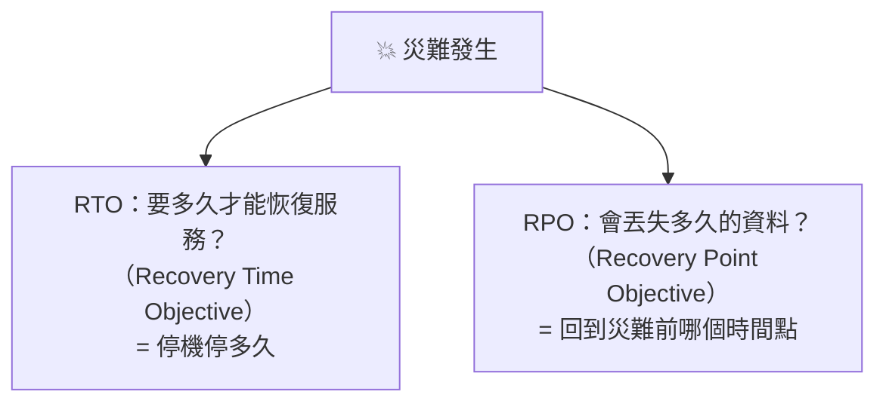

# [infra-8-4] 災難復原：機器整台掛了，怎麼快速重建

> **本章目標**：把前面所有 Part 串起來，理解「災難復原」的完整思路——當一台機器徹底掛掉，怎麼用 IaC + 備份在最短時間重建，並把它寫成一份可執行的復原計畫。

## 你會學到

- 災難復原（Disaster Recovery）是什麼
- 兩個關鍵指標：RTO 與 RPO
- 「重建機器」與「還原資料」是兩件事
- 把整個 infra 課程的技能，組成一套完整的復原能力

## 概念說明

### 終極考驗：一切歸零，你怎麼救回來？

想像最壞的情況：你的伺服器**徹底沒了**——硬碟燒毀、雲主機被誤刪、整個機房斷電。前面學的監控、加固都防不了「它就是掛了」。這時唯一重要的問題是：

> **你能多快、多完整地把整個服務重建起來？**

回答這個問題的能力，叫**災難復原（Disaster Recovery，DR）**。它是 infra 可靠性的最後一道防線，也是檢驗你前面所有功夫的終極考驗。

---

### 兩個關鍵指標：RTO 與 RPO

談災難復原，業界用兩個指標來定義「你的復原能力有多強」：



| 指標 | 全名 | 白話 | 由什麼決定 |
|------|------|------|-----------|
| **RTO** | Recovery **Time** Objective | 從掛掉到恢復服務，**要花多久** | 你重建環境的速度（→ IaC） |
| **RPO** | Recovery **Point** Objective | 會丟失**多久的資料** | 你多久備份一次（→ 備份頻率） |

舉例：如果你每天凌晨備份一次，災難在下午發生，那你會丟失「從凌晨到下午」的資料——你的 RPO 大約是「最多一天」。想縮短？就備份更頻繁（例如每小時）。

如果你的整套設定都寫成 Ansible，重建一台機器只要 10 分鐘——你的 RTO 就是「約 10 分鐘」。反之，如果全靠手動、邊查筆記邊重做，RTO 可能是「好幾小時甚至一整天」。

**這兩個指標直接對應你前面學的東西**：IaC 決定 RTO（重建多快），備份頻率決定 RPO（丟多少資料）。

---

### 復原 = 重建機器 + 還原資料

災難復原其實是兩件獨立的事，分開想會清楚很多：


**① 重建機器（解決 RTO）**：開一台全新的空機器，跑你 Part 6 的 Ansible playbook——套件、服務、防火牆、Nginx 設定，全部自動裝回來。這就是 Part 6-3 講的「牲畜模式」的回報時刻：**機器掛了不心疼，因為它能用程式碼重建**。

**② 還原資料（解決 RPO）**：環境就緒後，把 Part 8-2 的備份解開、還原使用者資料和資料庫。

這兩步合起來，就是一次完整的災難復原。**注意：缺一不可**——光有 Ansible 能重建環境，但沒備份，資料還是沒了；光有備份，但沒 IaC，你得手動重建環境，慢得要命。

---

### 這就是為什麼前面要鋪那麼多梗

回頭看，整個 infra 課程其實一直在為這一刻做準備：

| 你學的 | 在災難復原中的角色 |
|--------|------------------|
| Part 6 Ansible / IaC | 快速重建環境（縮短 RTO） |
| Part 8-1/8-2 備份 | 還原資料（決定 RPO） |
| Part 5 容器化 | 應用本身可一鍵重新部署 |
| Part 7 監控 | 第一時間發現災難發生 |
| Git 版本控制 | 程式碼與 playbook 本身的備份 |

**當這些拼圖都到位，「一台機器徹底掛掉」就從災難，變成一件 10 分鐘能處理完的例行公事。** 這正是現代 infra 工程的目標——不是「祈禱不要出事」，而是「出事了也能從容應對」。

## 程式碼範例

災難復原沒有單一指令，而是一套**流程**。把它寫成一份可執行的復原計畫（runbook），這份文件本身就是無價的。

在你的專案建立 `DISASTER-RECOVERY.md`：

```bash
vi ~/infra-practice/DISASTER-RECOVERY.md
```

```markdown
# 災難復原計畫（Runbook）

## 目標
- RTO（恢復時間）：30 分鐘內
- RPO（資料遺失）：最多 1 天（每日備份）

## 復原步驟

### 1. 開一台新機器
- 開一台新的 EC2（同規格、Ubuntu）
- 設定 SSH 金鑰能連入

### 2. 重建環境（IaC，約 10 分鐘）
- 把 inventory.ini 的 IP 改成新機器
- 執行：ansible-playbook -i inventory.ini site.yml

### 3. 還原資料（約 10 分鐘）
- 從 S3 下載最新備份：
  aws s3 cp s3://my-backup-bucket/最新備份 .
- 解開還原：tar -xzf 備份檔 -C /
- 還原資料庫：psql -U myuser mydb < 資料庫備份.sql

### 4. 啟動服務並驗證
- docker compose up -d
- 用 curl 驗證網站回應（Part 3-4）
- 確認資料完整

## 聯絡人 / 注意事項
- （備份 bucket 位置、金鑰在哪、誰能授權…）
```

這份文件的價值在於：**災難發生時，你（或同事）不用慌張回想，照著做就能救回來。** 它把你腦中的知識，變成任何人都能執行的步驟——這呼應了 Part 6-3「設定該被記錄成可執行的東西」的精神。

> 跟備份一樣：**這份計畫也要演練**。每隔一段時間，真的照著它從零重建一次，確認每一步都可行、時間真的在 RTO 內。沒演練過的復原計畫，跟沒演練過的備份一樣不可靠。

## 小練習

### 練習 1：理解 RTO 與 RPO

回答：

1. 用自己的話解釋 RTO 和 RPO 的差別。
2. 如果你想把 RPO 從「一天」縮短到「一小時」，要改什麼？
3. 如果你想縮短 RTO，要強化哪個環節？

<details>
<summary>參考解答</summary>

**1. RTO 和 RPO 的差別：**

兩個都是災難復原的指標，但量的是不同的東西——一個量「時間」，一個量「資料」：

- **RTO（Recovery Time Objective，恢復時間目標）**：從災難發生到服務**恢復上線**，能容忍**停機多久**。它衡量的是「你多快能救回來」，由你**重建環境的速度**決定。
- **RPO（Recovery Point Objective，恢復點目標）**：災難後你會**丟失多久的資料**，也就是能回到災難前哪個時間點。它衡量的是「你會丟多少資料」，由你**多久備份一次**決定。

一句話記法：**RTO 是「停機多久」（時間軸往未來看，多久恢復）；RPO 是「丟失多久的資料」（時間軸往過去看，回到哪個備份點）。** 舉例：每天凌晨備份一次，災難在下午發生，那你會丟失「凌晨到下午」的資料——RPO 大約是一天；而如果你的 Ansible 重建一台機器要 30 分鐘，那 RTO 就是約 30 分鐘。兩者互相獨立，要分開想、分開改善。

**2. 想把 RPO 從「一天」縮短到「一小時」，要改什麼？**

RPO 由**備份頻率**決定，所以答案是——**備份得更頻繁**。把 8-2 那個「每天凌晨 2 點」的 cron 排程，改成**每小時**跑一次：

```
# 原本：每天 2 點
0 2 * * * /home/deploy/infra-practice/backup.sh ...

# 改成：每小時的第 0 分鐘跑一次
0 * * * * /home/deploy/infra-practice/backup.sh ...
```

這樣災難最多只會丟「上一次整點備份到災難發生」之間的資料，RPO 就縮到一小時。代價是備份更頻繁 → 產生更多備份檔、佔更多空間、也給機器更多負載——又是一次「安全 vs 成本」的權衡。想再更短（例如幾分鐘、甚至趨近於零），就得用資料庫的**持續備份／WAL 歸檔／即時複製（replication）** 這類更進階的機制了。

**3. 想縮短 RTO，要強化哪個環節？**

RTO 由**重建環境的速度**決定，所以要強化的是 **IaC（基礎設施即程式碼），也就是你 Part 6 的 Ansible**。具體來說：

- **把所有設定都寫進 Ansible playbook**——套件安裝、服務設定、防火牆規則、Nginx 設定，全部自動化。手動步驟越少，重建越快、越不會出錯。
- **應用容器化**（Part 5）——用 `docker compose up` 一鍵把應用拉起來，不用一個個手動裝環境。
- **讓復原計畫（runbook）明確可執行**——照著做就行，不用臨場回想。
- 追求極致的話，可以做到「開機自動跑 playbook」甚至預先備好機器映像檔，把重建時間再往下壓。

核心對應關係要記牢：**IaC 決定 RTO（重建多快）、備份頻率決定 RPO（丟多少資料）**。想改善哪一個，就去強化對應的那一邊。

</details>

---

### 練習 2：寫你自己的復原計畫

針對你 Part 4~7 部署的網站，寫一份 `DISASTER-RECOVERY.md`，列出「從一台空機器到服務完整恢復」的每個步驟。把它放進 Git。

<details>
<summary>參考解答</summary>

> 這題是動手撰寫題，內容要對應你自己實際的部署（bucket 名稱、資料庫名、playbook 檔名都要換成你的），需自行驗證每一步照做真的可行。以下給一份可直接改用的範本與驗收點。

一份好的復原計畫（runbook）要涵蓋：**目標（RTO/RPO）→ 重建環境 → 還原資料 → 啟動驗證 → 關鍵資訊在哪**。範本：

```markdown
# 災難復原計畫（Runbook）

## 目標
- RTO（恢復時間）：30 分鐘內
- RPO（資料遺失）：最多 1 天（每日備份）

## 復原步驟

### 1. 開一台新機器
- 開一台新的 EC2（同規格、Ubuntu 版本一致）
- 設定 SSH 金鑰能連入
- 設定安全群組（開放 22 / 80 / 443）

### 2. 重建環境（IaC，約 10 分鐘）
- 把 inventory.ini 的 IP 改成新機器
- 執行：ansible-playbook -i inventory.ini site.yml
- （這一步把套件、服務、防火牆、Nginx 設定全裝回來）

### 3. 還原資料（約 10 分鐘）
- 從 S3 下載最新備份：
  aws s3 cp s3://my-backup-bucket/最新備份 .
- 解開檔案還原：tar -xzf 備份檔 -C /
- 還原資料庫：psql -U myuser mydb < 資料庫備份.sql

### 4. 啟動服務並驗證
- docker compose up -d
- 用 curl 驗證網站回應（Part 3-4）
- 抽查幾筆資料，確認資料完整

## 聯絡人 / 關鍵資訊
- 備份 bucket：s3://my-backup-bucket/
- SSH 私鑰放哪、誰保管
- 誰有權限開新 EC2 / 動 DNS
- DNS 記錄要不要指向新機器 IP
```

**驗收點：**

- 每一步都是**具體可執行的動作**（有指令、有檔名），而不是「重建環境」這種模糊的一句話——半夜出事時照著做就能救，不用臨場回想。
- 涵蓋了「**重建機器 + 還原資料**」兩件事，缺一不可（只有 Ansible 沒備份，資料還是沒了；只有備份沒 IaC，重建慢得要命）。
- 有寫清楚**關鍵資訊在哪**（備份位置、金鑰、權限）——這些卡住任何一個，整個復原都會停擺。
- **已經 commit 進 Git**（`git add DISASTER-RECOVERY.md && git commit`），這樣它本身也有版本控制、有備份，不會跟著掛掉的機器一起消失。

這份文件的價值在於：**把你腦中的知識，變成任何人（包含慌張的你自己）都能照著執行的步驟**。呼應 Part 6-3「設定該被記錄成可執行的東西」的精神。

</details>

---

### 練習 3：（進階）真的演練一次

如果你有餘力，做一次真正的災難演練：開一台全新的 EC2，**只靠你的 Ansible playbook + 備份 + 復原計畫**，把整個服務重建起來。計時看看，你的 RTO 是多少？過程中發現哪些步驟卡關或漏寫？

> 這個演練會讓你對「自己的系統到底多可靠」有最真實的認識。能從容做到這件事，你就具備了一個稱職 infra 工程師的核心能力——**讓系統不只會跑，還能在災難後復活**。

<details>
<summary>參考解答</summary>

> 這是進階的實機演練題，最終要以你自己真的「從一台空 EC2 把服務重建到能用」為準，需自行實機驗證。以下給做法、計時方式與驗收點。

**做法：完整跑一次「假裝一切歸零」的演練**

1. **開一台全新的空 EC2**（同規格、同 Ubuntu 版本），設好 SSH 金鑰能連入、安全群組開放必要 port。**注意：不要動到你的正式機器**——用一台全新的，才是真正在驗證「從零重建」。
2. **開始計時**（記下現在時間）。
3. **只靠你的三樣東西**——Ansible playbook + 備份 + 復原計畫（`DISASTER-RECOVERY.md`）——照著計畫一步步做：
   - 重建環境：`ansible-playbook -i inventory.ini site.yml`
   - 還原資料：從 S3 下載最新備份、`tar -xzf ... -C /`、`psql ... < 資料庫備份.sql`
   - 啟動服務：`docker compose up -d`
4. **驗證服務真的活了**：用 `curl` 打網站確認有正常回應（Part 3-4）、抽查幾筆資料確認完整。
5. **停止計時**——這段時間就是你真實的 RTO。

**驗收點：**

- 全程**只靠 playbook + 備份 + runbook**，沒有臨場上網查、沒有靠腦中記憶補步驟。一旦你發現「欸這步計畫裡沒寫、我只好自己想」——那就是計畫的漏洞，記下來補進 `DISASTER-RECOVERY.md`。
- 最後網站能正常訪問、資料完整。
- 記錄你的**實際 RTO**，跟計畫裡寫的目標（例如 30 分鐘）比對：達標了嗎？哪一步最花時間？

**這個演練的價值：** 它會逼出所有「以為做好、其實有洞」的地方——playbook 少裝了某個套件、備份漏備了某個資料夾、計畫某步描述太模糊、金鑰或權限沒準備好……這些只有真的做一次才會浮現。把發現的問題全部補回去，你的復原能力才是「驗證過、真的可靠」，而不是「紙上談兵」。能從容做到這件事，你就具備了稱職 infra 工程師的核心能力——**讓系統不只會跑，還能在災難後復活**。

演練完記得把這台測試用的 EC2 關掉／砍掉，避免多付費用。

</details>

## 課外讀物

> 災難復原的「異地備援」「多機房」概念，在更大規模會演化成完整的架構設計 → [課外讀物 E-13-4：Monolith vs Microservices](../../../課外讀物/E-13-scaling/E-13-4-monolith-vs-microservices.md)
