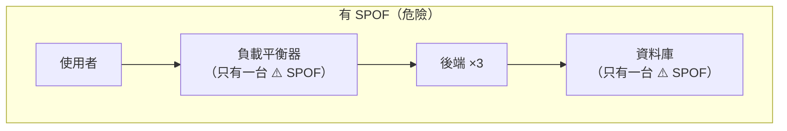
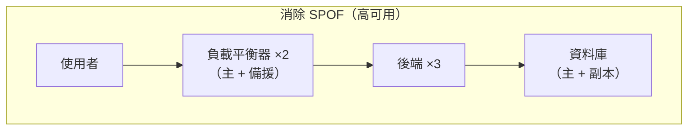

# [infra-9-2] 高可用：消滅單點故障

> **本章目標**：理解「單點故障（SPOF）」為什麼是可靠性的頭號敵人，學會用「冗餘」來消除它，建立「高可用（High Availability）」的設計直覺。

## 你會學到

- 單點故障（SPOF）是什麼、怎麼找出系統裡的 SPOF
- 冗餘（Redundancy）——用「多一份」換可靠
- 高可用（High Availability, HA）的核心思維
- 可靠性常用「幾個 9」來衡量

## 概念說明

### 鏈條最弱的一環：單點故障

有句話說「一條鏈條的強度，取決於最弱的一環」。系統可靠性也是——只要有**任何一個環節，它一掛整個服務就掛**，那個環節就是**單點故障（Single Point of Failure，SPOF）**。

上一章你用負載平衡讓後端變成多台，很好。但想想看：

- 後端有三台了，但**負載平衡器只有一台**——它掛了呢？整個服務還是全掛。
- 資料庫只有一台——它掛了呢？所有後端都沒資料可用。

這些「只有一個、掛了就全完」的地方，就是 SPOF。**高可用設計的核心工作，就是找出所有 SPOF，然後消滅它們。**



上圖雖然後端有三台，但負載平衡器和資料庫各只有一台——它們就是還沒解決的 SPOF。

---

### 解法：冗餘（Redundancy）

消滅 SPOF 的方法就一個字：**多一份**。這在 infra 叫**冗餘（Redundancy）**——關鍵環節都準備備援，一個掛了另一個立刻頂上。

用類比：飛機為什麼有多具引擎？因為「一具引擎故障，飛機還能飛」。這就是冗餘——**不是為了平常用，而是為了「出事時還有得用」**。



對照上一張圖，差別是：負載平衡器變兩台（一台掛了另一台接手）、資料庫有副本（主資料庫掛了，副本頂上）。每個關鍵環節都不再是「只有一個」。

---

### 高可用（High Availability）

當系統透過冗餘，做到「**任何單一元件故障，整體服務都還能繼續運作**」，就叫**高可用（High Availability，HA）**。

HA 的目標不是「永遠不出事」（不可能），而是「**出事了，使用者幾乎無感**」。某台機器半夜掛了，備援自動頂上，使用者根本沒注意到——這就是高可用的境界。

要達成 HA，通常需要：

- **冗餘**：關鍵元件都有備份（上面說的）。
- **故障轉移（Failover）**：偵測到某個元件掛了，自動切換到備援。
- **健康檢查**：持續確認每個元件還活著（呼應 Part 7 監控、Part 9-1 Nginx 跳過壞掉的後端）。

---

### 可靠性怎麼衡量：「幾個 9」

業界用**可用率（availability）**百分比衡量可靠性，常說「幾個 9」：

| 可用率 | 俗稱 | 一年可容許的停機時間 |
|--------|------|--------------------|
| 99% | 兩個 9 | 約 3.65 天 |
| 99.9% | 三個 9 | 約 8.76 小時 |
| 99.99% | 四個 9 | 約 52 分鐘 |
| 99.999% | 五個 9 | 約 5 分鐘 |

每多一個 9，難度和成本都**大幅**上升。重點不是盲目追求更多 9，而是**根據服務的重要性，選一個合理的目標**——一個個人部落格和一個銀行系統，需要的可靠性天差地遠。

> 「該追求幾個 9、可靠性與成本怎麼權衡」是 **SRE 課程**的核心議題（SLO / 錯誤預算）。infra 這裡先建立「用冗餘消除 SPOF」的設計直覺。

## 程式碼範例

高可用偏向「架構設計」，沒有單一指令。但你可以練習最重要的技能——**在一張架構圖裡找出所有 SPOF**。

以你目前的網站為例，把架構列出來，逐一檢查每個環節「如果只有一個、它掛了會怎樣」：

```
使用者
  → Nginx（幾台？只有一台 → ⚠️ SPOF）
  → 後端 app（Part 9-1 已做成三台 → ✅ 沒問題）
  → 資料庫（幾台？只有一台 → ⚠️ SPOF）
  → 那台機器本身（在同一個機房？機房斷電 → ⚠️ SPOF）
```

找出來之後，對每個 SPOF 想「怎麼加冗餘」：

| SPOF | 怎麼消除 |
|------|---------|
| 單一 Nginx | 開兩台 + 故障轉移機制 |
| 單一資料庫 | 主從複製（主庫掛了副本頂上，呼應 AWS RDS Multi-AZ） |
| 單一機房 | 把機器分散到不同機房（Multi-AZ） |

> 你會發現，要做到完整的高可用，自架其實很費工——這正好帶出下一章的問題：**什麼時候該把這些交給雲端託管服務（如 AWS 的 ALB、RDS Multi-AZ）來做？**

## 小練習

### 練習 1：找出 SPOF

畫出你 Part 4~7 部署的網站架構，標出所有「只有一個、掛了就全完」的單點故障。

<details>
<summary>參考解答</summary>

> 每個人的架構不同，以下是「典型單台部署」的示範答案。重點是**方法**：把資料流從使用者一路畫到底層，對每個環節問「如果它只有一個、掛了會怎樣？」

一個典型的單機部署，資料流大概是：

```
使用者
  → Nginx（反向代理／負載平衡）   ← 只有一台？ ⚠️ SPOF
  → 後端 app                      ← 若只跑一個 → ⚠️ SPOF；若已做三台 → ✅
  → 資料庫（PostgreSQL）           ← 只有一台？ ⚠️ SPOF
  → 那台實體機器 / 機房            ← 全都擠在同一台、同一個機房 → ⚠️ SPOF
```

把它們標出來，這個範例架構的 SPOF 有：

1. **單一 Nginx**——它一掛，流量進不來，整站全掛。
2. **單一後端 app**（如果你還沒做 Part 9-1 的多台分流）——掛了就沒服務。做了三台就不是 SPOF 了。
3. **單一資料庫**——它一掛，所有後端都拿不到資料。
4. **單一實體機器 / 單一機房**——就算軟體都做了多份，但全塞在同一台機器或同一個機房，機器整台當掉、或機房斷電／斷網，照樣全滅。這是最容易被忽略的 SPOF。

判斷口訣：**沿著請求走一遍，任何一個「只有一個」的環節，都是 SPOF。**

</details>

---

### 練習 2：設計冗餘

針對上題找出的每個 SPOF，寫出「要怎麼加冗餘來消除它」。

<details>
<summary>參考解答</summary>

消除 SPOF 的核心方法就一個字：**多一份（冗餘）**，再加上「偵測到掛掉就自動切換（故障轉移）」。對照上題的四個 SPOF：

| SPOF | 怎麼加冗餘消除 |
|------|--------------|
| **單一 Nginx** | 開**兩台** Nginx（主 + 備援），搭配故障轉移機制（例如用一個虛擬 IP／keepalived，主掛了備援自動接手）。這樣負載平衡器自己也不再是單點。 |
| **單一後端 app** | 就是 Part 9-1 做的——跑**多台**後端，用 Nginx 負載平衡分流。一台掛了，Nginx 自動跳過它。 |
| **單一資料庫** | 做**主從複製（replication）**：一個主庫 + 一個以上副本。主庫掛了，副本頂上（呼應下一章／AWS 的 RDS Multi-AZ）。 |
| **單一機器 / 機房** | 把機器**分散到不同機房**（Multi-AZ）。就算一整個機房斷電，另一個機房的機器還在服務。 |

共同的設計思維：**每個關鍵環節都不要只有一個**，而且要能在故障時自動切換，不必等人半夜爬起來手動處理——這就是高可用「出事了使用者幾乎無感」的境界。

同時也會發現：要把每個 SPOF 都親手加冗餘，其實非常費工——這正是下一章要討論的「什麼時候該交給雲端受管服務」。

</details>

---

### 練習 3：選一個合理的可靠性目標

回答：

1. 如果是你的個人專案，你覺得需要幾個 9？為什麼？
2. 為什麼「五個 9」對大多數服務來說是過度（且昂貴）的目標？

> 提示：每多一個 9，要投入的冗餘、人力、成本都指數成長。可靠性是「買來的」，要花得值得。

<details>
<summary>參考解答</summary>

> 這題沒有唯一正解，重點是能講出「可靠性 vs 成本」的權衡邏輯。以下是示範答案。

**1. 個人專案需要幾個 9？**

示範答案：**兩個 9（99%）就很夠了，甚至更低也無妨。**

理由：個人專案（部落格、side project）就算一年累積停機 3.65 天，也幾乎不會造成真實損失——沒有客戶會因為它半夜掛半小時而求償。相對地，要往上追一個 9，就得投入冗餘機器、故障轉移、半夜有人待命，這些成本對一個沒營收的專案完全不划算。把時間花在把產品做好，比追求高可用更值得。

核心判斷：**可靠性目標要跟「掛掉的實際損失」對齊**。損失小，就別花大錢買可靠性。

**2. 為什麼「五個 9」對大多數服務是過度的？**

因為五個 9（99.999%）代表一年只能停機**約 5 分鐘**——連「重開機、更新、部署」的空檔都幾乎不允許。要達到這種等級，必須：

- 每個環節都做到完整冗餘（多台、多機房，甚至跨區域）；
- 全自動的故障轉移，沒有任何需要人手介入的環節；
- 24 小時有人待命（on-call）、完善的監控告警與演練。

這些的成本是**指數級**成長的——每多一個 9，錢和人力都要翻好幾倍。對一個電商、內容網站、內部系統來說，四個 9 甚至三個 9 通常就綽綽有餘，多出來的那點可用率換不回投入的成本。只有像金流、電信、醫療這種「停一分鐘就是大事故、甚至人命」的系統，才值得為五個 9 砸這麼多資源。

一句話：**可靠性是買來的，要買在刀口上，別為了好看多買用不到的 9。**（這也正是 SRE 課程 SLO／錯誤預算要細談的主題。）

</details>

## 課外讀物

> 高可用與規模化是一體兩面，想看分散式系統怎麼面對故障 → [課外讀物 E-13-4：Monolith vs Microservices](../../../課外讀物/E-13-scaling/E-13-4-monolith-vs-microservices.md)
