# 導讀：從小餐車到企業連鎖餐廳

> **本章目標**：在學任何程式碼之前，先用一個故事看懂整個網路工程的世界——從一個人架的靜態網頁，到 Netflix 等級的全球系統，每一步都對應真實的工程概念。

> 這章沒有程式碼。只有一個故事，和一張你在整個課程都可以回來參考的地圖。

---

## 一間餐廳的成長史

想像你要開一間餐廳。

你不會一開始就租下整棟大樓、雇用 200 名員工。你會從小的開始，遇到問題再想辦法解決。

網路工程也是一樣。每一個你在職涯中會遇到的技術，都是為了解決某個真實的問題而存在的——不是因為它「很潮」，而是因為不用它就會出事。

讓我們跟著這間餐廳一起長大。

---

## 第一攤：路邊小餐車

### 場景

你在路邊擺了一台餐車。只有你一個人，客人走過來，你直接把食物遞給他，收錢，完成。

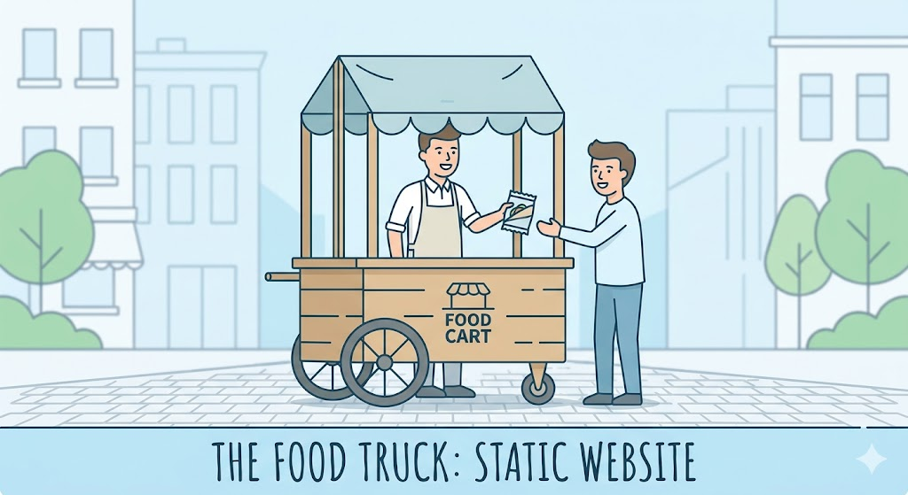

沒有服務生、沒有廚房、沒有倉庫。你就是全部。

### 對應的網路概念：靜態網站

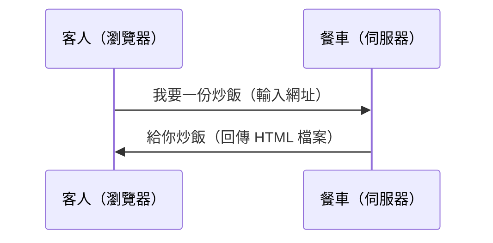
```mermaid
sequenceDiagram
    participant 客人 as 客人（瀏覽器）
    participant 餐車 as 餐車（伺服器）

    客人->>餐車: 我要一份炒飯（輸入網址）
    餐車->>客人: 給你炒飯（回傳 HTML 檔案）
```

這就是最早期的網站運作方式。

伺服器上存著一個 HTML 檔案，有人輸入網址，伺服器就把那個檔案整個丟過去。每個人拿到的東西完全一樣——就像餐車只賣一種套餐，沒有客製化。

**這個階段的特點：**

- 速度快，架構超簡單
- 但每個人看到的內容都一樣
- 無法「記住」客人是誰
- 無法根據不同條件顯示不同內容

今天很多純展示型的網站（公司介紹頁、個人作品集）還是這樣運作的。簡單的問題用簡單的解法就好。

---

## 小餐廳開幕：外場與廚房的分工

### 場景

生意越來越好，你租了店面。現在有了**外場（服務生）**和**廚房（廚師）**。

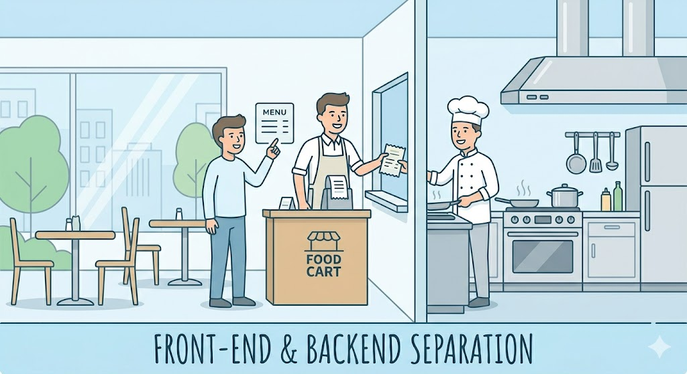

客人進門，服務生帶位、遞菜單、收點單——但服務生不會下廚。他把點單傳給廚房，廚房做好，再由服務生端出來。

外場負責「跟客人打交道」，廚房負責「實際做事」。

### 對應的網路概念：前後端分離

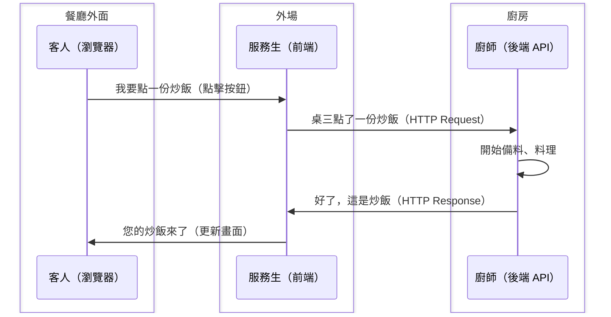
```mermaid
sequenceDiagram
    box 餐廳外面
        participant 客人 as 客人（瀏覽器）
    end
    box 外場
        participant 外場 as 服務生（前端）
    end
    box 廚房
        participant 廚房 as 廚師（後端 API）
    end

    客人->>外場: 我要點一份炒飯（點擊按鈕）
    外場->>廚房: 桌三點了一份炒飯（HTTP Request）
    廚房->>廚房: 開始備料、料理
    廚房->>外場: 好了，這是炒飯（HTTP Response）
    外場->>客人: 您的炒飯來了（更新畫面）
```

**外場 = 前端**：你在瀏覽器裡看到的畫面，按鈕、表單、動畫。負責呈現，以及把使用者的操作轉換成「請求」送給後端。

**廚房 = 後端**：你看不到的地方。負責處理邏輯、計算、查資料，然後把結果回傳給前端。

**傳遞點單的那張紙 = HTTP**：前後端溝通的語言。你之後會學到它的細節，但現在只需要知道：每次前端想要什麼，它就用 HTTP 發一個「請求（Request）」；後端處理完，用 HTTP 回一個「回應（Response）」。

> **為什麼要分開？**
> 你可以讓一個人同時當服務生和廚師——但他一忙起來就會出事。分工讓兩邊都可以獨立優化、獨立部署、獨立擴展。

---

## 廚房需要食譜：把資訊結構化保存

### 場景

餐廳開了幾個月，廚房開始混亂——每個廚師對同一道菜的做法都不一樣，食材買了多少沒人知道，昨天桌三點了什麼也沒人記得。

老闆決定整理出幾本**食譜本**，每本記一種事：

```
📗 食譜本           📙 訂單本          📘 食材本
─────────────────   ─────────────      ─────────────
炒飯               桌3: 炒飯x2        白米:  20kg
  食材: 白米、蛋    桌7: 牛肉麵x1      牛腱:   5kg
  步驟: 熱鍋下油…  桌1: 滷肉飯x3      滷包:  12包
牛肉麵
  食材: 牛腱、麵
  步驟: 滷三小時…
```

每本食譜本都有固定的**欄位結構**，讓任何人翻開都能快速找到需要的資訊。

這三本食譜本，就是三張**資料表（Table）**。

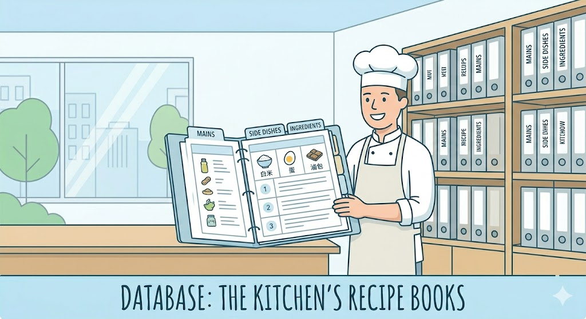

### 對應的網路概念：資料庫

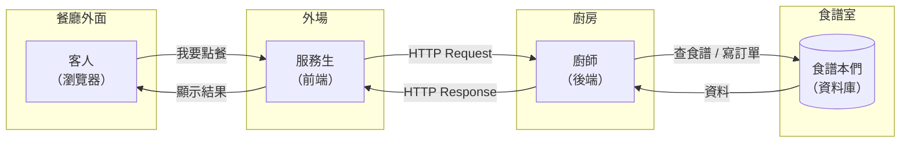
```mermaid
graph LR
    subgraph 餐廳外面
        A["客人<br/>（瀏覽器）"]
    end
    subgraph 外場
        FE["服務生<br/>（前端）"]
    end
    subgraph 廚房
        B["廚師<br/>（後端）"]
    end
    subgraph 食譜室
        C[("食譜本們<br/>（資料庫）")]
    end

    A -- "我要點餐" --> FE
    FE -- "HTTP Request" --> B
    B -- "查食譜 / 寫訂單" --> C
    C -- "資料" --> B
    B -- "HTTP Response" --> FE
    FE -- "顯示結果" --> A
```

**食譜本 = 資料庫**：把所有需要「永久保存」的資料，用結構化的方式記下來，讓任何人都能快速查詢。

這裡有個很關鍵的概念：

```
廚師的腦子 = 記憶體（RAM）
  → 程式跑著的時候可以用
  → 電源一關，全部消失

食譜本 = 資料庫（硬碟）
  → 寫下來就永遠在
  → 伺服器重啟，資料還在
```

廚師腦子裡記著「炒飯要放多少鹽」——但他請假了，新廚師就不知道。食譜本上寫著，任何人翻開都能照著做。

**為什麼要分成多本（多張資料表）？**
食譜的結構跟訂單的結構完全不同，硬塞在一起會變成一場災難。分開記錄、用關聯連結，才是資料庫的精髓——這個你在 Part 5 會深入學到。

---

## 廚房工作台的備料：快取

### 場景

食譜室解決了「永久保存」的問題，但帶來了一個新麻煩：**廚師每次都要跑去食譜室翻書**。

今天的熱門菜是炒飯，一個小時賣 300 份。廚師不可能每份都跑去翻一次「炒飯要放哪些食材」——他早就背下來了，食材也提前備好放在**廚房工作台**上。要用的時候直接拿，不用跑去食譜室。

這就是**快取（Cache）**：把「常用的東西」提前放到「更近的地方」，不用每次都跑去原本的地方拿。

### 對應的網路概念：伺服器快取（Redis）

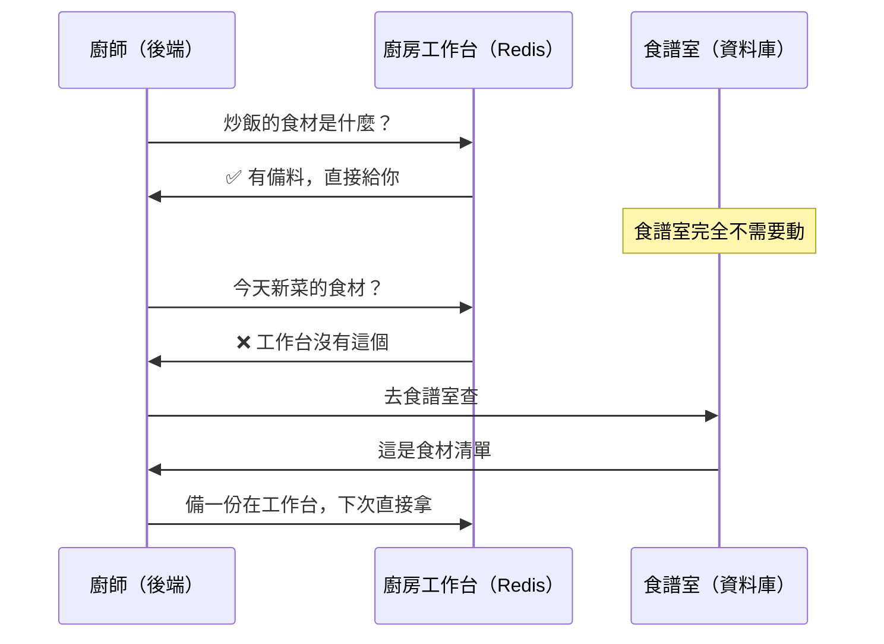
```mermaid
sequenceDiagram
    participant 廚師 as 廚師（後端）
    participant 工作台 as 廚房工作台（Redis）
    participant 食譜室 as 食譜室（資料庫）

    廚師->>工作台: 炒飯的食材是什麼？
    工作台->>廚師: ✅ 有備料，直接給你
    Note over 食譜室: 食譜室完全不需要動

    廚師->>工作台: 今天新菜的食材？
    工作台->>廚師: ❌ 工作台沒有這個
    廚師->>食譜室: 去食譜室查
    食譜室->>廚師: 這是食材清單
    廚師->>工作台: 備一份在工作台，下次直接拿
```

**工作台 = Redis（記憶體快取）**

```
從工作台拿（記憶體）：~0.1 毫秒
去食譜室翻書（資料庫）：~10 毫秒

速度差了約 100 倍
```

但工作台有兩個限制：

- **空間有限**：放不了所有食材，只放今天常用的
- **關電就清空**：廚房關門後工作台清空（但食譜室的書還在）

所以快取的設計是一門學問——放什麼、放多久、什麼時候更新。這個你在課外讀物 E-11 會深入學到。

---

## 老闆的辦公室：後台系統

### 場景

餐廳穩定下來，老闆有了新需求：

- 「今天賣了多少份炒飯？收入是多少？」
- 「我要把那道賣不好的菜從菜單下架」
- 「幫我設定週末的折扣活動」
- 「哪些常客消費最多？」

這些事情客人不需要知道，也不應該讓客人亂動。老闆需要一個**只有員工能進去的辦公室**，裡面有一套管理介面，連到同一個廚房和食譜室，但有不同的操作權限。

### 對應的網路概念：管理後台（Admin System）

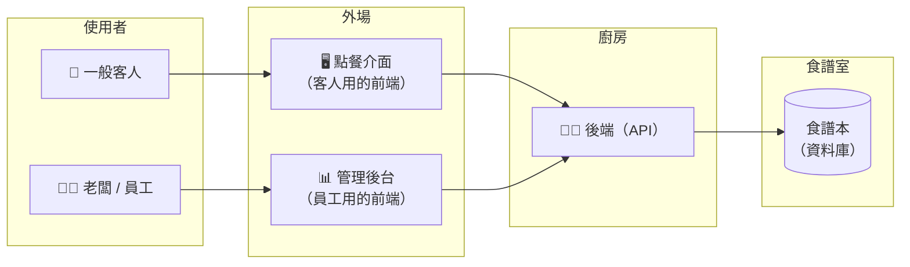
```mermaid
graph LR
    subgraph 使用者
        客人["🧑 一般客人"]
        老闆["👨‍💼 老闆 / 員工"]
    end

    subgraph 外場
        點餐介面["🖥️ 點餐介面<br/>（客人用的前端）"]
        後台介面["📊 管理後台<br/>（員工用的前端）"]
    end

    subgraph 廚房
        API["👨‍🍳 後端（API）"]
    end

    subgraph 食譜室
        DB[("食譜本<br/>（資料庫）")]
    end

    客人 --> 點餐介面
    老闆 --> 後台介面
    點餐介面 --> API
    後台介面 --> API
    API --> DB
```

連到的是同一個廚房、同一本食譜——只是身份不同，能做的事不同。

這裡有個初學者最常搞混的概念：

**「後台」≠「後端」**

|            | 後台（Admin）                | 後端（Backend）          |
| ---------- | ---------------------------- | ------------------------ |
| 是什麼？   | 給員工用的管理介面           | 處理邏輯的廚房           |
| 比喻       | 老闆辦公室                   | 廚房本身                 |
| 技術本質   | **一種前端**（服務對象不同） | 接收請求、處理資料的服務 |
| 誰能看到？ | 老闆、客服、行銷人員         | 對所有使用者不可見       |

後台是一種前端——只是服務的對象從「客人」換成了「內部員工」。它一樣透過 HTTP 請求跟後端廚房溝通，只是它能做的操作更多、限制更少（因為有管理員身份）。

---

## 假日人潮來了：增設分店

### 場景

週末突然湧進大量客人。一間餐廳忙不過來，客人排隊排到門外開始抱怨。

解法很直觀：在隔壁再開一間一模一樣的分店。甚至三間、四間。

但問題來了：**客人站在路口，怎麼知道要進哪間店？**

你安排了一個引導員站在路口，看哪間店比較空，就把下一批客人帶進去。每間店裡面都有自己完整的外場和廚房，運作方式完全一樣——客人不管進哪間，體驗都相同。

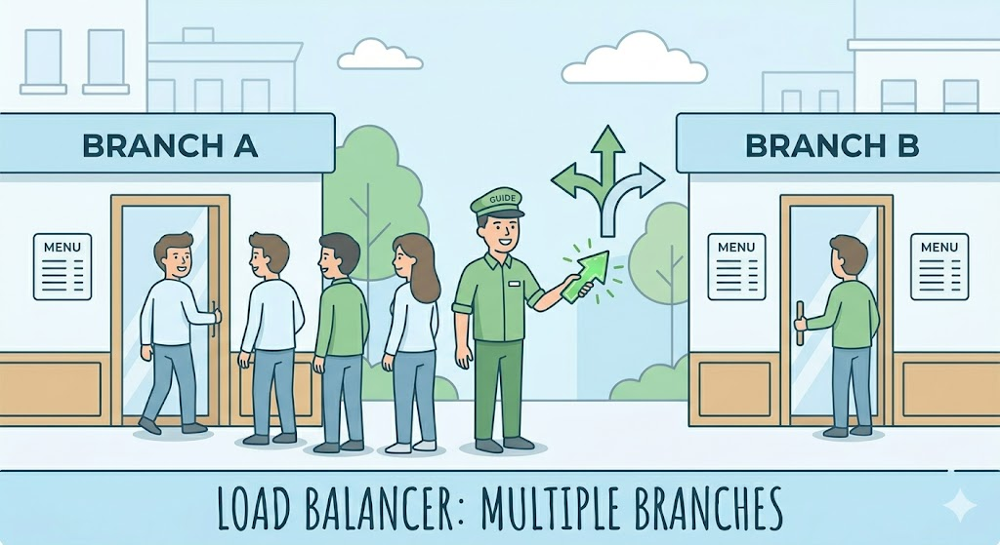

### 對應的網路概念：負載平衡（Load Balancer）

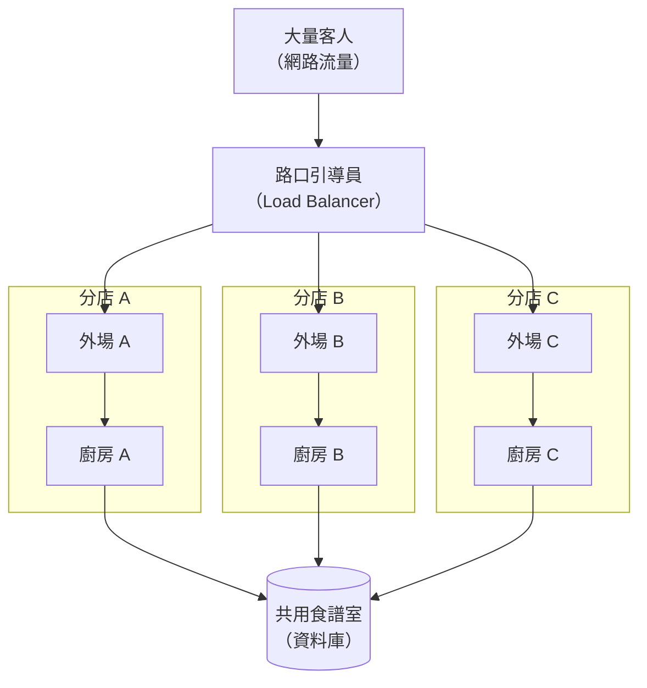
```mermaid
graph TD
    A["大量客人<br/>（網路流量）"] --> B["路口引導員<br/>（Load Balancer）"]

    subgraph 分店 A
        C1["外場 A"] --> C2["廚房 A"]
    end
    subgraph 分店 B
        D1["外場 B"] --> D2["廚房 B"]
    end
    subgraph 分店 C
        E1["外場 C"] --> E2["廚房 C"]
    end

    B --> C1
    B --> D1
    B --> E1
    C2 & D2 & E2 --> F[("共用食譜室<br/>（資料庫）")]
```

**引導員 = Load Balancer（負載平衡器）**：站在最前面，把進來的請求分配給多台伺服器，確保沒有任何一台被壓垮。

每台伺服器就是一間**完整的分店**——有自己的外場（前端）和廚房（後端）。它們共用同一個食譜室（資料庫），所以不管客人進哪間店，查到的菜單、記錄的訂單都是同一份。

這就是「水平擴展」——不是讓一個廚師練得更強（垂直擴展），而是開更多間一模一樣的店（水平擴展）。

> 這也是為什麼大型網站在促銷期間不會掛點：它們早就準備好了很多台伺服器在後面待命。

---

## 全城展店：讓食物更靠近客人

### 場景

你的品牌紅了，在台北、台中、高雄都開了分店。但中央廚房還是在台北。

問題出現了：高雄的客人點了一個「本日特餐」，廚房在台北做好，再一路送到高雄——等到的時候已經涼了，而且等了很久。

但高雄客人點的**麵包**，其實每天都一樣，不需要每次都從台北現做現送。

解法：在高雄建一個**前置倉庫**，把每天都一樣的食材提前放在那裡。高雄客人要麵包，直接從高雄拿；要本日特餐這種每天不同的東西，才回頭找台北廚房。

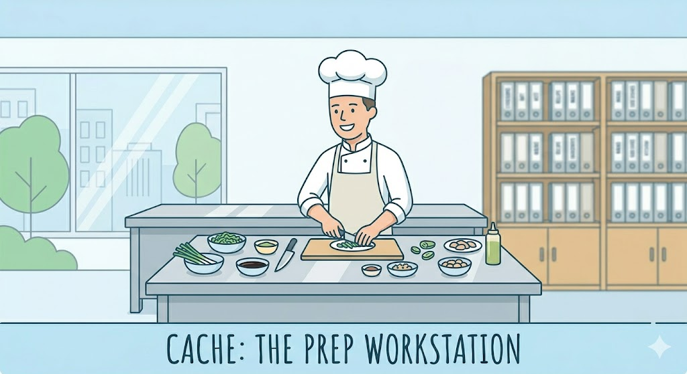

### 對應的網路概念：CDN（內容分發網路）

**場景一：客人要麵包**（每天都一樣的東西 → 靜態資源：圖片、CSS）

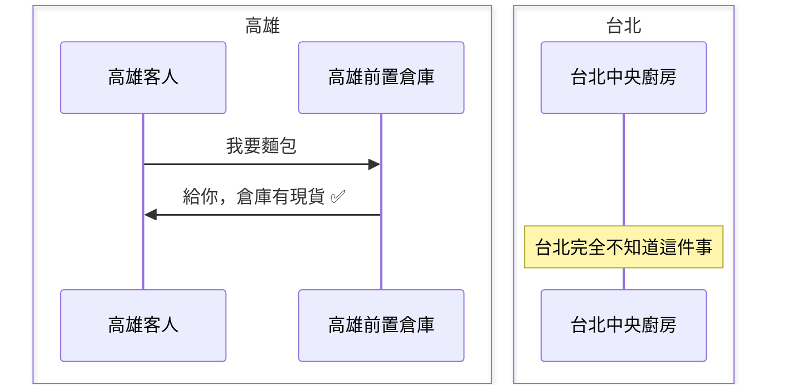
```mermaid
sequenceDiagram
    box 高雄
        participant 客人 as 高雄客人
        participant 倉庫 as 高雄前置倉庫
    end
    box 台北
        participant 廚房 as 台北中央廚房
    end

    客人->>倉庫: 我要麵包
    倉庫->>客人: 給你，倉庫有現貨 ✅
    Note over 廚房: 台北完全不知道這件事
```

**場景二：客人要本日特餐**（每天都不同的東西 → 動態內容：使用者資料、即時訊息）

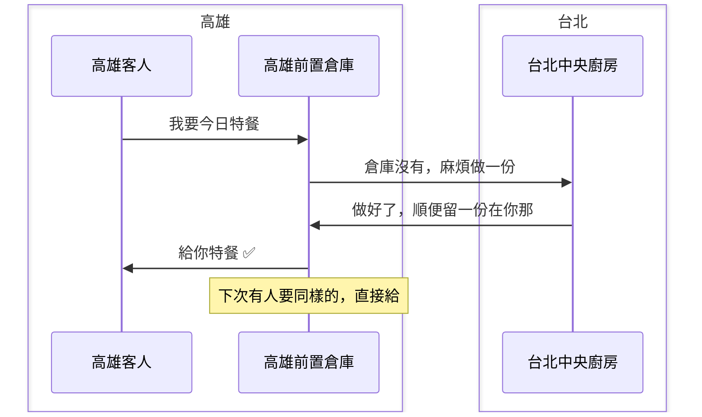
```mermaid
sequenceDiagram
    box 高雄
        participant 客人 as 高雄客人
        participant 倉庫 as 高雄前置倉庫
    end
    box 台北
        participant 廚房 as 台北中央廚房
    end

    客人->>倉庫: 我要今日特餐
    倉庫->>廚房: 倉庫沒有，麻煩做一份
    廚房->>倉庫: 做好了，順便留一份在你那
    倉庫->>客人: 給你特餐 ✅
    Note over 倉庫: 下次有人要同樣的，直接給
```

**CDN（Content Delivery Network）**= 分散在全球各地的前置倉庫網路。

把不常變動的東西——圖片、影片、CSS 樣式、JavaScript 檔案——預先放到離使用者最近的節點。使用者要這些東西時，直接從最近的地方拿，不用大老遠跑到主伺服器。

**為什麼重要？**
台灣台北到台南的延遲大約 5ms，到美國舊金山大約 150ms。如果你的網站圖片都放在美國，台灣使用者每次載入頁面都多等 150ms。CDN 解決的就是這個物理距離的問題。

你每天用的 YouTube、Netflix，影片之所以能這麼順，背後都有龐大的 CDN 網路。

---

## 集團化分工：各部門獨立運作

### 場景

餐飲集團越做越大，業務越來越複雜：

- **外送部門**：有自己的外送員、計費系統、地圖整合
- **內用部門**：有自己的訂位系統、點餐平板、桌號管理
- **外燴部門**：有自己的活動排程、大量採購、移動廚房
- **甜點專賣**：有自己的菜單、食材、定價邏輯

這些部門各自獨立。外送部門的系統壞了，你還是可以去內用，不會整家餐廳都倒。

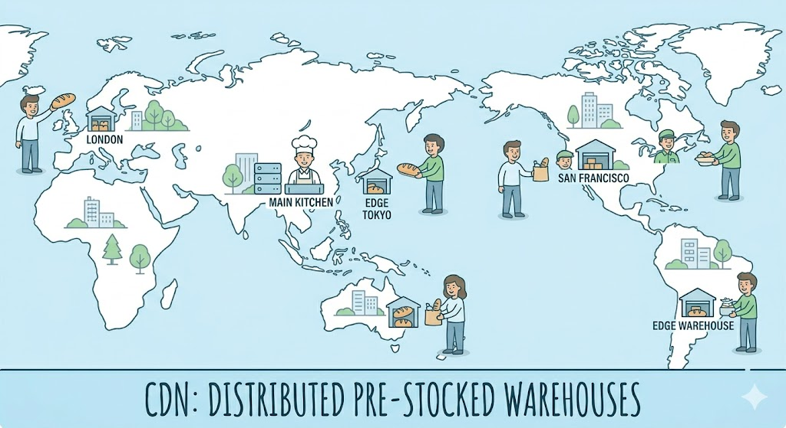

### 對應的網路概念：微服務（Microservices）

以前的大廚房什麼都自己來——點餐、外送、付款、通知，全塞在同一個系統裡。這叫 **Monolith（單體架構）**。

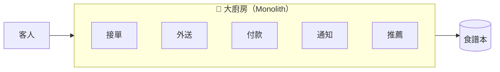
```mermaid
graph LR
    客人A["客人"] --> 大廚房

    subgraph 大廚房["🍳 大廚房（Monolith）"]
        接單 & 外送 & 付款 & 通知 & 推薦
    end

    大廚房 --> DB1[("食譜本")]
```

後來集團把不同業務拆成**各自獨立的部門**，每個部門有自己的人員和系統，這叫 **Microservices（微服務）**：

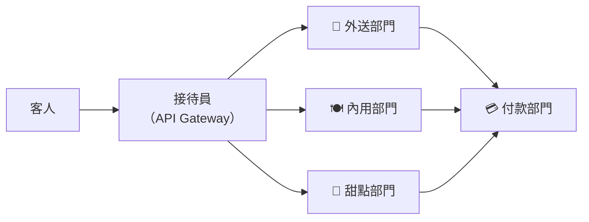
```mermaid
graph LR
    客人B["客人"] --> 接待員["接待員<br/>（API Gateway）"]

    接待員 --> A["🛵 外送部門"]
    接待員 --> B["🍽️ 內用部門"]
    接待員 --> C["🍰 甜點部門"]
    A --> D["💳 付款部門"]
    B --> D
    C --> D
```

**最關鍵的差異**——當某個部門出問題時：

**大廚房時代：外送出問題，全家一起倒**

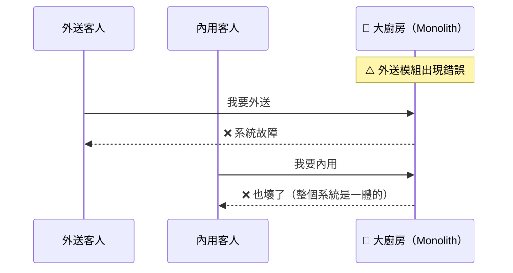
```mermaid
sequenceDiagram
    participant 外送客人
    participant 內用客人
    participant 大廚房 as 🍳 大廚房（Monolith）

    Note over 大廚房: ⚠️ 外送模組出現錯誤
    外送客人->>大廚房: 我要外送
    大廚房-->>外送客人: ❌ 系統故障
    內用客人->>大廚房: 我要內用
    大廚房-->>內用客人: ❌ 也壞了（整個系統是一體的）
```

**各部門獨立：外送出問題，內用照常**

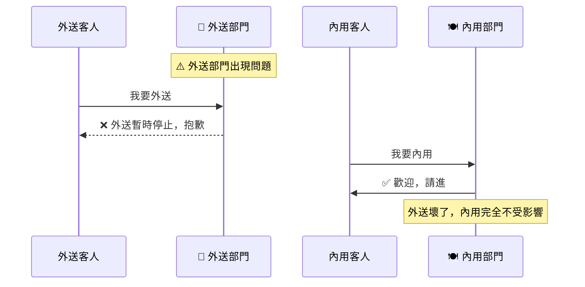
```mermaid
sequenceDiagram
    participant 外送客人
    participant 外送部門 as 🛵 外送部門
    participant 內用客人
    participant 內用部門 as 🍽️ 內用部門

    Note over 外送部門: ⚠️ 外送部門出現問題
    外送客人->>外送部門: 我要外送
    外送部門-->>外送客人: ❌ 外送暫時停止，抱歉
    內用客人->>內用部門: 我要內用
    內用部門->>內用客人: ✅ 歡迎，請進
    Note over 內用部門: 外送壞了，內用完全不受影響
```

Netflix 在 2009 年把整個系統從 Monolith 拆成微服務。原因是某天資料庫損壞，整個網站停擺了三天，損失慘重。拆成微服務後，一個服務掛掉不會影響其他服務。

> **重要提醒**：微服務不是「更好的架構」，它是「更複雜但更有彈性的架構」。一個初創公司從微服務開始是自找麻煩。這就是為什麼這個課程從 Monolith 開始——先搞懂一個系統，再談怎麼拆。

---

## 全球連鎖：標準化與中央管理

### 場景

你的集團現在在全球有 1000 家分店，每家的廚房設備、食譜標準、衛生規範必須一致。

你不可能飛到每個城市親自去架設廚房。你需要：

1. **一套標準化的廚房設備包**——不管在哪裡，打開這個包，廚房就設好了
2. **一個中央管理系統**——哪個城市人多就多開幾間、哪家店生意不好就暫時關掉、哪家店意外倒了就自動在旁邊補一間

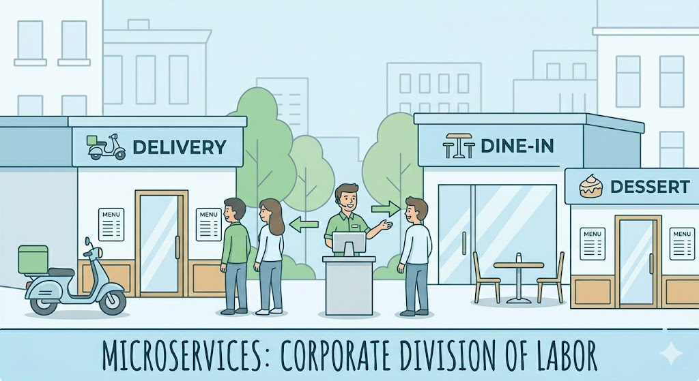

### 對應的網路概念：Docker 與 Kubernetes

**Docker = 標準化的廚房設備包**

把你的程式、它需要的環境、所有設定，一起打包成一個「容器（Container）」。不管在哪台電腦、哪個雲端平台打開，行為完全一致。

解決了工程師最痛恨的問題：「在我電腦上可以跑啊！」

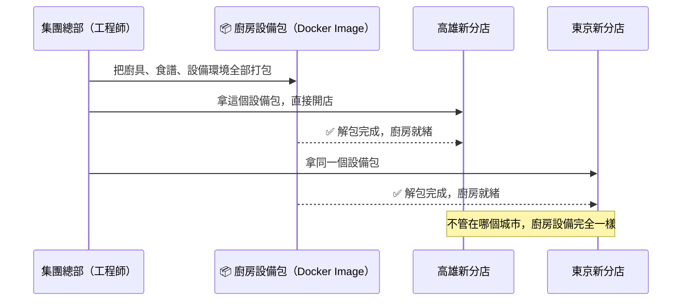
```mermaid
sequenceDiagram
    participant 集團 as 集團總部（工程師）
    participant 廚房包 as 📦 廚房設備包（Docker Image）
    participant 高雄店 as 高雄新分店
    participant 東京店 as 東京新分店

    集團->>廚房包: 把廚具、食譜、設備環境全部打包
    集團->>高雄店: 拿這個設備包，直接開店
    廚房包-->>高雄店: ✅ 解包完成，廚房就緒
    集團->>東京店: 拿同一個設備包
    廚房包-->>東京店: ✅ 解包完成，廚房就緒
    Note over 高雄店,東京店: 不管在哪個城市，廚房設備完全一樣
```

**Kubernetes（K8s）= 中央管理系統**

你告訴 K8s「高雄區保持 2 間分店在線」，它就自動幫你做到——包括某間分店突然倒閉時，自動在附近補開一間。

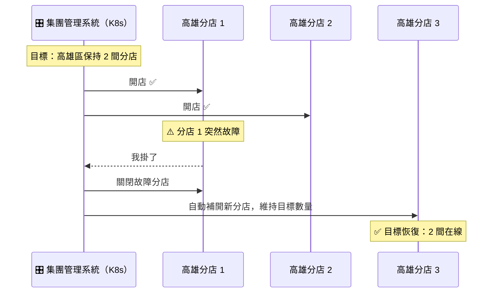
```mermaid
sequenceDiagram
    participant K8s as 🎛️ 集團管理系統（K8s）
    participant 分店1 as 高雄分店 1
    participant 分店2 as 高雄分店 2
    participant 分店3 as 高雄分店 3

    Note over K8s: 目標：高雄區保持 2 間分店
    K8s->>分店1: 開店 ✅
    K8s->>分店2: 開店 ✅
    Note over 分店1: ⚠️ 分店 1 突然故障
    分店1-->>K8s: 我掛了
    K8s->>分店1: 關閉故障分店
    K8s->>分店3: 自動補開新分店，維持目標數量
    Note over 分店3: ✅ 目標恢復：2 間在線
```

> 這章只是讓你知道這個層次的東西存在。K8s 不是這個課程的主要內容——你會在課程中學到 Docker 的基礎，K8s 的細節在課外讀物 E-13 有完整介紹。

---

## 整張地圖

好，讓我們把所有東西放在一起。

這是一個現代全端網路應用的完整架構，從使用者點擊按鈕，到資料存進資料庫的每一個節點：

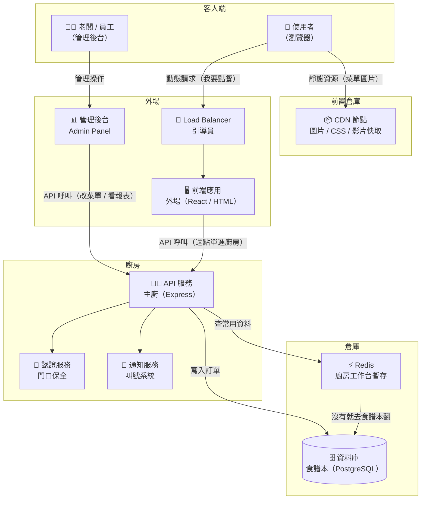
```mermaid
graph TB
    subgraph 客人端
        User["🧑 使用者<br/>（瀏覽器）"]
        Admin["👨‍💼 老闆 / 員工<br/>（管理後台）"]
    end

    subgraph 前置倉庫
        CDN["📦 CDN 節點<br/>圖片 / CSS / 影片快取"]
    end

    subgraph 外場
        LB["🚦 Load Balancer<br/>引導員"]
        FE["🖥️ 前端應用<br/>外場（React / HTML）"]
        AdminUI["📊 管理後台<br/>Admin Panel"]
    end

    subgraph 廚房
        API["👨‍🍳 API 服務<br/>主廚（Express）"]
        Auth["🔐 認證服務<br/>門口保全"]
        Notify["📣 通知服務<br/>叫號系統"]
    end

    subgraph 倉庫
        Cache["⚡ Redis<br/>廚房工作台暫存"]
        DB[("🗄️ 資料庫<br/>食譜本（PostgreSQL）")]
    end

    User -- "靜態資源（菜單圖片）" --> CDN
    User -- "動態請求（我要點餐）" --> LB
    Admin -- "管理操作" --> AdminUI
    LB --> FE
    FE -- "API 呼叫（送點單進廚房）" --> API
    AdminUI -- "API 呼叫（改菜單 / 看報表）" --> API
    API --> Auth
    API --> Notify
    API -- "查常用資料" --> Cache
    Cache -- "沒有就去食譜本翻" --> DB
    API -- "寫入訂單" --> DB
```

**你在這個課程裡會學到的每一個方塊**，都對應這張圖的某個部分：

| 課程 Part     | 對應圖中的位置                    |
| ------------- | --------------------------------- |
| Part 0-3      | 最左邊：使用者、瀏覽器、前端      |
| Part 4        | 前端 ↔ 後端的連線（HTTP、API）    |
| Part 4-B      | 管理後台（Admin System）          |
| Part 5        | 最右邊：資料庫                    |
| Part 6        | 前端應用（React）                 |
| Part 7        | Load Balancer、部署、整個系統上線 |
| 課外讀物 E-11 | Redis 快取、快取多層架構          |
| 課外讀物 E-13 | 整張圖的規模化                    |

**快取的多個層次（從客人到資料，越左邊越快）：**

```
客人的瀏覽器快取 → CDN 前置倉庫 → 廚房工作台（Redis）→ 食譜本（資料庫）
   已在本地，最快     附近節點，次快    記憶體，很快           硬碟，最準確
```

每一層都是前一層的「備胎」：優先從最快的地方拿，拿不到才往下一層找。

---

## 這章的重點不是記住所有名詞

你不需要現在就記住 Load Balancer、CDN、Kubernetes 這些詞。

這章的目的只有一個：**當你學某個技術的時候，你知道它在整張地圖的哪個位置，以及它解決了什麼問題。**

學 Express 的時候，你知道自己在蓋廚房。
學資料庫的時候，你知道自己在建倉庫。
學部署的時候，你知道自己在讓全世界的客人都能進門。

這張地圖，貼在你學習旅程的牆上。

---

## 小練習

這些都是思考題，沒有標準答案：

1. **你常用的 YouTube**，對應到這張圖的哪些部分？它為什麼可以讓全球這麼多人同時看影片？
2. **某個小型部落格網站**（每天 100 個訪客），需要 CDN 嗎？需要 Load Balancer 嗎？為什麼？
3. **如果你開了一個網路商店**，哪些資料一定要放資料庫？哪些資料放 CDN 比較合適？

---

## 課外讀物

> 想深入了解 CDN 的運作細節 → [課外讀物 E-11-5：CDN 是什麼？靜態資源如何加速](../../課外讀物/E-11-performance/E-11-5-cdn.md)

> 想了解 Redis 快取怎麼設計 → [課外讀物 E-11-3：Redis 與快取策略](../../課外讀物/E-11-performance/E-11-3-redis-cache.md)

> 想看快取各層次如何協作 → [課外讀物 E-11-8：多層次快取全景：瀏覽器到資料庫](../../課外讀物/E-11-performance/E-11-8-cache-layers.md)

> 想了解 Monolith vs 微服務的真實取捨 → [課外讀物 E-13-4：Monolith vs Microservices](../../課外讀物/E-13-scaling/E-13-4-monolith-vs-microservices.md)

> 想提前看看 K8s 在做什麼 → [課外讀物 E-13-3：Kubernetes 概念入門](../../課外讀物/E-13-scaling/E-13-3-kubernetes-intro.md)
