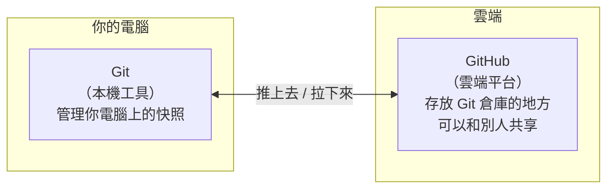

# [0-4] Git 是什麼？為什麼每個工程師都需要它

> **本章目標**：理解版本控制的概念，知道 Git 解決了什麼問題，以及它和 GitHub 的差別。

## 你會學到

- 「命名地獄」是什麼，為什麼它很痛苦
- 版本控制系統解決了哪些問題
- Git 的核心概念：快照（snapshot）
- Git（本機工具）和 GitHub（雲端平台）的差別
- 團隊不用 Git 會發生什麼慘事

## 概念說明

### 你一定遇過這個問題

打開資料夾，看到這些檔案：

```
報告.docx
報告_修改.docx
報告_修改2.docx
報告_final.docx
報告_final_v2.docx
報告_final_v2_真的最終版.docx
報告_final_v2_真的最終版_老師改.docx
```

這就是「命名地獄」（Naming Hell）。每次你不確定要不要覆蓋舊檔案，就複製一份改個名字。最後資料夾裡積了十幾個版本，你完全不記得哪個是最新的、哪個改了什麼。

寫程式的時候這個問題更嚴重。一個專案可能有幾十個檔案，每個檔案都在改，你根本沒辦法用複製貼上的方式追蹤所有改動。

### Git 的解法：幫你的專案拍快照

想像你在玩電玩遊戲。每隔一段時間，你會手動存檔——「存檔點 1」、「存檔點 2」。如果你在某個關卡死掉了，你可以從上一個存檔點繼續，不需要從頭來過。

Git 做的事情幾乎一樣：

```
你寫了一些程式碼
    ↓
覺得這個階段可以記錄了
    ↓
告訴 Git：「幫我存一個快照」
    ↓
Git 記住「此刻所有檔案的狀態」
    ↓
你繼續寫...
```

這個「快照」在 Git 裡叫做 **commit（提交）**。每個 commit 都有：
- 那個時間點所有檔案的內容
- 你寫的一段說明（「新增了登入功能」）
- 時間戳記
- 是從哪個 commit 改過來的（上一個存檔點）

有了這些快照，你可以：
- 看某個功能是什麼時候加進去的
- 回到三天前的狀態
- 知道這一行程式碼是誰改的、為什麼改

### 快照的時間軸


這條時間軸上的每一個藍點，就是一個 commit。你可以跳回任何一個點，就像電玩的存檔點一樣。

### 如果團隊不用 Git，會發生什麼事

假設你和一個朋友一起做一個網站。你們用 USB 或 Line 傳檔案：

```
情境一：覆蓋慘案
你：改了 index.html，傳給對方
朋友：同時也在改 index.html（他不知道你改了）
朋友把自己的版本傳給你
→ 你的改動全部消失了

情境二：誰改的？
第二天看到一行程式碼，你說「這不是我寫的」
朋友說「我也不記得了」
→ 完全不知道這行是做什麼的，敢刪嗎？

情境三：改壞了
你改了某個功能，網站壞掉了
你不知道改了哪裡，只能一行一行看
→ 浪費兩個小時除錯
```

用 Git 的話，這三個問題都解決了。Git 知道每一行是誰在什麼時候改的，任何時候都能回到「還沒改壞」的狀態。

### Git 和 GitHub 的差別

這兩個名字很像，但它們是完全不同的東西：



**Git** 是一個安裝在你電腦上的工具，就像 Word 一樣——離線也能用，它只管你本機的版本控制。

**GitHub** 是一個網站（github.com），讓你把 Git 管理的程式碼放到雲端，這樣：
- 電腦壞掉不怕，雲端有備份
- 可以和團隊成員共享程式碼
- 可以讓別人看到你的作品集

你可以把關係想成：
- Git = 你家的保險箱
- GitHub = 銀行的保管箱（有備份、可共享、更安全）

下一章（0-5）會教你怎麼用 Git 指令，0-6 再教你怎麼把程式碼推到 GitHub。

## 小練習

這章沒有程式碼，先做幾個思考題，讓概念更清晰：

1. **想一想**：你過去有沒有遇過「命名地獄」的情況？不管是學校報告、遊戲存檔、還是任何檔案。那個時候你是怎麼解決的？

2. **想一想**：如果你要和一個朋友一起寫作業文件（不能用 Google Docs），你們會怎麼分工？會遇到什麼問題？Git 可以怎麼幫你們？

3. **猜一猜**：Git 說它可以讓你「回到任何一個存檔點」——你覺得 Git 是怎麼做到的？它把什麼東西存在哪裡了？（下一章揭曉）

## 課外讀物

> 想了解 Git 在電腦裡怎麼存資料 → [課外讀物 E-8-1：Git 的內部運作：blob、tree、commit 是什麼](../../課外讀物/E-8-git/E-8-1-git-internals.md)

> 想看 Linus Torvalds 怎麼在 2 週內寫出 Git → [課外讀物 E-8-9：Linus Torvalds 與 Git 的誕生](../../課外讀物/E-8-git/E-8-9-linus-git-story.md)
