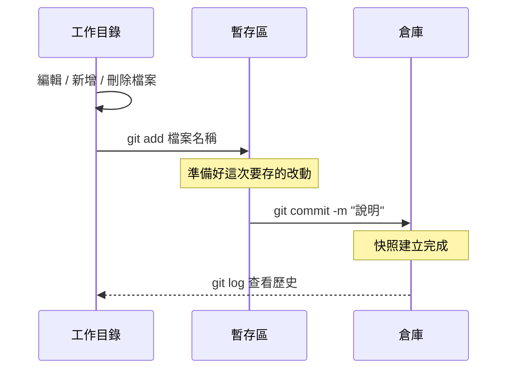

# [0-5] Git 基本操作：init / add / commit / log

> **本章目標**：學會用 Git 指令在本機建立版本控制，能夠追蹤檔案改動並建立 commit。

## 你會學到

- Git 的三個區域：工作目錄、暫存區、倉庫
- `git init`：讓一個資料夾變成 Git 管理的專案
- `git add` 和 `git commit`：建立快照的兩個步驟
- `git log` 和 `git diff`：查看歷史和改動
- 怎麼寫一個有意義的 commit 訊息

## 概念說明

### Git 的三個區域

在學指令之前，先搞懂 Git 的運作模型。Git 把你的工作分成三個區域：

```
工作目錄（Working Directory）
你實際在編輯的檔案，就是你在 VS Code 裡看到的那些

        ↓  git add

暫存區（Staging Area）
「打包箱」，你決定要放進這次快照的改動先放這裡

        ↓  git commit

倉庫（Repository）
「倉庫」，正式儲存快照的地方，存在 .git 資料夾裡
```

用生活類比來說：

| Git 區域 | 生活類比 |
|---------|---------|
| 工作目錄 | 你的工作桌，東西散在上面 |
| 暫存區 | 打包箱，準備要寄出的東西放這裡 |
| 倉庫 | 倉庫，已經打包好、存好的紀錄 |

為什麼要有「暫存區」這個中間步驟？因為你可能同時改了三個檔案，但只想把其中兩個放進這次的快照，第三個還沒改好，等下一次再一起放。暫存區讓你精確控制「這次的 commit 包含哪些改動」。


### 你的第一個 Git 倉庫

打開終端機（Terminal），跟著做：

**第一步：建立一個新資料夾，進去**

這段在做什麼：建立一個叫 `my-first-git` 的資料夾，然後進入它。

```bash
mkdir my-first-git
cd my-first-git
```

**第二步：初始化 Git**

這段在做什麼：告訴 Git「請開始追蹤這個資料夾」。Git 會在這裡建立一個隱藏的 `.git` 資料夾，用來存所有的快照。

```bash
git init
```

你會看到：
```
Initialized empty Git repository in /你的路徑/my-first-git/.git/
```

## 程式碼範例

### git status — 查看目前狀態

這段在做什麼：問 Git「現在發生了什麼事？有什麼改動嗎？」。這是你最常用的指令，隨時可以下。

```bash
git status
```

剛 `git init` 完，還沒有任何檔案，所以會看到：
```
On branch main
No commits yet
nothing to commit
```

現在建立一個檔案：

```bash
# 建立一個簡單的 HTML 檔案
echo "<!DOCTYPE html><html><body><h1>Hello Git</h1></body></html>" > index.html
```

再執行一次 `git status`：
```
On branch main
No commits yet

Untracked files:
  (use "git add <file>..." to include in what will be committed)
        index.html

nothing added to commit but untracked files present
```

Git 說它看到了 `index.html`，但這個檔案是「untracked（未追蹤）」——也就是說，Git 還沒開始管理它。

---

### git add — 把檔案放進打包箱

這段在做什麼：告訴 Git「這個檔案的改動，放進下次 commit 的打包箱裡」。

```bash
# 把單一檔案加進暫存區
git add index.html

# 或者把所有有改動的檔案一次加進去
git add .
```

> **常見錯誤** — 很多人習慣直接 `git add .` 什麼都加。這樣有個問題：你可能不小心把不應該上傳的東西（例如密碼、大型媒體檔案）也一起加進去了。
> 養成好習慣：先 `git status` 看清楚有哪些改動，再決定要 `add` 什麼。

加完之後再 `git status`：
```
On branch main
No commits yet

Changes to be committed:
  (use "git rm --cached <file>..." to unstage)
        new file:   index.html
```

現在 `index.html` 在「Changes to be committed」裡，代表它在暫存區、準備好了。

---

### git commit — 建立快照，進倉庫

這段在做什麼：把暫存區裡的所有改動，正式打包成一個快照（commit），存進倉庫。`-m` 後面接的是這次 commit 的說明訊息。

```bash
git commit -m "新增首頁 HTML 結構"
```

你會看到：
```
[main (root-commit) a3f8c12] 新增首頁 HTML 結構
 1 file changed, 1 insertion(+)
 create mode 100644 index.html
```

`a3f8c12` 是這個 commit 的 ID（SHA-1 雜湊值的前幾位），Git 用它來識別每個 commit。

**什麼是好的 commit 訊息？**

想像三個月後的你，打開這個專案，看到 commit 歷史：

```
# 壞的 commit 訊息（完全沒資訊）
fix
update
改了一些東西
aaaa

# 好的 commit 訊息（一眼知道做了什麼）
新增使用者登入頁面
修復手機版選單不能點的 bug
更新首頁 banner 圖片尺寸
```

一個好的 commit 訊息應該完成這個句子：「這個 commit 會 ___」。

> 這裡用到了 Single Responsibility Principle 的概念，每個 commit 只做一件事 → **[課外讀物 E-7-2] S — Single Responsibility Principle**

---

### git log — 看歷史紀錄

這段在做什麼：顯示目前分支的所有 commit 歷史，從最新的排到最舊的。

先多做幾個 commit，讓歷史看起來比較有趣：

```bash
# 建立第二個檔案
echo "body { font-family: sans-serif; }" > style.css
git add style.css
git commit -m "新增基本 CSS 樣式"

# 修改 index.html
echo "<!DOCTYPE html><html><head><link rel='stylesheet' href='style.css'></head><body><h1>Hello Git</h1></body></html>" > index.html
git add index.html
git commit -m "連結 CSS 樣式表到首頁"
```

現在執行：

```bash
git log
```

你會看到：
```
commit 9d2e1f3 (HEAD -> main)
Author: 你的名字 <你的信箱>
Date:   Thu May 8 14:30:00 2025 +0800

    連結 CSS 樣式表到首頁

commit b7a4c89
Author: 你的名字 <你的信箱>
Date:   Thu May 8 14:28:00 2025 +0800

    新增基本 CSS 樣式

commit a3f8c12
Author: 你的名字 <你的信箱>
Date:   Thu May 8 14:25:00 2025 +0800

    新增首頁 HTML 結構
```

想看精簡版（一行一個 commit）：

```bash
git log --oneline
```

```
9d2e1f3 (HEAD -> main) 連結 CSS 樣式表到首頁
b7a4c89 新增基本 CSS 樣式
a3f8c12 新增首頁 HTML 結構
```

`HEAD` 代表「你現在在哪個 commit」，通常就是最新的那個。

---

### git diff — 看做了哪些改動

這段在做什麼：比較「現在的檔案」和「上一個 commit 的檔案」有什麼不同，讓你在 commit 之前確認自己改了什麼。

修改 `index.html`，但還不 commit：

```bash
# 假設你手動編輯了 index.html，加了一行 <p>歡迎來到我的網站</p>
git diff
```

你會看到類似：
```diff
diff --git a/index.html b/index.html
index abc1234..def5678 100644
--- a/index.html
+++ b/index.html
@@ -1 +1,2 @@
 <!DOCTYPE html><html>...
+<p>歡迎來到我的網站</p>
```

`+` 開頭的行是新增的，`-` 開頭的行是刪除的。

---

### 完整流程回顧



## 小練習

### 練習一：建立你的第一個 Git 專案

1. 在桌面建立一個叫 `git-practice` 的資料夾
2. 進入資料夾，執行 `git init`
3. 建立一個 `index.html` 檔案，寫一個簡單的 HTML 頁面
4. 用 `git add` 和 `git commit` 建立第一個 commit
5. 執行 `git log` 確認 commit 成功

### 練習二：做三個有意義的 commit

繼續在同一個資料夾：

1. 新增一個 `style.css`，建立第二個 commit（訊息：「新增 CSS 樣式」）
2. 修改 `index.html`，把 CSS 連進去，建立第三個 commit（訊息：「連結 CSS 到首頁」）
3. 執行 `git log --oneline` 看看你的三個 commit

### 練習三：用 git diff 看改動

1. 修改 `index.html`，加一些內容
2. **先不要 `git add`**，執行 `git diff`
3. 確認你看得懂 `+` 和 `-` 代表什麼

## 課外讀物

> 想了解 commit 訊息怎麼寫才專業 → [課外讀物 E-8-5：Commit 訊息規範：Conventional Commits](../../課外讀物/E-8-git/E-8-5-commit-message.md)

> 想了解 Branch 是什麼 → [課外讀物 E-8-2：Branch 與 Merge：平行宇宙的概念](../../課外讀物/E-8-git/E-8-2-branch-and-merge.md)
