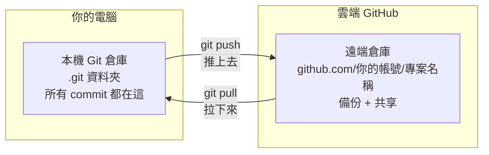
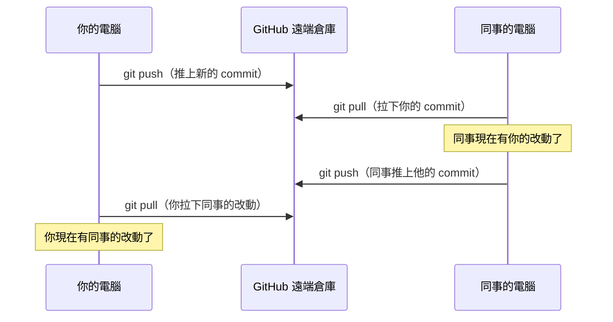

# [0-6] GitHub 入門：把程式碼放到雲端

> **本章目標**：建立 GitHub 帳號、建立遠端倉庫，把本機的 Git 專案推上 GitHub，並了解如何和別人協作。

## 你會學到

- Git 和 GitHub 的根本差別
- 如何在 GitHub 建立新倉庫
- `git remote add`、`git push`、`git pull` 這三個指令
- README.md 和 .gitignore 是什麼、為什麼要有
- 把 0-5 練習的專案推上 GitHub

## 概念說明

### Git 不等於 GitHub

上一章學的所有操作——`git init`、`git add`、`git commit`——全部都發生在你的電腦上。你的程式碼快照存在 `.git` 資料夾裡，只有你看得到。

**Git** 是一個本機工具，它不需要網路、不需要帳號，離線也能用。

**GitHub** 是一個網站（[github.com](https://github.com)），它讓你把 Git 倉庫放到雲端。有了 GitHub：

- 電腦壞掉或遺失，程式碼還在
- 可以和團隊成員共同編輯、查看彼此的改動
- 可以公開你的作品，讓世界看到
- 可以在任何一台電腦把程式碼拉下來繼續工作

用保險箱來比喻：

```
Git   → 你家裡的保險箱
         （你自己管，只有你看得到）

GitHub → 銀行的保管箱
         （有備份、可以授權別人進來、更安全）
```



這張圖說明的是：你的本機倉庫和 GitHub 上的遠端倉庫是兩個獨立的地方，你用 `push` 和 `pull` 在它們之間同步。

### 建立 GitHub 帳號

如果你還沒有 GitHub 帳號：

1. 前往 [github.com](https://github.com)
2. 點「Sign up」，輸入信箱、建立密碼、選擇帳號名稱
3. 驗證信箱
4. 帳號建立完成

帳號名稱建議用你的真實名字或固定的英文 ID，因為之後這會出現在你所有公開倉庫的網址上。

## 程式碼範例

### 在 GitHub 建立新倉庫

1. 登入 GitHub，點右上角的 `+` → **New repository**
2. 填寫設定：
   - **Repository name**：`git-practice`（和 0-5 練習的資料夾名稱一樣）
   - **Description**（可選）：「我的第一個 Git 練習專案」
   - **Public** 或 **Private**：先選 Public，讓別人看得到你的作品
   - **不要**勾選「Add a README file」（因為我們本機已經有了）
3. 點「Create repository」

建立完成後，GitHub 會給你一個網址，長這樣：
```
https://github.com/你的帳號名稱/git-practice.git
```

---

### git remote add origin — 連結遠端倉庫

這段在做什麼：告訴你本機的 Git「有一個遠端倉庫，我幫它取個名字叫 origin，網址是這個」。

`origin` 是一個慣例名稱，你可以改成其他名字，但幾乎所有人都用 `origin` 代表「主要的遠端倉庫」。

```bash
git remote add origin https://github.com/你的帳號名稱/git-practice.git
```

確認連結成功：

```bash
git remote -v
```

你會看到：
```
origin  https://github.com/你的帳號名稱/git-practice.git (fetch)
origin  https://github.com/你的帳號名稱/git-practice.git (push)
```

---

### git push — 把本機 commit 推上去

這段在做什麼：把你本機所有的 commit 推到 GitHub 上的遠端倉庫。`origin` 是遠端倉庫的名稱，`main` 是分支名稱。

```bash
git push -u origin main
```

第一次 push 要加 `-u`，這是「upstream」的縮寫，意思是「設定這個分支的預設上游」——之後你只需要輸入 `git push` 就好，不需要每次都寫 `origin main`。

你可能會被要求輸入 GitHub 帳號和密碼（或是 Personal Access Token）。輸入完成後：

```
Enumerating objects: 9, done.
Counting objects: 100% (9/9), done.
Delta compression using up to 8 threads
Compressing objects: 100% (6/6), done.
Writing objects: 100% (9/9), 800 bytes | 800.00 KiB/s, done.
Total 9 (delta 1), reused 0 (delta 0)
To https://github.com/你的帳號名稱/git-practice.git
 * [new branch]      main -> main
Branch 'main' set up to track remote branch 'main' from 'origin'.
```

現在打開 GitHub 網頁，重新整理，你的程式碼就出現在上面了。

---

### git pull — 把別人的改動拉下來

這段在做什麼：從遠端倉庫把別人（或你在另一台電腦）推上去的 commit，同步到你的本機。

```bash
git pull
```

在團隊開發中，每次開始工作之前先 `git pull`，確保你的本機是最新狀態，是一個好習慣。



---

### README.md — 你的專案說明書

在 GitHub 上，`README.md` 這個檔案會自動顯示在倉庫的首頁，就像一個專案的門面。

打開 VS Code，在 `git-practice` 資料夾裡新增 `README.md`：

```markdown
# git-practice

這是我學習 Git 時的練習專案。

## 包含什麼

- index.html：基本的 HTML 頁面
- style.css：基本 CSS 樣式

## 怎麼執行

用瀏覽器直接開啟 index.html 就可以了。
```

然後把它加進 commit 並推上去：

```bash
git add README.md
git commit -m "新增 README 說明文件"
git push
```

---

### .gitignore — 告訴 Git 哪些東西不要追蹤

有些東西不應該放到 Git 裡：
- `node_modules/`（幾十萬個檔案，可以用 `npm install` 重新產生）
- `.env`（環境變數，通常包含密碼或 API 金鑰）
- 系統產生的暫存檔（例如 macOS 的 `.DS_Store`）

`.gitignore` 是一個告訴 Git「這些東西不要管」的設定檔。

在專案根目錄建立 `.gitignore`：

```
# .gitignore

# Node.js 的依賴套件目錄（太大了，而且可以重新安裝）
node_modules/

# 環境變數（千萬不要上傳密碼！）
.env
.env.local

# macOS 系統檔案
.DS_Store

# 編輯器暫存
*.swp
```

> **常見錯誤** — 很多新手把 `node_modules` 推上 GitHub，因為他們沒設定 `.gitignore`。`node_modules` 可能有幾十萬個小檔案、好幾百 MB，推上去既慢又沒意義——這個資料夾應該列在 `.gitignore` 裡。

```bash
git add .gitignore
git commit -m "新增 .gitignore，排除 node_modules 和 .env"
git push
```

## 小練習

### 把 0-5 的練習推上 GitHub

1. 在 GitHub 建立一個新的 public 倉庫，名稱叫 `git-practice`
2. 在終端機進入 0-5 練習的 `git-practice` 資料夾
3. 執行 `git remote add origin https://github.com/你的帳號/git-practice.git`
4. 執行 `git push -u origin main`
5. 打開 GitHub 網頁，確認你的三個 commit 都在上面
6. 在 GitHub 上的 README.md 區域，點擊「Add a README」，GitHub 會直接讓你在網頁上編輯
7. 回到終端機，執行 `git pull`，看看本機有沒有同步到你剛才在網頁上加的 README

## 課外讀物

> 想了解 Git 分支策略與團隊協作流程 → [課外讀物 E-8-7：Git Flow 與 GitHub Flow](../../課外讀物/E-8-git/E-8-7-git-flow.md)
