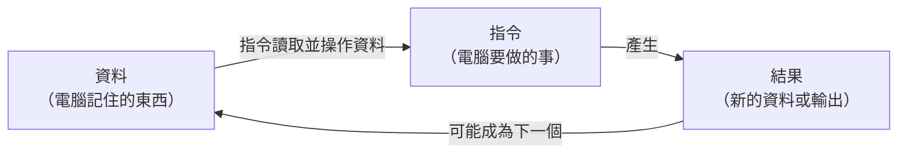

# [1-1] 電腦只懂兩件事：資料與指令

> **本章目標**：理解所有程式的本質都是「資料」和「指令」的組合，建立看程式碼的基本框架。

## 你會學到

- 什麼是資料（Data）、什麼是指令（Instruction）
- 用食譜類比理解這兩個概念
- 在程式碼裡，資料和指令長什麼樣子
- 為什麼連 Instagram、Netflix 這種龐大系統，也只是這兩件事的組合

## 概念說明

### 先從一個問題開始

你有沒有想過，電腦到底在做什麼？

它看起來能做好多事：播音樂、顯示網頁、計算數字、傳訊息……但如果你剝掉所有外表，電腦其實只懂兩件事：

1. **記住東西**（資料）
2. **對東西做事**（指令）

就這樣。沒有別的了。

---

### 用食譜來理解

想像你手上有一份食譜：

```
【材料】
- 水 200ml
- 茶葉 5g
- 糖 10g

【步驟】
1. 把水燒開
2. 放入茶葉，等 3 分鐘
3. 過濾茶葉
4. 加入糖，攪拌均勻
```

這份食譜裡有兩種東西：

| 食譜中的東西 | 對應到電腦的概念 |
|------------|---------------|
| 材料列表（水、茶葉、糖） | **資料**（Data）— 電腦記住的東西 |
| 烹飪步驟（燒開、過濾、攪拌） | **指令**（Instruction）— 電腦要做的事 |

這個比喻不是亂講的——程式設計師真的就是這樣想事情的。

---

### 資料是什麼？

**資料（Data）**就是電腦存在記憶體裡、需要用到的東西。

它可以是：
- 數字（`42`、`3.14`、`-7`）
- 文字（`"你好"`、`"password123"`）
- 是非值（`true` 或 `false`）
- 圖片、影音……（本質上還是數字，只是很多很多個）

在程式碼裡，資料通常長這樣：

```
水量 = 200
茶葉重量 = 5
糖的重量 = 10
使用者姓名 = "小明"
是否已登入 = 是
```

---

### 指令是什麼？

**指令（Instruction）**就是你叫電腦去做的動作。

它可以是：
- 計算（`加`、`減`、`乘`、`除`）
- 比較（`是否相等`、`是否大於`）
- 顯示（`把這段文字印出來`）
- 傳送（`把這個請求送到伺服器`）
- 儲存（`把這份資料寫進資料庫`）

在程式碼裡，指令通常長這樣：

```
燒開水
把茶葉放進去
等待 3 分鐘
過濾掉茶葉
加入糖，攪拌
```

---

### 用 Pseudo Code 組合起來

**Pseudo Code**（虛擬碼）是一種用接近人類語言寫出來的「假程式碼」，讓你先把想法寫清楚，不用擔心語法。

泡茶的 pseudo code 長這樣：

```
// 資料（材料）
水量 = 200
茶葉重量 = 5
糖的重量 = 10

// 指令（步驟）
加熱(水量)
放入(茶葉重量)
等待(3 分鐘)
過濾()
加入(糖的重量)
攪拌()
輸出("茶泡好了！")
```

看出來了嗎？上面定義的資料，在指令裡被使用了。**資料和指令不是分開的——指令操作資料，資料被指令改變。**

---

### 視覺化：資料與指令的關係



這張圖說明一件很重要的事：**指令處理資料，產生結果，結果又可能成為下一個輸入**。這個循環就是程式在做的事。

## 程式碼範例

### 用 JavaScript 寫出泡茶程式

下面這段程式碼把剛才的 pseudo code「翻譯」成真正的 JavaScript。先看看，感受一下資料和指令的分界線在哪裡。

```javascript
// === 資料區 ===
// 這些是我們需要「記住」的東西
const waterAmount = 200;       // 水量（毫升）
const teaAmount = 5;           // 茶葉重量（克）
const sugarAmount = 10;        // 糖的重量（克）
const brewingMinutes = 3;      // 泡茶時間（分鐘）

// === 指令區 ===
// 這些是我們叫電腦「去做」的事
console.log(`加熱 ${waterAmount}ml 的水`);
console.log(`放入 ${teaAmount}g 茶葉`);
console.log(`等待 ${brewingMinutes} 分鐘`);
console.log("過濾茶葉");
console.log(`加入 ${sugarAmount}g 糖，攪拌均勻`);
console.log("完成！一杯茶泡好了 ☕");
```

執行結果會長這樣：
```
加熱 200ml 的水
放入 5g 茶葉
等待 3 分鐘
過濾茶葉
加入 10g 糖，攪拌均勻
完成！一杯茶泡好了 ☕
```

注意看：`const waterAmount = 200` 是在定義**資料**；`console.log(...)` 是在下**指令**（叫電腦把文字印到螢幕上）。

---

### 在更複雜的例子裡也一樣

你可能覺得：「泡茶這麼簡單，當然只有資料和指令。Instagram 那麼複雜不一樣吧？」

不一樣嗎？看看 Instagram 的核心：

```
// 資料
使用者資訊 = { 名字: "小明", 追蹤者數量: 1234 }
照片列表 = [照片1, 照片2, 照片3, ...]
貼文內容 = "今天天氣好！"

// 指令
取得使用者的追蹤清單()
從追蹤清單中找出最新的貼文()
按照時間排序(貼文列表)
顯示在畫面上(排序後的貼文)
如果 使用者按下愛心：
    把愛心數量加 1
    通知貼文作者()
```

本質上還是一樣的東西——只是資料更複雜、指令更多，而且指令裡面還有很多層指令。

**這就是程式設計的奧祕**：把複雜的問題，拆解成資料和指令的組合，一層一層疊起來。

## 小練習

### 練習 1：分析 ATM 提款

想像你走到 ATM 前要提款，用以下框架分析這個過程：

1. **資料**：ATM 需要記住哪些東西？（提示：帳戶、餘額、密碼……）
2. **指令**：ATM 需要做哪些事？（提示：驗證密碼、扣款……）

試著用 pseudo code 的格式列出來。

---

### 練習 2：分析 Google 搜尋

當你在 Google 搜尋「貓咪影片」時，試著想想：

1. 你輸入的搜尋詞是**資料**還是**指令**？
2. Google 回傳給你的搜尋結果是**資料**還是**指令**？
3. 「把搜尋詞跟資料庫比對」是**資料**還是**指令**？

> 提示：這個問題沒有絕對的對錯，重點是你有沒有開始用「資料/指令」的眼光看事情。

---

### 練習 3：動手跑程式碼

把上面泡茶的 JavaScript 程式碼複製下來，貼到一個叫 `tea.js` 的檔案裡，然後在終端機執行：

```bash
node tea.js
```

接著試試看：
- 把 `waterAmount` 改成 `500`，再跑一次，結果有什麼不同？
- 加一行 `console.log(`溫度設定為 100 度`);`，放在適當的位置

## 課外讀物

> 你有沒有好奇過，為什麼程式裡的陣列第一個位置是 `[0]` 而不是 `[1]`？這跟資料在記憶體裡的儲存方式有關 → [課外讀物 E-5-1：為什麼陣列從 0 開始？](../../課外讀物/E-5-fun-facts/E-5-1-why-arrays-start-at-zero.md)
