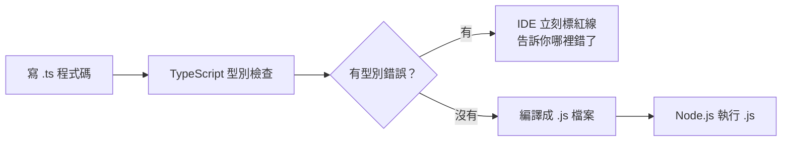

# [2-1] JavaScript vs TypeScript：為什麼型別很重要

> **本章目標**：理解 TypeScript 解決了 JavaScript 的什麼問題，並且能在本機跑出第一個 `.ts` 檔案。

---

## 你會學到

- JavaScript 因為沒有型別檢查，會造成什麼樣的 bug
- TypeScript 如何在程式執行前幫你抓到這些錯誤
- 如何安裝 TypeScript 並跑出第一個 `.ts` 檔案
- 型別標注（type annotation）的基本語法
- TypeScript 和 JavaScript 的關係是什麼

---

## 概念說明

### 先來看一個真實的 bug

想像你在寫一個計算總價的函式，傳入商品數量跟單價，回傳總價：

```
// pseudo code
函式 計算總價(數量, 單價):
    回傳 數量 × 單價
```

用 JavaScript 寫出來長這樣：

```js
function calculateTotal(quantity, price) {
  return quantity * price
}
```

看起來沒問題。但如果呼叫的人不小心傳了字串進來：

```js
calculateTotal(3, "100")
```

你猜結果是什麼？

```
300
```

等等，這次看起來好像還對？那換成加法：

```js
function add(a, b) {
  return a + b
}

add(1, "2")   // 你期望：3
              // 實際上："12"
```

JavaScript 的 `+` 碰到字串會變成「字串串接」。`1 + "2"` 不是 `3`，而是 `"12"`。JavaScript 不會報錯，它會靜靜地給你一個錯誤的答案，然後這個 bug 就在程式裡面藏著，等著在最糟糕的時機爆發。

這類錯誤有個特點：**只有在程式跑起來（runtime）才會發現**，而且通常是使用者先發現的。

### TypeScript 在做什麼

TypeScript 是 JavaScript 的「升級版」，它加了一層**型別系統**。

你可以把它想成：TypeScript 就像一個很嚴格的助理，在你把程式交出去之前，先幫你看一遍，發現問題就叫你改。

```
JavaScript 的世界：
  你寫程式 → 直接跑 → 出問題（可能幾週後才發現）

TypeScript 的世界：
  你寫程式 → TypeScript 先檢查 → 發現型別錯誤 → 你修正 → 跑起來
```

用 Mermaid 圖看清楚整個流程：



這張圖說明：TypeScript 的型別檢查發生在執行前，而不是執行時。

### TypeScript 和 JavaScript 的關係

一個常見的誤解：「TypeScript 是另一種語言」。其實不是。

**TypeScript 是 JavaScript 加上型別標注**。當你把 TypeScript 程式碼「編譯」（compile）之後，所有的型別標注都會被移除，產生的是標準的 JavaScript 檔案。

```
TypeScript (.ts)
    ↓ 編譯 (tsc)
JavaScript (.js)
    ↓ 執行
Node.js / 瀏覽器
```

型別資訊只在開發的時候存在，幫助你（和你的編輯器）發現問題。程式真正跑起來的時候，TypeScript 已經不見了。

---

## 程式碼範例

### 安裝 TypeScript

先在你的專案目錄開一個新資料夾，進去之後初始化 npm：

```bash
mkdir part-2-practice
cd part-2-practice
npm init -y
```

然後安裝 TypeScript 和 `tsx`（一個讓你直接執行 `.ts` 檔案的工具，不需要先手動編譯）：

```bash
npm install -D typescript tsx
```

這裡的 `-D` 代表「只在開發時用」（devDependency），因為正式上線的環境只需要跑 JavaScript，不需要 TypeScript。

### 第一個 .ts 檔案

建立一個 `hello.ts` 檔案：

```typescript
// 這個函式接收一個 string 型別的參數，回傳一個 string
function greet(name: string): string {
  return `Hello, ${name}!`
}

console.log(greet("Alice"))
```

注意 `name: string` 和 `: string` — 這就是**型別標注（type annotation）**，告訴 TypeScript 這個變數是什麼型別。

用 `tsx` 直接跑：

```bash
npx tsx hello.ts
```

輸出：
```
Hello, Alice!
```

### TypeScript 如何抓到型別錯誤

現在試著傳一個數字進去：

```typescript
function greet(name: string): string {
  return `Hello, ${name}!`
}

greet(42)  // 傳數字進去
```

TypeScript 會立刻報錯，在你執行之前就告訴你：

```
Argument of type 'number' is not assignable to parameter of type 'string'.
```

翻成白話：「你傳了 number 進去，但我們說好要傳 string 的。」

這就是 TypeScript 的價值——錯誤在你的 IDE 裡就出現了，而不是在用戶那邊爆炸。

### 型別標注語法

基本語法很直覺，就是在變數名稱後面加 `: 型別`：

```typescript
const name: string = "Alice"
const age: number = 25
const isLoggedIn: boolean = false
```

不過有一件事很重要：**很多時候不需要寫型別標注**。TypeScript 夠聰明，可以自己推斷：

```typescript
const name = "Alice"       // TypeScript 自動推斷：string
const age = 25             // TypeScript 自動推斷：number
const isLoggedIn = false   // TypeScript 自動推斷：boolean
```

這叫做**型別推斷（type inference）**。能推斷的就讓 TypeScript 自己來，不需要把每個變數都寫上型別，那樣反而讓程式碼變得囉嗦。

### tsconfig.json — 告訴 TypeScript 你的規則

在專案根目錄建立 `tsconfig.json`：

```json
{
  "compilerOptions": {
    "strict": true,
    "target": "ES2022",
    "module": "CommonJS"
  }
}
```

三個設定的意思：

- `"strict": true`：開啟最嚴格的型別檢查。**這是必須的**，沒開這個，TypeScript 的很多保護措施會失效。
- `"target": "ES2022"`：把 TypeScript 編譯成哪個版本的 JavaScript。ES2022 支援大多數現代環境。
- `"module": "CommonJS"`：模組格式，Node.js 預設用 CommonJS（也就是 `require` / `module.exports` 的格式）。

> **注意**：用 `npx tsx` 直接執行 `.ts` 檔案時，`tsconfig.json` 不是必須的，但養成建立它的習慣很重要。一旦你的專案變大，你會需要它。

---

## 小練習

**練習 1：重現 JavaScript 的 bug**

用 Node.js 跑這段 JavaScript，確認輸出是 `"12"` 而不是 `3`：
```js
// save as bug.js
function add(a, b) {
  return a + b
}
console.log(add(1, "2"))
```

**練習 2：用 TypeScript 修復**

把上面的 `bug.js` 改寫成 `fix.ts`，加上正確的型別標注，讓 TypeScript 在你傳錯型別時就報錯。用 `npx tsx fix.ts` 確認它可以正常執行。

**練習 3：觀察型別推斷**

建立一個 `inference.ts`，宣告幾個變數但不加型別標注：
```typescript
const city = "Taipei"
const population = 2700000
const isCapital = true
```
把滑鼠移到每個變數名稱上（在 VS Code 裡），確認 TypeScript 有自動推斷出正確的型別。

---

## 課外讀物

> 想了解 TypeScript 的最佳實踐和常見陷阱 → [課外讀物 E-6-4：TypeScript 最佳實踐：strict、避免 any、型別推斷](../../課外讀物/E-6-best-practices/E-6-4-typescript-best-practices.md)
