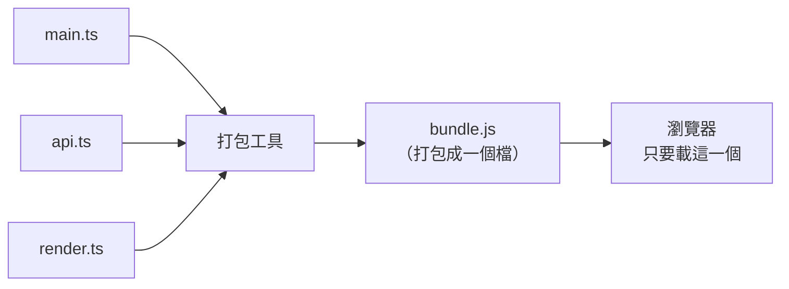

# [4-C-1] 為什麼需要打包工具？（瀏覽器不直接懂 TypeScript）

> **本章目標**：理解 V1~V3 那個「手動 `npm run build` 再開 HTML」的流程到底有哪些痛點，以及「打包工具（Bundler）」是來解決什麼問題的。

## 你會學到

- 為什麼瀏覽器看不懂 TypeScript，以及這帶來的麻煩
- 手動編譯流程在專案變大後會遇到的四個痛點
- 「打包工具」是什麼，它幫你做了哪些事
- 為什麼我們選 Vite

---

## 概念說明

### 先回顧：我們前三版是怎麼跑前端的

在 V1~V3，前端要跑起來，你每次都得：

```
1. 改 main.ts
2. 手動執行 npm run build（用 tsc 編譯成 main.js）
3. 重新整理瀏覽器
4. 改一行又要重來一次...
```

這在「只有一個 `main.ts`」時還能忍。但真實專案不會只有一個檔案——你會把程式拆成很多模組（還記得 [2-7 模組化] 嗎？）。一旦檔案變多，這套手動流程就會處處卡關。

---

### 痛點一：瀏覽器看不懂 TypeScript

這是最根本的問題。瀏覽器只懂 JavaScript，**完全不認得 TypeScript**。所以你寫的每一行 `.ts`，都得先「翻譯」成 `.js` 瀏覽器才看得懂。

```
你寫的：       const todos: Todo[] = []
瀏覽器看到：   ??? （看不懂 : Todo[] 這種型別語法）

必須先編譯：   const todos = []   ← 拿掉型別，變成純 JS
瀏覽器才看得懂
```

V1~V3 我們用 `tsc` 手動做這件事。但每次改都要手動跑一次，很煩。

---

### 痛點二：很多檔案，瀏覽器要一個一個載

當你把程式拆成多個模組：

```
src/
├── main.ts        （import 了下面兩個）
├── api.ts         （負責跟後端溝通）
└── render.ts      （負責畫面）
```

瀏覽器要正確載入這些有 `import`／`export` 關係的檔案，設定其實很瑣碎，而且檔案一多，瀏覽器要發很多次請求去抓，載入也慢。

**打包工具會把這一堆檔案「打包」成一兩個檔案**，瀏覽器只要抓這一兩個就好——這就是「打包（bundle）」這個詞的由來。



這張圖表達打包工具的核心工作：把散落的多個原始檔，編譯並合併成瀏覽器好載入的成品。

---

### 痛點三：改一行就要手動重整

開發時最理想的體驗是：**改了程式碼，畫面馬上更新**。但 V1~V3 你得「存檔 → 等編譯 → 手動按重新整理」。

現代打包工具提供「開發伺服器」，內建 **HMR（Hot Module Replacement，熱模組替換）**——你一存檔，瀏覽器自動更新，甚至不用整頁重整。這對開發效率的提升非常大。

---

### 痛點四：開發版和上線版的需求不一樣

開發時你要的是「快、好除錯」；但真的要把網站放上線時，你要的是「檔案小、載入快」。這兩個目標需要不同的處理：

```
開發環境（自己寫程式時）：
    要快速重新編譯、要能對應到原始碼方便除錯

生產環境（放上線給使用者）：
    要把程式碼壓到最小、把多檔案合併、移除沒用到的東西
```

手動用 `tsc` 沒辦法輕鬆切換這兩種模式。打包工具一個指令就能分別產出「開發用」和「上線用」的版本。

---

### 打包工具到底幫你做了什麼？

把上面四個痛點對照一下，打包工具的工作就一目了然：

```
痛點                      打包工具的對策
─────────────────────────────────────────────
瀏覽器不懂 TS          →  自動編譯 TS → JS
很多檔案要分別載       →  打包成少數幾個檔
改一行要手動重整       →  開發伺服器 + 熱更新（HMR）
開發版／上線版需求不同  →  一個指令切換 dev / build
```

---

### 為什麼選 Vite？

打包工具有好幾種（你可能聽過 Webpack、Parcel）。我們選 **Vite**（發音像法文的「veet」，意思是「快」），因為：

```
- 啟動快：開發伺服器幾乎是秒開
- 設定少：開箱即用，不用寫一大堆設定檔
- 原生支援 TypeScript：不用自己接 tsc
- 現在前端社群的主流選擇（React、Vue 都推薦它）
```

> **注意**：打包工具不是「魔法」，它做的還是「把 TS 編譯成 JS、把檔案合併」這些你已經理解的事，只是自動化、做得更好。先理解痛點，再用工具——這樣你用的是工具，而不是被工具綁架。

---

## 程式碼範例

這章是觀念章，沒有要你寫程式。但你可以做一個對比，親身感受痛點。

### 範例一：數一數你在 V3 做了幾個手動步驟

回到 `poc/v3/frontend`，回想你每改一次前端要做什麼：

```
1. 改 src/main.ts
2. 切到終端機，執行 npm run build（或開著 npm run dev 的 watch）
3. 切回瀏覽器
4. 按 Cmd/Ctrl + R 重新整理
5. 看結果
```

下一章用 Vite 之後，這串會縮短成：

```
1. 改 src/main.ts
2. （存檔，瀏覽器自動更新，什麼都不用做）
```

這個差距，在一天要改幾百次的真實開發裡，會放大成巨大的效率差異。

---

## 小練習

**練習 1**：用自己的話回答：為什麼瀏覽器不能直接執行你寫的 `.ts` 檔？中間少了哪個步驟？

**練習 2**：列出你在 V1~V3 開發前端時，覺得最麻煩的一個步驟。對照本章四個痛點，看看它屬於哪一個。

**練習 3**：上網查查看「Webpack」和「Vite」，各找出一個它們宣稱的優點。（不用看懂細節，目的是知道「打包工具不只一種」。）

---

## 課外讀物

> 想了解 `npm` 與這些工具所在的套件生態系怎麼運作 → [課外讀物 E-2-1：npm 是什麼？package.json 解析](../../課外讀物/E-2-npm/E-2-1-npm-intro.md)
