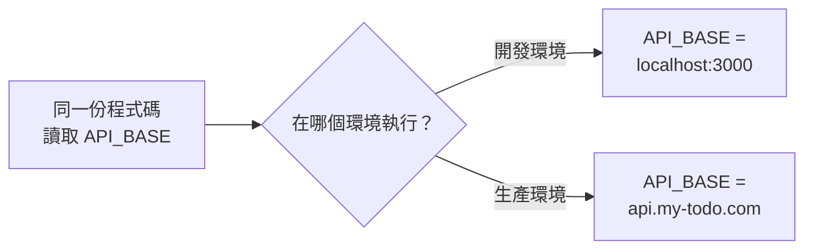

# [4-C-3] 環境變數：如何安全地管理設定

> **本章目標**：理解為什麼不該把「會變動的設定」寫死在程式碼裡，學會用環境變數管理它們，並避免把機密推上 GitHub。

## 你會學到

- 什麼是環境變數，為什麼需要它
- 「寫死設定」會造成什麼問題
- 怎麼用 `.env` 檔管理設定
- Vite 前端怎麼讀環境變數（`VITE_` 前綴的特殊規則）
- 為什麼 `.env` 一定要加進 `.gitignore`

---

## 概念說明

### 問題：有些東西會「隨環境改變」

回想 V2~V3，前端程式裡有這麼一行：

```typescript
const API_BASE = "http://localhost:3000"
```

開發時這樣沒問題。但等你把網站放上線，後端的網址會變成像 `https://api.my-todo.com` 之類的東西。難道每次切換開發／上線，都要手動進去改這行、改完上線又要記得改回來嗎？

這就是「設定會隨環境改變」的典型例子。會變的東西還有很多：

```
開發環境                    生產環境
─────────────────────────────────────────────
API 網址：localhost:3000   →  api.my-todo.com
資料庫：本機的測試資料庫    →  雲端的正式資料庫
密鑰：隨便一組測試用的      →  真正的機密金鑰
```

---

### 解法：把「會變的設定」抽出程式碼

核心原則一句話：

> **程式碼是固定的，設定是會變的。把會變的東西抽出來，不要寫死在程式碼裡。**

這些「抽出來的設定」就放在**環境變數（Environment Variable）**裡。程式碼只負責「讀取」這個變數，至於它的值是什麼，由「當前所在的環境」決定。



這張圖表達環境變數的精神：程式碼不變，但同一個變數在不同環境會拿到不同的值，於是同一份程式碼就能跑在不同地方。

---

### 為什麼這對「安全」特別重要？

有一類設定不只是「會變」，而是「絕對不能外洩」——例如資料庫密碼、API 金鑰、JWT 的簽章密鑰（Part 4-D 會用到）。

> **常見錯誤 — 也是新手最危險的錯** — 把機密寫死在程式碼裡然後推上 GitHub：
>
> ```typescript
> // ❌ 千萬不要這樣
> const DATABASE_PASSWORD = "my-super-secret-123"
> const STRIPE_API_KEY = "sk_live_abc123..."
> ```
>
> 問題是：只要這段程式碼推上 GitHub（即使是 private repo，之後設成 public 或被別人 fork 就糟了），這些機密就等於公開了。真實世界每天都有人因為這樣被盜刷、資料庫被入侵。爬蟲機器人專門掃 GitHub 上洩漏的金鑰，幾分鐘內就會被撿走。
>
> 正確做法：機密放進 `.env` 檔，而且 **`.env` 永遠不進版本控制**（加進 `.gitignore`）。程式碼裡只留「讀取環境變數」這個動作，看不到真正的值。

---

## 程式碼範例

### 範例一：建立 `.env` 檔

在前端專案根目錄建立一個 `.env` 檔，寫入設定：

```bash
# .env（這個檔不要進版本控制！）
VITE_API_BASE=http://localhost:3000
```

注意這裡的變數名是 `VITE_API_BASE`，**開頭一定要有 `VITE_`**——這是 Vite 的規則，下面解釋為什麼。

---

### 範例二：在程式碼裡讀取它

Vite 用 `import.meta.env` 來讀環境變數：

```typescript
// 從環境變數讀取 API 網址，而不是寫死
const API_BASE = import.meta.env.VITE_API_BASE

// 之後的 fetch 就用這個變數
const response = await fetch(`${API_BASE}/todos`)
```

現在這份程式碼「不知道」也「不在乎」API 網址到底是什麼——它只負責讀變數。開發時讀到 `localhost:3000`，上線時換一個 `.env` 就指向正式網址，**程式碼一個字都不用改**。

---

### 範例三：為什麼前端的環境變數要加 `VITE_` 前綴？

這是一個重要的安全設計。Vite 規定：**只有 `VITE_` 開頭的變數，才會被「打包進前端」讓瀏覽器讀得到**。

```
VITE_API_BASE       → 會被打包進前端，瀏覽器讀得到 ✅
DATABASE_PASSWORD   → 不會被打包進前端，前端讀不到 🔒
```

為什麼要這樣？因為**前端的程式碼最終會送到使用者的瀏覽器，任何人都能看**。如果不小心把資料庫密碼放進前端變數，等於公開給全世界。Vite 用「只有 `VITE_` 前綴才暴露」這個規則，幫你擋掉「不小心把機密塞進前端」的意外。

```
記住這個界線：
    前端的環境變數 = 公開的（使用者看得到）→ 只放不敏感的設定
    後端的環境變數 = 私密的（藏在伺服器）  → 機密放這裡
```

換句話說，真正的機密（密碼、金鑰）應該放在**後端**的環境變數，永遠不要出現在前端。

---

### 範例四：把 `.env` 加進 `.gitignore`

這一步**絕對不能忘**。在專案的 `.gitignore` 裡加上：

```bash
# .gitignore
node_modules/
dist/

# 環境變數檔，內含設定與機密，絕不進版本控制
.env
.env.local
```

那團隊其他人怎麼知道有哪些變數要設定？慣例是提供一個 **`.env.example`** 範本檔（這個可以進版控），只列出「變數名稱」但不含真正的值：

```bash
# .env.example（這個可以進版控，當作說明文件）
VITE_API_BASE=
```

新成員 clone 專案後，照著 `.env.example` 複製一份成 `.env`，填入自己的值即可。

---

## 小練習

**練習 1**：把 V3 前端那行寫死的 `const API_BASE = "http://localhost:3000"`，改成從環境變數讀取。建立 `.env` 檔、加上 `VITE_API_BASE`，並確認 `fetch` 還是正常運作。

**練習 2**：刻意建立一個**沒有** `VITE_` 前綴的變數（例如 `SECRET=12345`），試著在前端用 `import.meta.env.SECRET` 讀它。你會發現讀到 `undefined`——這驗證了 Vite 的保護機制。

**練習 3**：檢查你的 `.gitignore` 有沒有包含 `.env`。然後想一想：如果你已經不小心把含機密的 `.env` commit 上去了，光是「之後再加進 `.gitignore`」夠不夠？（提示：git 會記住歷史……這跟 Git 的運作原理有關。）

---

## 課外讀物

> 想了解 `PATH` 這類系統層級的環境變數、以及它和專案 `.env` 的關係 → [課外讀物 E-1-1：Terminal 是什麼？](../../課外讀物/E-1-terminal/E-1-1-what-is-terminal.md)

> 練習 3 提到「git 會記住歷史」，想知道為什麼刪掉也救不回機密 → [課外讀物 E-8-1：Git 的內部運作](../../課外讀物/E-8-git/E-8-1-git-internals.md)
