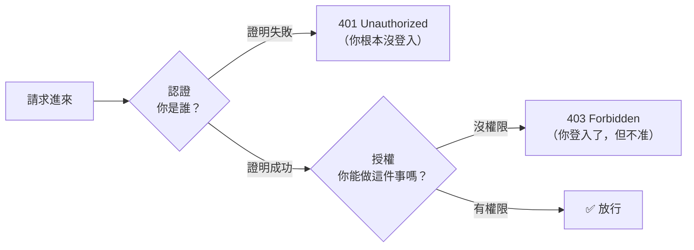
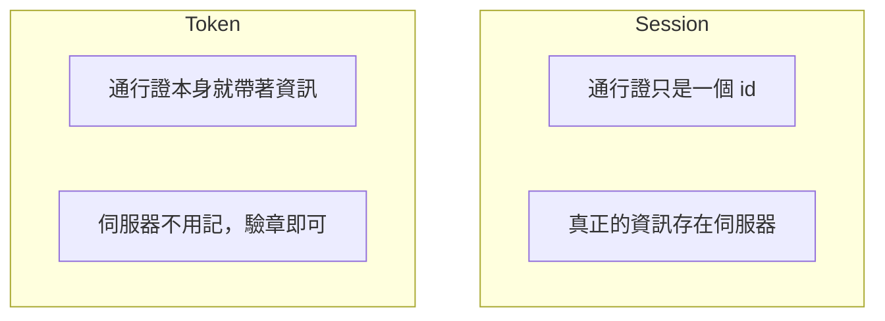

# [4-D-2] 認證（Authentication）vs 授權（Authorization）：你是誰？你能做什麼？

> **本章目標**：分清楚「認證」和「授權」這兩個常被混淆的概念，它們是所有登入系統的地基。

## 你會學到

- 認證（你是誰）和授權（你能做什麼）的差別
- 為什麼這兩件事要分開思考
- 「無狀態」的 HTTP 為什麼讓「保持登入」變成一個問題
- Session 和 Token 兩種解法的概念差異（細節後面章節展開）

---

## 概念說明

### 兩個常被搞混的詞

`Authentication` 和 `Authorization` 長得超像，連工程師都常簡寫成 `authn` 和 `authz` 來區分。但它們是兩件完全不同的事：

```
認證 Authentication（authn）：「你是誰？」
    → 證明你就是你宣稱的那個人
    → 例如：輸入帳號密碼，證明「我是 alice」

授權 Authorization（authz）：「你能做什麼？」
    → 確認你有沒有權限做某件事
    → 例如：alice 是一般使用者，不能進管理後台
```

用機場類比，一次就懂：

```
認證 = 在櫃台出示護照
    → 證明「你就是護照上這個人」

授權 = 你的登機證上寫著哪個艙等
    → 經濟艙的登機證，不能進商務艙休息室
    → （就算你成功證明了身分，也不代表你哪裡都能去）
```

順序上**一定是先認證、再授權**：先知道你是誰，才能判斷你能做什麼。



這張圖也順帶帶出兩個容易搞混的狀態碼：**401 是「你沒證明身分」**，**403 是「你證明了，但這件事不准你做」**。

---

### 為什麼「保持登入」是個問題？

還記得 4-A-1 說 HTTP 是**無狀態（Stateless）**的嗎？「講完這次就忘了你」。這個特性現在帶來一個麻煩：

```
你登入了 → 後端說「好，我確認你是 alice」
你下一個請求（想看待辦）→ 後端：「你哪位？」（它已經忘了你）
```

每個請求對後端來說都像「第一次見面」。那要怎麼讓使用者「登入一次，之後都記得」？

核心想法是：**登入成功後，後端發給你一張「通行證」，之後每個請求你都帶著它，後端看到通行證就知道你是誰。**

```
登入：alice 輸入帳密 → 後端驗證成功 → 發一張「通行證」給 alice
之後：alice 每個請求都附上這張通行證 → 後端看通行證 → 「喔是 alice」
```

這張「通行證」要怎麼設計，就是接下來的主題。

---

### 兩種通行證：Session 與 Token

業界主要有兩種做法，先建立概念，細節後面章節再展開：

```
做法一：Session（伺服器記著）
    後端發一個「session id」給你，自己在伺服器端記著「這個 id = alice」。
    你每次帶 id 來，後端查自己的記錄。
    缺點：後端要儲存所有人的登入狀態，多台伺服器時麻煩。

做法二：Token（資訊寫在通行證上）
    後端發一個「token」，裡面就寫著「我是 alice」，並蓋上防偽章。
    你每次帶 token 來，後端驗章就好，不用自己記。
    優點：後端不用儲存登入狀態，天生適合多台伺服器。
```

我們這門課選 **Token**（具體是 JWT），因為它無狀態、好擴展，是現代前後端分離架構的主流。下一章就來拆解 JWT 到底是什麼。



這張圖點出兩者的本質差異：Session 的資訊在伺服器、通行證只是索引；Token 的資訊就在通行證上、伺服器只負責驗章。

---

## 程式碼範例

這章是觀念章。但我們可以用 pseudo code 把「先認證、再授權」的流程寫清楚，這就是接下來幾章要實作的骨架：

### 範例一：登入（認證）的 pseudo code

```
當收到登入請求（帶著帳號、密碼）：
    從資料庫找出這個帳號的使用者
    如果 找不到，或密碼不對：
        回 401（認證失敗，你不是你說的那個人）
    否則：
        產生一張通行證（token），裡面寫著這個人是誰
        把 token 回給前端
```

### 範例二：存取受保護資源（授權）的 pseudo code

```
當收到「刪除某待辦」的請求（帶著 token）：
    驗證 token 是不是真的、有沒有過期
    如果 token 無效：
        回 401（你沒有有效的通行證）
    取出 token 裡的「我是誰」
    如果 這個人沒有權限刪這筆（例如不是他的待辦）：
        回 403（你登入了，但這件事不准你做）
    否則：
        執行刪除
```

把這兩段對照「認證 vs 授權」「401 vs 403」，整個登入系統的邏輯骨架就清楚了。接下來幾章，就是把這些 pseudo code 變成真的程式碼。

---

## 小練習

**練習 1**：判斷以下各屬於「認證」還是「授權」：
1. 用指紋解鎖手機
2. 你是免費會員，不能下載高畫質影片
3. 輸入 Email 和密碼登入
4. 一般員工看不到公司的財務報表

**練習 2**：用自己的話解釋 401 和 403 的差別。舉一個生活中的例子，分別對應這兩個狀態。

**練習 3**：想一想——如果 HTTP 不是無狀態的（後端會「記得」每個使用者），登入系統會變簡單還是變複雜？這樣的設計又會帶來什麼新問題？（提示：想想伺服器的記憶體、還有多台伺服器的情況。）

---

## 課外讀物

> 通行證在網路上傳輸時，怎麼確保不被偷看、竄改？這牽涉到加密連線 → [課外讀物 E-3-2：HTTPS 與 TLS](../../課外讀物/E-3-network/E-3-2-https-tls.md)
