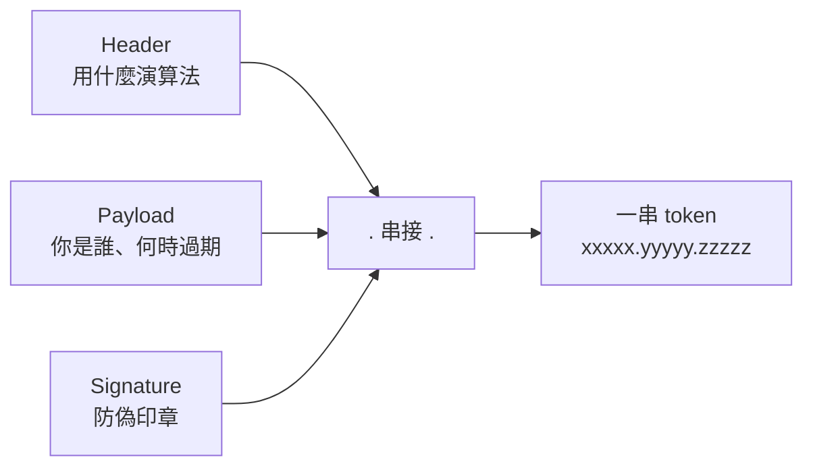
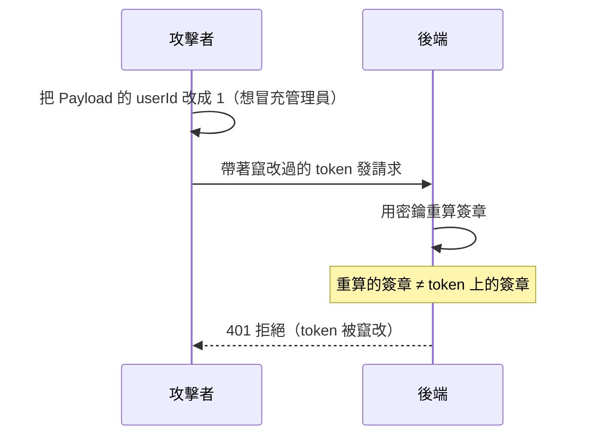

# [4-D-3] JWT 原理：token 是什麼，如何證明你是你

> **本章目標**：拆解 JWT 的三段結構，理解它為什麼「無法偽造」卻又「任何人都看得到內容」，破除對 token 的神秘感。

## 你會學到

- JWT（JSON Web Token）的三段結構：Header / Payload / Signature
- 為什麼 JWT 的內容是「公開可讀」的，這代表什麼
- 簽章（Signature）怎麼讓 token 無法被偽造
- 一個常見的安全誤解：JWT 不是加密，別把機密放進去

---

## 概念說明

### 先用「防偽印章的證件」來想像

JWT 就像一張**蓋了防偽印章的證件**：

```
證件上寫著：「持有人是 alice，會員等級：一般，到期日：今天下午 3 點」
            （這些字任何人都看得到）

證件角落有一個防偽印章：
            只有發證單位（你的後端）才蓋得出來
            別人偽造一張，蓋不出一模一樣的章
```

關鍵理解兩件事：

```
1. 證件上的「內容」是公開的 —— 任何人撿到都看得懂寫什麼
2. 但「印章」無法偽造 —— 所以別人不能造一張假的、或竄改內容
```

這正是 JWT 的精神：**內容公開，但防竄改**。

---

### JWT 的三段結構

一個 JWT 長這樣，是用兩個點 `.` 分成三段的一串文字：

```
xxxxx.yyyyy.zzzzz
  ↑     ↑     ↑
Header Payload Signature
```



這張圖表達 JWT 是三段資訊用 `.` 串成一條字串。逐段看：

```
Header（標頭）：
    說明「這個 token 用什麼演算法簽章」。
    例如：{ "alg": "HS256", "typ": "JWT" }

Payload（內容）：
    真正想攜帶的資訊，叫做 claims。
    例如：{ "userId": 7, "name": "alice", "exp": 1717612800 }
    → exp 是過期時間，時間到 token 就失效

Signature（簽章）：
    用「前兩段 + 一把只有後端知道的密鑰」算出來的防偽印章。
    這就是讓 token 無法偽造的關鍵。
```

---

### 簽章怎麼讓 token 無法偽造？

簽章的計算方式，用 pseudo code 表示：

```
簽章 = 某種雜湊演算法(
           Header + "." + Payload,
           密鑰    ← 只有後端知道，絕不外洩
       )
```

關鍵在那把**密鑰（secret key）**：

```
後端發 token 時：用密鑰算出簽章，蓋在 token 上。
後端收 token 時：用同一把密鑰，重新算一次簽章，
                跟 token 上帶的簽章比對。
                一樣 → 沒被動過，可信。
                不一樣 → 被竄改了，拒絕。
```

為什麼別人偽造不了？因為**他沒有那把密鑰**。他可以看到、甚至修改 Payload（例如把 `userId` 從 7 改成 1 想冒充別人），但只要改了內容，簽章就對不上——而他算不出正確的新簽章，因為密鑰只在你後端手裡。



這張圖說明竄改為什麼會失敗：改了內容，簽章就對不上，而攻擊者沒有密鑰、補不出正確的簽章。

---

### 重要安全觀念：JWT 不是「加密」

這是初學者最常見、也最危險的誤解：

> **常見錯誤** — 以為 JWT 的內容是加密的，於是把機密塞進 Payload：
>
> ```
> ❌ Payload: { "userId": 7, "password": "alice的密碼", "creditCard": "4242..." }
> ```
>
> 問題是：**JWT 的 Payload 只是用 Base64 編碼，不是加密**。任何人拿到你的 token，貼到網路上隨便一個 JWT 解碼工具，就能看到 Payload 的全部內容。簽章只防「竄改」，不防「偷看」。
>
> 正確做法：Payload 只放「不怕被看到」的識別資訊（userId、name、role、過期時間），**絕對不要放密碼、信用卡等機密**。

可以這樣記：

```
簽章（Signature）防的是「竄改」—— 別人改不了
Base64 編碼   不防「偷看」    —— 別人看得到內容

所以：JWT 內容公開可讀，請只放識別資訊。
```

那 token 在網路上傳輸時不就被看光了？這就是為什麼**一定要搭配 HTTPS**——HTTPS 負責加密「傳輸過程」，讓中途的人攔截不到 token 本身。

---

## 程式碼範例

### 範例一：親手解碼一個 JWT（觀察任務）

這不是要你寫的程式，而是一個體驗——證明「Payload 真的人人可讀」：

```
第一步：到 https://jwt.io
第二步：它預設就放了一個範例 token
第三步：看右邊，Payload 那段被解出來了，清清楚楚寫著 name、iat 等
```

你會親眼看到：不需要任何密鑰，就能讀出 Payload。這就是「內容公開」的意思。而左下角要你填 secret 才能驗證的那塊，就是簽章——那才是需要密鑰的部分。

---

### 範例二：在後端簽發與驗證 JWT

實務上我們用 `jsonwebtoken` 這個套件，不自己手刻演算法。先看它的兩個核心動作：

```typescript
import jwt from "jsonwebtoken"

// 這把密鑰實務上要放環境變數（還記得 4-C-3 嗎），這裡為了說明先寫死
const JWT_SECRET = process.env.JWT_SECRET ?? "dev-secret"

// 簽發：把「這個人是誰」打包成 token，設定 1 小時後過期
function signToken(userId: number): string {
  return jwt.sign({ userId }, JWT_SECRET, { expiresIn: "1h" })
}

// 驗證：檢查簽章對不對、有沒有過期；不合法會 throw
function verifyToken(token: string): { userId: number } {
  return jwt.verify(token, JWT_SECRET) as { userId: number }
}
```

`jwt.sign` 幫你做掉「組三段、算簽章」的所有細節；`jwt.verify` 幫你「驗簽章、檢查過期」。你只要保管好 `JWT_SECRET`——它就是那把讓一切安全的密鑰。

> **密鑰是機密中的機密**：`JWT_SECRET` 一旦外洩，任何人都能偽造合法 token、冒充任何使用者。所以它一定要放後端的環境變數，永遠不進版本控制 → [課外讀物 E-1-1：Terminal 是什麼？](../../課外讀物/E-1-terminal/E-1-1-what-is-terminal.md)

---

## 小練習

**練習 1**：到 jwt.io，把預設 token 的 Payload 改一個值（例如把 name 改成你的名字），觀察 token 字串跟著變了。然後注意：在你不知道 secret 的情況下，左下角的 signature 驗證會顯示什麼？

**練習 2**：用自己的話回答：為什麼說「JWT 防竄改，但不防偷看」？這對「該往 Payload 放什麼」有什麼指導意義？

**練習 3**：思考一個情境——如果你的 `JWT_SECRET` 不小心被推上 GitHub 公開了，會發生什麼最壞的情況？該怎麼補救？（提示：換一把新的 secret 會讓所有舊 token 怎麼樣？）

---

## 課外讀物

> token 在傳輸過程怎麼避免被攔截偷看，靠的是加密連線 → [課外讀物 E-3-2：HTTPS 與 TLS](../../課外讀物/E-3-network/E-3-2-https-tls.md)

> 密鑰這類機密為什麼絕不能進版本控制 → [課外讀物 E-8-1：Git 的內部運作](../../課外讀物/E-8-git/E-8-1-git-internals.md)
