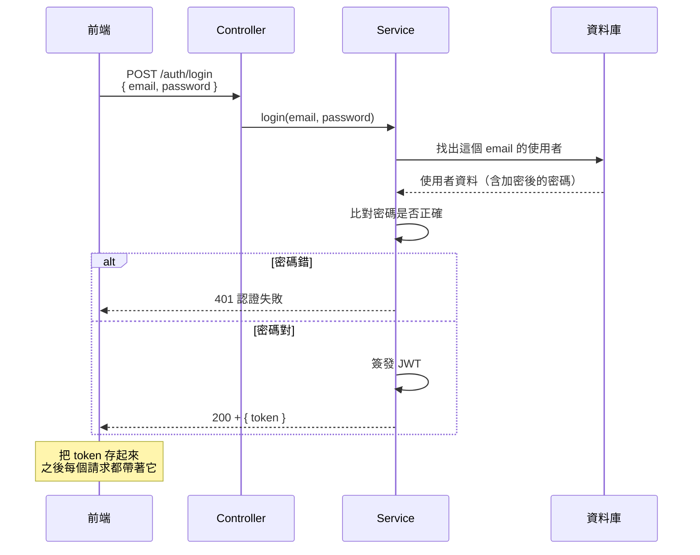

# [4-D-4] 完整登入流程：前端表單 → 後端驗證 → 簽發 token

> **本章目標**：把前面的概念串成一條完整的登入流程，並學會一個攸關安全的關鍵：密碼絕對不能存明文。

## 你會學到

- 一次登入從前端到後端的完整旅程
- 為什麼密碼絕對不能用明文儲存
- 雜湊（hash）是什麼，bcrypt 怎麼保護密碼
- 註冊與登入兩條流程的差異
- 前端拿到 token 後存哪裡

---

## 概念說明

### 登入的完整旅程

把 4-D-2、4-D-3 學的串起來，一次登入是這樣走的：



這張圖把整條鏈路畫出來：前端送帳密 → 後端找人、比對密碼 → 對了就簽發 token 回傳。注意這裡也用上了 4-D-1 的分層——Controller 接 HTTP、Service 做驗證邏輯。

---

### 最重要的一課：密碼不能存明文

這是整個課程最攸關安全的一點，請記一輩子：

> **常見錯誤 —— 絕對不能犯的錯** — 把使用者密碼原樣存進資料庫：
>
> ```
> ❌ users 表：
>    | email           | password   |
>    | alice@mail.com  | mypass123  |   ← 明文！
> ```
>
> 問題是：哪天資料庫被駭、或是有內部人員偷看，所有人的密碼就全洩漏了。更糟的是，很多人到處用同一組密碼——你的疏忽會害他們的其他帳號也淪陷。這種事在真實世界一再發生，後果極其嚴重。
>
> 正確做法：**只存密碼的「雜湊值」，不存密碼本身。**

---

### 雜湊（Hash）：單向的「絞肉機」

雜湊函式的特性是**單向**——可以把密碼變成一串看不懂的雜湊值，但**沒辦法從雜湊值倒推回原密碼**：

```
mypass123  ──雜湊──>  $2b$10$N9qo8uLOickgx2ZMRZo...   （存這個）
                       ↑
            就算駭客拿到這串，也推不回 mypass123
```

用絞肉機比喻：你可以把肉絞成肉泥（密碼 → 雜湊），但沒辦法把肉泥還原成原本那塊肉（雜湊 → 密碼）。

那既然推不回去，登入時怎麼比對？答案很巧妙：

```
註冊時：把使用者的密碼絞成雜湊值 A，存起來。
登入時：把使用者「這次輸入的密碼」也絞一次，得到雜湊值 B。
        比對 A 和 B 一不一樣。
        一樣 → 密碼正確（同樣的輸入會絞出同樣的結果）
        不一樣 → 密碼錯
```

全程後端都不需要、也不應該知道「原始密碼」是什麼。

---

### bcrypt：專門用來雜湊密碼的工具

我們用 `bcrypt` 這個專門設計來存密碼的套件。它比一般雜湊多做兩件事：

```
1. 加鹽（salt）：每個密碼都加一段隨機字串再雜湊，
   讓「相同密碼」也產生「不同雜湊值」，擋掉預先算好的破解表。

2. 故意很慢：bcrypt 刻意設計得計算較慢，
   讓駭客就算想暴力猜，也猜得非常吃力。
```

你不用懂這些數學細節，只要會用它的兩個動作：「把密碼雜湊」和「比對密碼」。

---

## 程式碼範例

### 範例一：註冊時雜湊密碼

註冊流程的核心——存進資料庫的是雜湊值，不是原始密碼：

```typescript
import bcrypt from "bcrypt"

async function register(email: string, password: string): Promise<void> {
  // 把密碼雜湊。10 是「成本」，數字越大越安全但越慢，10 是常見預設
  const passwordHash = await bcrypt.hash(password, 10)

  // 存進資料庫的是 passwordHash，原始 password 用完就丟，絕不儲存
  await userRepository.create({ email, passwordHash })
}
```

---

### 範例二：登入時比對密碼

登入流程——用 bcrypt 比對，而不是自己拿字串去 `===`：

```typescript
import bcrypt from "bcrypt"
import jwt from "jsonwebtoken"

const JWT_SECRET = process.env.JWT_SECRET ?? "dev-secret"

async function login(email: string, password: string): Promise<string> {
  const user = await userRepository.findByEmail(email)

  // 找不到使用者，或密碼比對不過 → 認證失敗
  // bcrypt.compare 會自動處理「把輸入密碼雜湊後跟存的雜湊值比對」
  if (!user || !(await bcrypt.compare(password, user.passwordHash))) {
    throw new Error("帳號或密碼錯誤")
  }

  // 驗證通過，簽發 token（裡面帶著 userId）
  return jwt.sign({ userId: user.id }, JWT_SECRET, { expiresIn: "1h" })
}
```

> **小細節**：錯誤訊息故意寫成「帳號或密碼錯誤」，而不是「這個帳號不存在」或「密碼錯」。因為如果分開講，攻擊者就能用它來試出「哪些 email 有註冊」。**模糊的錯誤訊息在這裡反而是安全的。**

---

### 範例三：前端拿到 token 後存哪裡？

登入成功後，前端收到 token，要存起來給之後的請求用：

```typescript
async function login(email: string, password: string): Promise<void> {
  const response = await fetch(`${API_BASE}/auth/login`, {
    method: "POST",
    headers: { "Content-Type": "application/json" },
    body: JSON.stringify({ email, password }),
  })

  if (!response.ok) {
    throw new Error("登入失敗")
  }

  const { token } = await response.json()

  // 先用 localStorage 存（還記得 V1 用過嗎）。
  // 之後每個需要登入的請求，都從這裡拿出 token 附上去。
  localStorage.setItem("token", token)
}
```

> **關於存哪裡的取捨**：`localStorage` 簡單直觀，是入門的合理選擇，但它對某類攻擊（XSS）較脆弱；正式產品常改用更安全的方式（如 httpOnly cookie）。這牽涉到 Web 安全的權衡，入門先用 `localStorage` 把流程跑通，安全強化是進階主題。

---

## 小練習

**練習 1**：用自己的話解釋：為什麼「雜湊是單向的」反而讓密碼更安全？如果雜湊可以反推回原密碼，還有意義嗎？

**練習 2**：bcrypt 加鹽（salt）讓「相同密碼產生不同雜湊值」。想一想：如果不加鹽，兩個都用 `123456` 當密碼的人，雜湊值會一樣——這會給攻擊者什麼方便？

**練習 3**：範例二的錯誤訊息故意模糊成「帳號或密碼錯誤」。假設改成明確的「此 Email 尚未註冊」，攻擊者可以利用這個差異做什麼壞事？

---

## 課外讀物

> token 與密碼在網路上傳輸時，靠 HTTPS 加密保護 → [課外讀物 E-3-2：HTTPS 與 TLS](../../課外讀物/E-3-network/E-3-2-https-tls.md)

> 登入相關的金鑰、密碼雜湊設定都屬機密，要用環境變數管理、不進版控 → [課外讀物 E-8-1：Git 的內部運作](../../課外讀物/E-8-git/E-8-1-git-internals.md)
