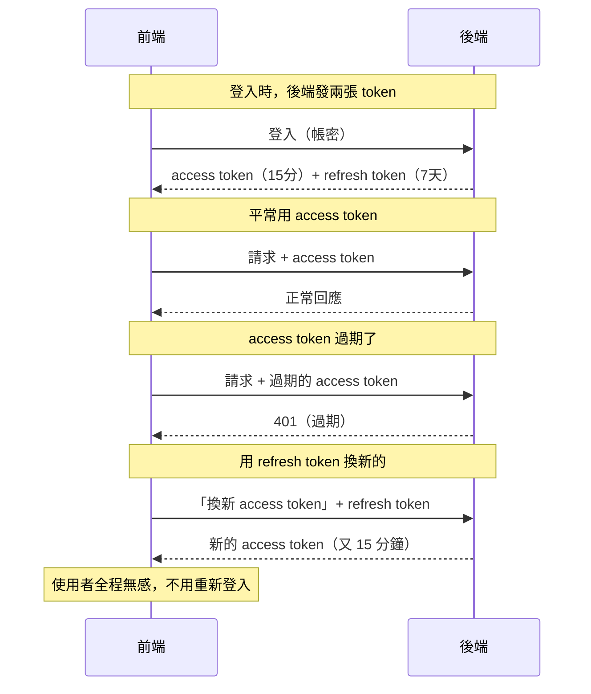

# [4-D-6] Refresh Token：為什麼 access token 要短命

> **本章目標**：理解「為什麼不乾脆發一個永久 token 就好」，認識 access token 與 refresh token 的雙 token 機制如何兼顧安全與體驗。

## 你會學到

- 為什麼 access token 要設得「短命」
- 「安全」和「使用者體驗」之間的兩難
- access token 與 refresh token 各自的角色
- 雙 token 機制怎麼運作

---

## 概念說明

### 一個兩難：token 該設多久過期？

還記得 4-D-4 簽 token 時寫的 `{ expiresIn: "1h" }` 嗎？這個過期時間該設多長？兩邊都有壞處：

```
設很長（例如 30 天）：
    好處：使用者很久不用重新登入，體驗好
    壞處：萬一 token 被偷，攻擊者可以用整整 30 天 😱

設很短（例如 5 分鐘）：
    好處：就算被偷，攻擊者也只能用 5 分鐘
    壞處：使用者每 5 分鐘就要重新登入一次，煩死 😤
```

這是「安全」和「體驗」的經典拉扯。有沒有辦法兩全？

---

### 解法：把 token 拆成「兩張」

聰明的做法是發**兩張不同用途的 token**，各司其職：

```
Access Token（門禁卡）：
    用途：每個 API 請求都帶它，證明「我是誰」
    特性：短命（例如 15 分鐘）
    心態：常常在用，所以做成「就算掉了損失也有限」

Refresh Token（補卡證明）：
    用途：只在「access token 過期時，用來換一張新的」
    特性：長命（例如 7 天），但用得很少、保管更嚴
    心態：很少拿出來，所以被偷的機會小
```

用飯店類比：

```
Access Token  = 房卡：每次進房間都要刷，但有效期很短，
                每天要去櫃台重新感應一次。
Refresh Token = 你的訂房證明：平常收在身上不用拿出來，
                只有房卡失效時，拿它去櫃台換新房卡，不用重新訂房（重新登入）。
```

---

### 雙 token 怎麼運作



這張圖的關鍵在最後一段：access token 過期時，前端**默默地**用 refresh token 換一張新的，使用者完全不會被打斷。於是我們同時得到了「access token 短命所以安全」和「使用者很久不用重新登入」兩個好處。

---

### 為什麼這樣就更安全？

```
攻擊者偷到 access token：
    → 只能用 15 分鐘，很快就失效，損失有限。

攻擊者想偷 refresh token：
    → 它很少在網路上傳輸（只有換卡時才用），
      被攔截的機會比每次請求都帶的 access token 小得多。
    → 而且 refresh token 通常存在更安全的地方、可以被後端「撤銷」。
```

> **入門提醒**：refresh token 的完整實作（撤銷機制、儲存策略、輪替）牽涉不少安全細節，是進階主題。這門課的 POC 為了聚焦，會先用「單一 access token」把登入流程跑通，理解雙 token 的**概念**即可；真正要上線的產品再導入完整的 refresh 機制。

---

## 程式碼範例

### 範例一：登入時發兩張 token

概念上，登入成功後同時簽發兩張、過期時間不同的 token：

```typescript
import jwt from "jsonwebtoken"

const ACCESS_SECRET = process.env.JWT_ACCESS_SECRET ?? "dev-access-secret"
const REFRESH_SECRET = process.env.JWT_REFRESH_SECRET ?? "dev-refresh-secret"

function issueTokens(userId: number): { accessToken: string; refreshToken: string } {
  // access token：短命，每個請求都用
  const accessToken = jwt.sign({ userId }, ACCESS_SECRET, { expiresIn: "15m" })

  // refresh token：長命，只用來換 access token
  const refreshToken = jwt.sign({ userId }, REFRESH_SECRET, { expiresIn: "7d" })

  return { accessToken, refreshToken }
}
```

注意兩張用了**不同的密鑰**——這樣即使 access 的密鑰外洩，也偽造不出 refresh token。

---

### 範例二：用 refresh token 換新的 access token

一個專門的端點，負責「驗證 refresh token，發一張新的 access token」：

```typescript
function refreshAccessToken(refreshToken: string): string {
  // 用 refresh 專屬的密鑰驗證；不合法會 throw
  const payload = jwt.verify(refreshToken, REFRESH_SECRET) as { userId: number }

  // 通過就發一張新的 access token
  return jwt.sign({ userId: payload.userId }, ACCESS_SECRET, { expiresIn: "15m" })
}
```

前端的流程則是：發現某個請求回了 401（access 過期）→ 自動呼叫這個端點換新的 → 拿新 access token 重試原本的請求。整個過程使用者無感。

---

## 小練習

**練習 1**：用自己的話解釋——為什麼「兩張 token」能同時解決「安全」和「不用一直重新登入」這對矛盾？

**練習 2**：假設一個 access token 設定 15 分鐘過期，refresh token 設定 7 天。如果使用者連續操作了 3 小時，期間需要「重新登入」幾次？背後實際換了幾次 access token？

**練習 3**：思考——為什麼 access token 和 refresh token 要用「不同的密鑰」？如果用同一把，會少了什麼保障？

---

## 課外讀物

> token 在網路上傳輸時的加密保護 → [課外讀物 E-3-2：HTTPS 與 TLS](../../課外讀物/E-3-network/E-3-2-https-tls.md)
